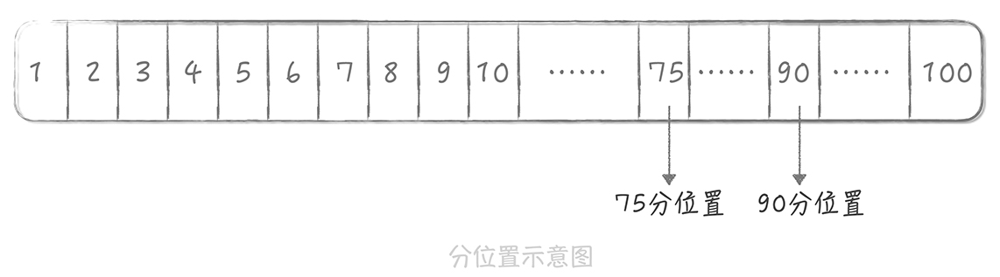

# 03丨系统设计目标 1：如何提升系统性能？

提到互联网系统设计，你可能听到最多的词儿就是 **三高**，也就是 **高并发**、**高性能**、**高可用**，它们是互联网系统架构设计永恒的主题。在前两节课中，我带你了解了高并发系统设计的含义，意义以及分层设计原则，接下来，我想带你整体了解一下高并发系统设计的目标，然后在此基础上，进入我们今天的话题：如何提升系统的性能？

## 高并发系统设计的三大目标：高性能、高可用、可扩展

**高并发，** 是指运用设计手段让系统能够处理更多的用户并发请求，也就是承担更大的流量。**它是一切架构设计的背景和前提**，脱离了它去谈性能和可用性是没有意义的。很显然嘛，你在每秒一次请求和每秒一万次请求，两种不同的场景下，分别做到毫秒级响应时间和五个九（99.999%）的可用性，无论是设计难度还是方案的复杂度，都不是一个级别的。

**而性能和可用性，** 是我们实现高并发系统设计必须考虑的因素。

性能反应了系统的使用体验，想象一下，同样承担每秒一万次请求的两个系统，一个响应时间是毫秒级，一个响应时间在秒级别，它们带给用户的体验肯定是不同的。

可用性则表示系统可以正常服务用户的时间。我们再类比一下，还是两个承担每秒一万次的系统，一个可以做到全年不停机、无故障，一个隔三差五宕机维护，如果你是用户，你会选择使用哪一个系统呢？答案不言而喻。

另一个耳熟能详的名词叫 **可扩展性** ，它同样是高并发系统设计需要考虑的因素。为什么呢？我来举一个具体的例子。

流量分为 **平时流量** 和 **峰值流量** 两种，峰值流量可能会是平时流量的几倍甚至几十倍，在应对峰值流量的时候，我们通常需要在架构和方案上做更多的准备。**这就是淘宝会花费大半年的时间准备双十一，也是在面对「明星离婚」等热点事件时，看起来无懈可击的微博系统还是会出现服务不可用的原因。** 而易于扩展的系统能在短时间内迅速完成扩容，更加平稳地承担峰值流量。

高性能、高可用和可扩展，是我们在做高并发系统设计时追求的三个目标，我会用三节课的时间，带你了解在高并发大流量下如何设计高性能、高可用和易于扩展的系统。

了解完这些内容之后，我们正式进入今天的话题：如何提升系统的性能？

## 性能优化原则

「天下武功，唯快不破」。性能是系统设计成功与否的关键，实现高性能也是对程序员个人能力的挑战。不过在了解实现高性能的方法之前，我们先明确一下性能优化的原则。

- **首先，性能优化一定不能盲目，一定是问题导向的** 

  脱离了问题，盲目地提早优化会增加系统的复杂度，浪费开发人员的时间，也因为某些优化可能会对业务上有些折中的考虑，所以也会损伤业务。

- **其次，性能优化也遵循「八二原则」**

  即你可以用 20% 的精力解决 80% 的性能问题。所以我们在优化过程中一定要抓住主要矛盾，优先优化主要的性能瓶颈点。

- **再次，性能优化也要有数据支撑**

  在优化过程中，你要时刻了解你的优化让响应时间减少了多少，提升了多少的吞吐量。

- **最后，性能优化的过程是持续的**

  高并发的系统通常是业务逻辑相对复杂的系统，那么在这类系统中出现的性能问题通常也会有多方面的原因。因此，我们在做性能优化的时候要明确目标，比方说，支撑每秒 1 万次请求的吞吐量下响应时间在 10ms，那么我们就需要持续不断地寻找性能瓶颈，制定优化方案，直到达到目标为止。

在以上四个原则的指引下，掌握常见性能问题的排查方式和优化手段，就一定能让你在设计高并发系统时更加游刃有余。

## 性能的度量指标

性能优化的第三点原则中提到，对于性能我们需要有度量的标准，有了数据才能明确目前存在的性能问题，也能够用数据来评估性能优化的效果。 **所以明确性能的度量指标十分重要。**

一般来说，度量性能的指标是 **系统接口的响应时间**，但是单次的响应时间是没有意义的，你需要知道一段时间的性能情况是什么样的。所以，我们需要收集这段时间的响应时间数据，然后依据一些统计方法计算出 **特征值**，这些特征值就能够代表这段时间的性能情况。我们常见的特征值有以下几类。

- 平均值

  顾名思义，平均值是把这段时间所有请求的响应时间数据相加，再除以总请求数。平均值可以在一定程度上反应这段时间的性能，**但它敏感度比较差**，如果这段时间有少量慢请求时，在平均值上并不能如实的反应。

  举个例子，假设我们在 30s 内有 10000 次请求，每次请求的响应时间都是 1ms，那么这段时间响应时间平均值也是 1ms。这时，当其中 100 次请求的响应时间变成了 `100ms`，那么整体的响应时间是  `100 * 100 + 9900 * 1) / 10000 = 1.99ms`。你看，虽然从平均值上来看仅仅增加了不到 1ms，但是实际情况是有 1% 的请求`（100/10000）` 的响应时间已经增加了 100 倍。 **所以，平均值对于度量性能来说只能作为一个参考。** 

- 最大值

  这个更好理解，就是这段时间内所有请求响应时间最长的值，**但它的问题又在于过于敏感了**。

  还拿上面的例子来说，如果 10000 次请求中只有一次请求的响应时间达到 100ms，那么这段时间请求的响应耗时的最大值就是 100ms，性能损耗为原先的百分之一，这种说法明显是不准确的。

- 分位值

  分位值有很多种，比如 90 分位、95 分位、75 分位。以 90 分位为例，我们把这段时间请求的 **响应时间从小到大排序**，假如一共有 100 个请求，那么排在第 90 位的响应时间就是 90 分位值。分位值排除了偶发极慢请求对于数据的影响，能够很好地反应这段时间的性能情况，**分位值越大，对于慢请求的影响就越敏感**。

  

在我来看，**分位值是最适合作为时间段内，响应时间统计值来使用的**，在实际工作中也应用最多。除此之外，平均值也可以作为一个参考值来使用。

我在上面提到，**脱离了并发来谈性能是没有意义的**，我们通常使用 **吞吐量** 或者 **同时在线用户数** 来度量并发和流量，使用吞吐量的情况会更多一些。但是你要知道，这两个指标是呈倒数关系的。

这很好理解，响应时间 1s 时，吞吐量是每秒 1 次，响应时间缩短到 10ms，**那么吞吐量就上升到每秒 100 次**。所以，一般我们度量性能时都会同时兼顾吞吐量和响应时间，比如我们设立性能优化的目标时通常会这样表述：在每秒 1 万次的请求量下，响应时间 99 分位值在 10ms 以下。

那么，响应时间究竟控制在多长时间比较合适呢？这个不能一概而论。

从用户使用体验的角度来看：

- 200ms 是第一个分界点：

  接口的响应时间在 200ms 之内，用户是感觉不到延迟的，就像是瞬时发生的一样。

- 而 1s 是另外一个分界点：

  接口的响应时间在 1s 之内时，虽然用户可以感受到一些延迟，但却是可以接受的

- 超过 1s 之后用户就会有明显等待的感觉，等待时间越长，用户的使用体验就越差。

所以，健康系统的 99 分位值的响应时间通常需要控制在 200ms 之内，而不超过 1s 的请求占比要在 99.99% 以上。

现在你了解了性能的度量指标，那我们再来看一看，随着并发的增长我们实现高性能的思路是怎样的。

## 高并发下的性能优化

假如说，你现在有一个系统，这个系统中处理核心只有一个，执行的任务的响应时间都在 10ms，它的吞吐量是在每秒 100 次。那么我们如何来优化性能从而提高系统的并发能力呢？主要有两种思路：

- 一种是提高系统的处理核心数
- 另一种是减少单次任务的响应时间。

### 1. 提高系统的处理核心数

提高系统的处理核心数就是 **增加系统的并行处理能力**，这个思路是优化性能最简单的途径。拿上一个例子来说，你可以把系统的处理核心数增加为两个，并且增加一个进程，让这两个进程跑在不同的核心上。这样从理论上，你系统的吞吐量可以增加一倍。当然了，在这种情况下，吞吐量和响应时间就不是倒数关系了，而是：`吞吐量 = 并发进程数 / 响应时间`。

计算机领域的阿姆达尔定律（Amdahl’s law）是吉恩·阿姆达尔在 1967 年提出的。它描述了并发进程数与响应时间之间的关系，含义是在固定负载下，并行计算的加速比，也就是并行化之后效率提升情况，可以用下面公式来表示：`(Ws + Wp) / (Ws + Wp/s)`

其中，Ws 表示任务中的串行计算量，Wp 表示任务中的并行计算量，s 表示并行进程数。从这个公式我们可以推导出另外一个公式：`1/(1-p+p/s)`

其中，s 还是表示并行进程数，p 表示任务中并行部分的占比。当 p 为 1 时，也就是完全并行时，加速比与并行进程数相等；当 p 为 0 时，即完全串行时，加速比为 1，也就是说完全无加速；当 s 趋近于无穷大的时候，加速比就等于 `1/(1-p)`，你可以看到它完全和 p 成正比。特别是，当 p 为 1 时，加速比趋近于无穷大。

以上公式的推导过程有些复杂，你只需要记住结论就好了。

我们似乎找到了解决问题的银弹，**是不是无限制地增加处理核心数就能无限制地提升性能，从而提升系统处理高并发的能力呢？**很遗憾，随着并发进程数的增加，并行的任务对于系统资源的争抢也会愈发严重。在某一个临界点上继续增加并发进程数，反而会造成系统性能的下降，这就是性能测试中的 **拐点模型**。

从图中你可以发现：

- 并发用户数处于轻压力区时，响应时间平稳，吞吐量和并发用户数线性相关。
- 而当并发用户数处于重压力区时，系统资源利用率到达极限，吞吐量开始有下降的趋势，响应时间也会略有上升。
- 这个时候，再对系统增加压力，系统就进入拐点区，处于超负荷状态，吞吐量下降，响应时间大幅度上升。

所以我们在评估系统性能时通常需要做压力测试，目的就是找到系统的「拐点」，从而知道系统的承载能力，也便于找到系统的瓶颈，持续优化系统性能。

说完了提升并行能力，我们再看看优化性能的另一种方式：减少单次任务响应时间。

### 2. 减少单次任务响应时间

想要减少任务的响应时间，首先要看你的系统是 **CPU 密集型** 还是 **IO 密集型** 的，因为不同类型的系统性能优化方式不尽相同。

#### CPU 密集型系统

**CPU 密集型系统中，需要处理大量的 CPU 运算，那么选用更高效的算法或者减少运算次数就是这类系统重要的优化手段**。比方说，如果系统的主要任务是计算 Hash 值，那么这时选用更高性能的 Hash 算法就可以大大提升系统的性能。发现这类问题的主要方式，是通过一些 Profile 工具来找到消耗 CPU 时间最多的方法或者模块，比如 Linux 的 perf、eBPF 等。

#### IO 密集型系统

**IO 密集型系统指的是系统的大部分操作是在等待 IO 完成，这里 IO 指的是磁盘 IO 和网络 IO**。我们熟知的系统大部分都属于 IO 密集型，比如数据库系统、缓存系统、Web 系统。这类系统的性能瓶颈可能出在系统内部，也可能是依赖的其他系统，而发现这类性能瓶颈的手段主要有两类。

- 第一类是 **采用工具**

  Linux 的工具集很丰富，完全可以满足你的优化需要，比如网络协议栈、网卡、磁盘、文件系统、内存，等等。这些工具的用法很多，你可以在排查问题的过程中逐渐积累。除此之外呢，一些开发语言还有针对语言特性的分析工具，比如说 Java 语言就有其专属的内存分析工具。

- 另外一类手段就是可以通过 **监控** 来发现性能问题。

  在监控中我们可以对任务的每一个步骤做分时的统计，从而找到任务的哪一步消耗了更多的时间。这一部分在演进篇中会有专门的介绍，这里就不再展开了。

那么找到了系统的瓶颈点，我们要如何优化呢？优化方案会随着问题的不同而不同。比方说，如果是数据库访问慢，那么就要看是不是有锁表的情况、是不是有全表扫描、索引加得是否合适、是否有 JOIN 操作、需不需要加缓存，等等；如果是网络的问题，就要看网络的参数是否有优化的空间，抓包来看是否有大量的超时重传，网卡是否有大量丢包等。

总而言之，「兵来将挡水来土掩」，我们需要制定不同的性能优化方案来应对不同的性能问题。

## 课程小结

今天，我带你了解了性能的原则、度量指标，以及在高并发下优化性能的基本思路。性能优化是一个很大的话题，只用短短一讲是完全不够的，所以我会在后面的课程中详细介绍其中的某些方面，比方说我们如何用缓存优化系统的读取性能，如何使用消息队列优化系统的写入性能等等。

有时候你在遇到性能问题的时候会束手无策，从今天的课程中你可以得到一些启示，在这里我给你总结出几点：

- 数据优先，你做一个新的系统在上线之前一定要把性能监控系统做好；
- 掌握一些性能优化工具和方法，这就需要在工作中不断的积累；
- 计算机基础知识很重要，比如说网络知识、操作系统知识等等，掌握了基础知识才能让你在优化过程中抓住性能问题的关键，也能在性能优化过程中游刃有余。

## 思考时间

在课程中我们提到了一些性能优化的原则和基本的思考点，那么你在日常工作中有哪些性能优化的手段和经验呢？

笔者想了想，貌似只想到用 JVM 缓存减少短时重复命中率高的查询操作
