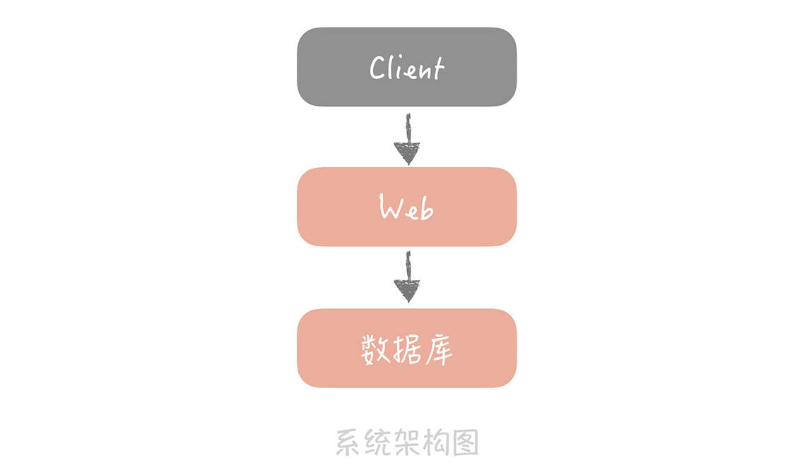

---
tags:
	- tcpdump 抓包工具
---


# 07丨池化技术：如何减少频繁创建数据库连接的性能损耗？

在前面几节课程中，我从宏观的角度带你了解了高并发系统设计的基础知识，你已经知晓了，我们系统设计的目的是为了获得更好的性能、更高的可用性，以及更强的系统扩展能力。

那么从这一讲开始，我们正式进入演进篇，我会再从局部出发，带你逐一了解完成这些目标会使用到的一些方法，这些方法会针对性地解决高并发系统设计中出现的问题。比如，在 15 讲中我会提及布隆过滤器，这个组件就是为了解决存在大量缓存穿透的情况下，如何尽量提升缓存命中率的问题。

当然，单纯地讲解理论，讲解方案会比较枯燥，所以我将用一个虚拟的系统作为贯穿整个课程的主线，说明当这个系统到达某一个阶段时，我们会遇到什么问题，然后要采用什么样的方案应对，应对的过程中又涉及哪些技术点。通过这样的讲述方式，力求以案例引出问题，能够让你了解遇到不同问题时，解决思路是怎样的， **当然，在这个过程中，我希望你能多加思考，然后将学到的知识活学活用到实际的项目中。** 

**接下来，让我们正式进入课程。**

来想象这样一个场景，一天，公司 CEO 把你叫到会议室，告诉你公司看到了一个新的商业机会，希望你能带领一名兄弟，迅速研发出一套面向某个垂直领域的电商系统。

在人手紧张，时间不足的情况下，为了能够完成任务，你毫不犹豫地采用了 **最简单的架构** ：前端一台 Web 服务器运行业务代码，后端一台数据库服务器存储业务数据。



这个架构图是我们每个人最熟悉的，最简单的架构原型，很多系统在一开始都是长这样的，只是随着业务复杂度的提高，架构做了叠加，然后看起来就越来越复杂了。

再说回我们的垂直电商系统，系统一开始上线之后，虽然用户量不大，但运行平稳，你很有成就感，不过 CEO 觉得用户量太少了，所以紧急调动运营同学做了一次全网的流量推广。

这一推广很快带来了一大波流量， **但这时，系统的访问速度开始变慢。**

分析程序的日志之后，你发现系统慢的原因 **出现在和数据库的交互上** 。因为你们数据库的调用方式是先获取数据库的连接，然后依靠这条连接从数据库中查询数据，最后关闭连接释放数据库资源。这种调用方式下，每次执行 SQL 都需要重新建立连接，所以你怀疑， **是不是频繁地建立数据库连接耗费时间长导致了访问慢的问题**。

**那么为什么频繁创建连接会造成响应时间慢呢？来看一个实际的测试。**

我用  

```bash
# -i: 指定网卡
tcpdump -i bond0 -nn -tttt port 4490
```

 命令抓取了线上 MySQL 建立连接的网络包来做分析，从抓包结果来看，整个 MySQL 的连接过程可以分为两部分：


- **第一部分是前三个数据包** 

  第一个数据包是客户端向服务端发送的一个 SYN 包，

  第二个包是服务端回给客户端的 ACK 包以及一个 SYN 包，

  第三个包是客户端回给服务端的 ACK 包，熟悉 TCP 协议的同学可以看出这是一个 TCP 的三次握手过程。

- **第二部分是 MySQL 服务端校验客户端密码的过程。**

  其中第一个包是服务端发给客户端要求认证的报文，

  第二和第三个包是客户端将加密后的密码发送给服务端的包，

  最后两个包是服务端回给客户端认证 OK 的报文。

从图中，你可以看到整个连接过程大概消耗了 4ms（969012-964904）。

那么单条 SQL 执行时间是多少呢？我们统计了一段时间的 SQL 执行时间，发现 SQL 的平均执行时间大概是 1ms，也就是说相比于 SQL 的执行，MySQL 建立连接的过程是比较耗时的。这在请求量小的时候其实影响不大，因为无论是建立连接还是执行 SQL，耗时都是毫秒级别的。可是请求量上来之后，如果按照原来的方式建立一次连接只执行一条 SQL 的话，1s 只能执行 200 次数据库的查询，而数据库建立连接的时间占了其中 4/5。

**那这时你要怎么做呢？**

一番谷歌搜索之后，你发现解决方案也很简单，只要使用连接池将数据库连接预先建立好，这样在使用的时候就不需要频繁地创建连接了。调整之后，你发现 1s 就可以执行 1000 次的数据库查询，查询性能大大的提升了。

## 用连接池预先建立数据库连接

虽然短时间解决了问题，不过你还是想彻底搞明白解决问题的核心原理，于是又开始补课。

其实，在开发过程中我们会用到很多的连接池，像是数据库连接池、HTTP 连接池、Redis 连接池等等。而连接池的管理是连接池设计的核心， **我就以数据库连接池为例，来说明一下连接池管理的关键点。**

数据库连接池有两个最重要的配置： **最小连接数和最大连接数，** 它们控制着从连接池中获取连接的流程：

- 如果当前连接数小于最小连接数，则创建新的连接处理数据库请求；
- 如果连接池中有空闲连接则复用空闲连接；
- 如果空闲池中没有连接并且当前连接数小于最大连接数，则创建新的连接处理请求；
- 如果当前连接数已经大于等于最大连接数，则按照配置中设定的时间（C3P0 的连接池配置是 checkoutTimeout）等待旧的连接可用；
- 如果等待超过了这个设定时间则向用户抛出错误。

这个流程你不用死记，非常简单。你可以停下来想想如果你是连接池的设计者你会怎么设计，有哪些关键点，这个设计思路在我们以后的架构设计中经常会用到。

为了方便你理解性记忆这个流程，我来举个例子。

假设你在机场里经营着一家按摩椅的小店，店里一共摆着 10 台按摩椅（类比最大连接数），为了节省成本（按摩椅费电），你平时会保持店里开着 4 台按摩椅（最小连接数），其他 6 台都关着。

有顾客来的时候，如果平时保持启动的 4 台按摩椅有空着的，你直接请他去空着的那台就好了。但如果顾客来的时候，4 台按摩椅都不空着，那你就会新启动一台，直到你的 10 台按摩椅都被用完。

那 10 台按摩椅都被用完之后怎么办呢？你会告诉用户，稍等一会儿，我承诺你 5 分钟（等待时间）之内必定能空出来，然后第 11 位用户就开始等着。这时，会有两个结果：如果 5 分钟之内有空出来的，那顾客直接去空出来的那台按摩椅就可以了，但如果用户等了 5 分钟都没空出来，那你就得赔礼道歉，让用户去其他店再看看。

对于数据库连接池，根据我的经验，一般在线上我建议最小连接数控制在 10 左右，最大连接数控制在 20～30 左右即可。

在这里，你需要注意池子中连接的维护问题，也就是我提到的按摩椅。有的按摩椅虽然开着，但有的时候会有故障，一般情况下， **按摩椅故障** 的原因可能有以下几种：

1. 数据库的域名对应的 IP 发生了变更，池子的连接还是使用旧的 IP，当旧的 IP 下的数据库服务关闭后，再使用这个连接查询就会发生错误；

2. MySQL 有个参数是 `wait_timeout`，控制着当数据库连接闲置多长时间后，数据库会主动的关闭这条连接。这个机制对于数据库使用方是无感知的，所以当我们使用这个被关闭的连接时就会发生错误。

那么，作为按摩椅店老板，你怎么保证你启动着的按摩椅一定是可用的呢？

1. 启动一个线程来定期检测连接池中的连接是否可用，比如使用连接发送  `select 1`  的命令给数据库看是否会抛出异常，如果抛出异常则将这个连接从连接池中移除，并且尝试关闭。目前 C3P0 连接池可以采用这种方式来检测连接是否可用， **也是我比较推荐的方式。**

2. 在获取到连接之后，先校验连接是否可用，如果可用才会执行 SQL 语句。比如 DBCP 连接池的 `testOnBorrow`  配置项，就是控制是否开启这个验证。这种方式在获取连接时会引入多余的开销， **在线上系统中还是尽量不要开启，在测试服务上可以使用。**

至此，你彻底搞清楚了连接池的工作原理。可是，当你刚想松一口气的时候，CEO 又提出了一个新的需求。你分析了一下这个需求，发现在一个非常重要的接口中，你需要访问 3 次数据库。根据经验判断，你觉得这里未来肯定会成为系统瓶颈。

进一步想，你觉得可以创建多个线程来并行处理与数据库之间的交互，这样速度就能快了。不过，因为有了上次数据库的教训，你想到在高并发阶段，频繁创建线程的开销也会很大，于是顺着之前的思路继续想，猜测到了线程池。

## 用线程池预先创建线程

果不其然，JDK 1.5 中引入的 `ThreadPoolExecutor`  就是一种线程池的实现，它有两个重要的参数：`coreThreadCount` 和 `maxThreadCount`，这两个参数控制着线程池的执行过程。它的执行原理类似上面我们说的按摩椅店的模式，我这里再给你描述下，以加深你的记忆：

- 如果线程池中的线程数少于 coreThreadCount 时，处理新的任务时会创建新的线程；
- 如果线程数大于 coreThreadCount 则把任务丢到一个队列里面，由当前空闲的线程执行；
- 当队列中的任务堆积满了的时候，则继续创建线程，直到达到 maxThreadCount；
- 当线程数达到 maxTheadCount 时还有新的任务提交，那么我们就不得不将它们丢弃了。


这个任务处理流程看似简单，实际上有很多坑，你在使用的时候一定要注意。

**首先，** JDK 实现的这个线程池优 **先把任务放入队列暂存起来，而不是创建更多的线程** ，它比较适用于执行 CPU 密集型的任务，也就是需要执行大量 CPU 运算的任务。这是为什么呢？因为执行 CPU 密集型的任务时 CPU 比较繁忙，因此只需要创建和 CPU 核数相当的线程就好了，多了反而会造成线程上下文切换，降低任务执行效率。所以当当前线程数超过核心线程数时，线程池不会增加线程，而是放在队列里等待核心线程空闲下来。

但是，我们平时开发的 Web 系统通常都有大量的 IO 操作，比方说查询数据库、查询缓存等等。任务在执行 IO 操作的时候 CPU 就空闲了下来，这时如果增加执行任务的线程数而不是把任务暂存在队列中，就可以在单位时间内执行更多的任务，大大提高了任务执行的吞吐量。所以你看 Tomcat 使用的线程池就不是 JDK 原生的线程池，而是做了一些改造，当线程数超过 coreThreadCount 之后会优先创建线程，直到线程数到达 maxThreadCount，这样就比较适合于 Web 系统大量 IO 操作的场景了，你在实际运用过程中也可以参考借鉴。

**其次，线程池中使用的队列的堆积量也是我们需要监控的重要指标** ，对于实时性要求比较高的任务来说，这个指标尤为关键。

**我在实际项目中就曾经遇到过任务被丢给线程池之后，长时间都没有被执行的诡异问题。** 最初，我认为这是代码的 Bug 导致的，后来经过排查发现，是因为线程池的 coreThreadCount 和 maxThreadCount 设置的比较小，导致任务在线程池里面大量的堆积，在调大了这两个参数之后问题就解决了。跳出这个坑之后，我就把重要线程池的队列任务堆积量 ，作为一个重要的监控指标放到了系统监控大屏上。

**最后，** 如果你使用线程池请一定记住 **不要使用无界队列（即没有设置固定大小的队列）** 。也许你会觉得使用了无界队列后，任务就永远不会被丢弃，只要任务对实时性要求不高，反正早晚有消费完的一天。但是，大量的任务堆积会占用大量的内存空间，一旦内存空间被占满就会频繁地触发 Full GC，造成服务不可用，我之前排查过的一次 GC 引起的宕机，起因就是系统中的一个线程池使用了无界队列。

理解了线程池的关键要点，你在系统里加上了这个特性，至此，系统稳定，你圆满完成了公司给你的研发任务。

这时，你回顾一下这两种技术，会发现它们都有一个 **共同点：** 它们所管理的对象，无论是连接还是线程，**它们的创建过程都比较耗时，也比较消耗系统资源** 。所以，我们把它们放在一个池子里统一管理起来，以达到 **提升性能和资源复用的目的** 。

**这是一种常见的软件设计思想，叫做池化技术，** 它的核心思想是空间换时间，期望使用预先创建好的对象来减少频繁创建对象的性能开销，同时还可以对对象进行统一的管理，降低了对象的使用的成本，总之是好处多多。

不过，池化技术也存在一些缺陷，比方说存储池子中的对象肯定需要消耗多余的内存，如果对象没有被频繁使用，就会造成内存上的浪费。再比方说，池子中的对象需要在系统启动的时候就预先创建完成，这在一定程度上增加了系统启动时间。

可这些缺陷相比池化技术的优势来说就比较微不足道了，只要我们确认要使用的对象在创建时确实比较耗时或者消耗资源，并且这些对象也确实会被频繁地创建和销毁，我们就可以使用池化技术来优化。

## 课程小结

本节课，我模拟了研发垂直电商系统最原始的场景，在遇到数据库查询性能下降的问题时，我们使用数据库连接池解决了频繁创建连接带来的性能问题，后面又使用线程池提升了并行查询数据库的性能。

其实，连接池和线程池你并不陌生，不过你可能对它们的原理和使用方式上还存在困惑或者误区，我在面试时，就发现有很多的同学对线程池的基本使用方式都不了解。借用这节课，我想再次强调的重点是：

- 池子的最大值和最小值的设置很重要，初期可以依据经验来设置，后面还是需要根据实际运行情况做调整。
- 池子中的对象需要在使用之前预先初始化完成，这叫做 **池子的预热** ，比方说使用线程池时就需要预先初始化所有的核心线程。如果池子未经过预热可能会导致系统重启后产生比较多的慢请求。
- 池化技术核心是一种空间换时间优化方法的实践，所以要关注空间占用情况，避免出现空间过度使用出现内存泄露或者频繁垃圾回收等问题。

## 思考时间

在实际的项目中，你可能会用到其他的池化技术，那么结合今天的内容，你可以和我分享一下在研发过程中，还使用过哪些其它池化技术吗？又因池化技术踩过哪些坑，当时你是怎么解决的？

## 拓展阅读

- 池子预热：ThreadPoolExecutor 中源码没有使用该策略，没有就创建线程

  它有提供 `prestartAllCoreThreads()` 方法，启动所有核心线程，就是预先创建出所有的核心线程。当然还有一个是 `prestartCoreThread()` 方法，启动一个核心线程

- 重要线程池的队列任务堆积量，这个指标怎么监控？

  ```java
  // 对于 JDK 的 threadPoolExecutor 来说可以获得队列中元素个数
  threadPoolExecutor.getQueue().size()
  ```

- 怎样启动一个线程来定期检测连接池中的连接是否可用？是否会增加数据库的负担？

  定期检查没有那么大的压力，每隔几分钟去检查一次。相比于业务来说很少了

- 文中说的最小连接数是 10 和最大连接数是 20-30，这个数是如何计算出来的？有没有参考标准或者计算公式？根据具体的业务场景或者规模，有什么可以套用的配置经验吗？

  其实这些是经验所得，这个数值需要在实际运行中来调整，初期可以按照这个来设置

