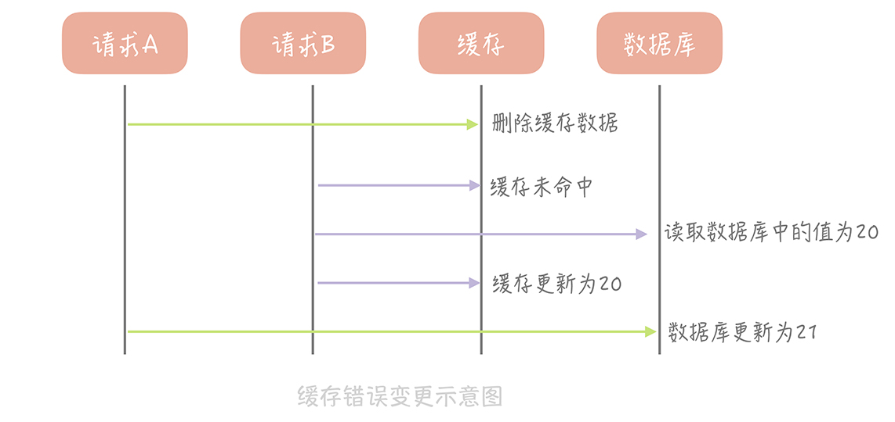
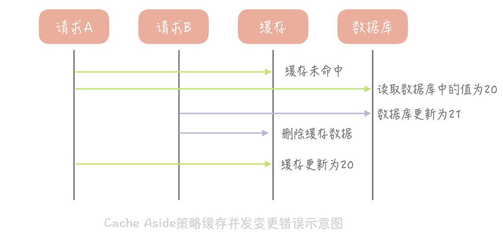

# 13丨缓存的使用姿势 1：如何选择缓存的读写策略？

上节课，我带你了解了缓存的定义、分类以及不足，你现在应该对缓存有了初步的认知。从今天开始，我将带你了解一下使用缓存的正确姿势，比如缓存的读写策略是什么样的，如何做到缓存的高可用以及如何应对缓存穿透。通过了解这些内容，你会对缓存的使用有深刻的认识，这样在实际工作中就可以在缓存使用上游刃有余了。

今天，我们先讲讲缓存的读写策略。你可能觉得缓存的读写很简单，只需要优先读缓存，缓存不命中就从数据库查询，查询到了就回种缓存。实际上，针对不同的业务场景，缓存的读写策略也是不同的。

而我们在选择策略时也需要考虑诸多的因素，比如说，缓存中是否有可能被写入脏数据，策略的读写性能如何，是否存在缓存命中率下降的情况等等。接下来，我就以标准的 **缓存 + 数据库** 的场景为例，带你剖析经典的缓存读写策略以及它们适用的场景。这样一来，你就可以在日常的工作中根据不同的场景选择不同的读写策略。

## Cache Aside（旁路缓存）策略

我们来考虑一种最简单的业务场景，比方说在你的电商系统中有一个用户表，表中只有 ID 和年龄两个字段，缓存中我们以 ID 为 Key 存储用户的年龄信息。那么当我们要把 ID 为 1 的用户的年龄从 19 变更为 20，要如何做呢？

**你可能会产生这样的思路：** 先更新数据库中 ID 为 1 的记录，再更新缓存中 Key 为 1 的数据。

**这个思路会造成缓存和数据库中的数据不一致。** 比如，A 请求将数据库中 ID 为 1 的用户年龄从 19 变更为 20，与此同时，请求 B 也开始更新 ID 为 1 的用户数据，它把数据库中记录的年龄变更为 21，然后变更缓存中的用户年龄为 21。紧接着，A 请求开始更新缓存数据，它会把缓存中的年龄变更为 20。此时，数据库中用户年龄是 21，而缓存中的用户年龄却是 20。

**为什么产生这个问题呢？** 因为变更数据库和变更缓存是两个独立的操作，而我们并没有对操作做任何的并发控制。那么当两个线程并发更新它们的时候，就会因为写入顺序的不同造成数据的不一致。

另外，直接更新缓存还存在另外一个问题就是丢失更新。还是以我们的电商系统为例，假如电商系统中的账户表有三个字段：ID、户名和金额，这个时候缓存中存储的就不只是金额信息，而是完整的账户信息了。当更新缓存中账户金额时，你需要从缓存中查询完整的账户数据，把金额变更后再写入到缓存中。

这个过程中也会有并发的问题，比如说原有金额是 20，A 请求从缓存中读到数据，并且把金额加 1，变更成 21，在未写入缓存之前又有请求 B 也读到缓存的数据后把金额也加 1，也变更成 21，两个请求同时把金额写回缓存，这时缓存里面的金额是 21，但是我们实际上预期是金额数加 2，这也是一个比较大的问题。

**那我们要如何解决这个问题呢？** 其实，我们可以在更新数据时不更新缓存，而是删除缓存中的数据，在读取数据时，发现缓存中没了数据之后，再从数据库中读取数据，更新到缓存中。

这个策略就是我们使用缓存最常见的策略，**Cache Aside 策略（也叫旁路缓存策略）**，这个策略数据 **以数据库中的数据为准，缓存中的数据是按需加载的** 。它可以分为读策略和写策略，

**读策略的步骤是：**

- 从缓存中读取数据；
- 如果缓存命中，则直接返回数据；
- 如果缓存不命中，则从数据库中查询数据；
- 查询到数据后，将数据写入到缓存中，并且返回给用户。

**写策略的步骤是：**

- 更新数据库中的记录；
- 删除缓存记录。

你也许会问了，在写策略中，能否先删除缓存，后更新数据库呢？ **答案是不行的，** 因为这样也有可能出现缓存数据不一致的问题，我以用户表的场景为例解释一下。

假设某个用户的年龄是 20，请求 A 要更新用户年龄为 21，所以它会删除缓存中的内容。这时，另一个请求 B 要读取这个用户的年龄，它查询缓存发现未命中后，会从数据库中读取到年龄为 20，并且写入到缓存中，然后请求 A 继续更改数据库，将用户的年龄更新为 21，这就造成了缓存和数据库的不一致。

那么像 Cache Aside 策略这样先更新数据库，后删除缓存就没有问题了吗？其实在理论上还是有缺陷的。假如某个用户数据在缓存中不存在，请求 A 读取数据时从数据库中查询到年龄为 20，在未写入缓存中时另一个请求 B 更新数据。它更新数据库中的年龄为 21，并且清空缓存。这时请求 A 把从数据库中读到的年龄为 20 的数据写入到缓存中，造成缓存和数据库数据不一致。

**不过这种问题出现的几率并不高，原因是缓存的写入通常远远快于数据库的写入** ，所以在实际中很难出现请求 B 已经更新了数据库并且清空了缓存，请求 A 才更新完缓存的情况。而一旦请求 A 早于请求 B 清空缓存之前更新了缓存，那么接下来的请求就会因为缓存为空而从数据库中重新加载数据，所以不会出现这种不一致的情况。

**Cache Aside 策略是我们日常开发中最经常使用的缓存策略，不过我们在使用时也要学会依情况而变。** 比如说当新注册一个用户，按照这个更新策略，你要写数据库，然后清理缓存（当然缓存中没有数据给你清理）。可当我注册用户后立即读取用户信息，**并且数据库主从分离时** ，会出现因为主从延迟所以读不到用户信息的情况。

**而解决这个问题的办法** 恰恰是在插入新数据到数据库之后写入缓存，这样后续的读请求就会从缓存中读到数据了。**并且因为是新注册的用户，所以不会出现并发更新用户信息的情况** 。

Cache Aside 存在的最大的问题是当写入比较频繁时，缓存中的数据会被频繁地清理，这样会对缓存的命中率有一些影响。 **如果你的业务对缓存命中率有严格的要求，那么可以考虑两种解决方案：** 

1. 一种做法是在更新数据时也更新缓存，只是在更新缓存前先加一个分布式锁，因为这样在同一时间只允许一个线程更新缓存，就不会产生并发问题了。当然这么做对于写入的性能会有一些影响；
2. 另一种做法同样也是在更新数据时更新缓存，只是给缓存加一个较短的过期时间，这样即使出现缓存不一致的情况，缓存的数据也会很快地过期，对业务的影响也是可以接受。

::: tip

笔者感觉上面的一些点感觉很混乱，对缓存命中率有要求，根本原因是写入频繁，加锁单线程更新就能保证了？

这里细说一下：
数据更新：发送更新缓存指令给 缓存组件，由缓存组件对同一个 key 是加锁更新的，它可以进行一个时间窗口的优化很厚再更新

读数据：发现没有缓存? 则发送读缓存指令给缓存，然后自己这边等待缓存数据的更新，直到读到后或则超时返回。

:::

当然了，除了这个策略，在计算机领域还有其他几种经典的缓存策略，它们也有各自适用的使用场景。

## Read/Write Through（读穿 / 写穿）策略

**这个策略的核心原则是用户只与缓存打交道，由缓存和数据库通信，写入或者读取数据** 。这就好比你在汇报工作的时候只对你的直接上级汇报，再由你的直接上级汇报给他的上级，你是不能越级汇报的。

Write Through 的策略是这样的：先查询要写入的数据在缓存中是否已经存在，如果已经存在，则更新缓存中的数据，并且由缓存组件同步更新到数据库中，如果缓存中数据不存在，我们把这种情况叫做  **Write Miss（写失效）**。

一般来说，我们可以选择两种 Write Miss 方式：

- Write Allocate（按写分配）

  做法是写入缓存相应位置，再由缓存组件同步更新到数据库中；
  
- No-write allocate（不按写分配）

  做法是不写入缓存中，而是直接更新到数据库中

在 Write Through 策略中，我们一般选择 `No-write allocate` 方式，原因是无论采用哪种 `Write Miss` 方式，我们都需要同步将数据更新到数据库中，而 `No-write allocate` 方式相比 `Write Allocate` 还减少了一次缓存的写入，能够提升写入的性能。

Read Through 策略就简单一些，它的步骤是这样的：先查询缓存中数据是否存在，如果存在则直接返回，如果不存在，则由缓存组件负责从数据库中同步加载数据。

下面是 Read Through/Write Through 策略的示意图：

Read Through/Write Through 策略的特点是 **由缓存节点而非用户来和数据库打交道 **，在我们开发过程中相比 Cache Aside 策略要少见一些，原因是我们经常使用的分布式缓存组件，无论是 Memcached 还是 Redis 都不提供写入数据库，或者自动加载数据库中的数据的功能。而我们在使用本地缓存的时候可以考虑使用这种策略，比如说在上一节中提到的本地缓存 Guava Cache 中的 Loading Cache 就有 Read Through 策略的影子。

我们看到 **Write Through 策略中写数据库是同步的** ，这对于性能来说会有比较大的影响，因为相比于写缓存，同步写数据库的延迟就要高很多了。那么我们可否异步地更新数据库？这就是我们接下来要提到的 `Write Back` 策略。

## Write Back（写回）策略

这个策略的核心思想是 **在写入数据时只写入缓存，并且把缓存块儿标记为 「脏」 的**。而脏块儿只有被再次使用时才会将其中的数据写入到后端存储中。

**需要注意的是，** 在 `Write Miss` 的情况下，我们采用的是 `Write Allocate` 的方式，也就是在写入后端存储的同时要写入缓存，这样我们在之后的写请求中都只需要更新缓存即可，而无需更新后端存储了，我将 Write back 策略的示意图放在了下面：

**如果使用 Write Back 策略的话，读的策略也有一些变化了：**  

1. 我们在读取缓存时如果发现 **缓存命中则直接返回缓存数据**。

2. 如果缓存不命中则寻找一个可用的缓存块儿

   如果这个缓存块儿是 「脏」的，就把缓存块儿中之前的数据写入到后端存储中，并且从后端存储加载数据到缓存块儿

   如果不是脏的，则由缓存组件将后端存储中的数据加载到缓存中，最后我们将缓存设置为不是脏的，返回数据就好了。

**发现了吗？** 其实这种策略不能被应用到我们常用的数据库和缓存的场景中，它是计算机体系结构中的设计，比如我们在向磁盘中写数据时采用的就是这种策略。无论是操作系统层面的 Page Cache，还是日志的异步刷盘，亦或是消息队列中消息的异步写入磁盘，大多采用了这种策略。因为这个策略在性能上的优势毋庸置疑，它避免了直接写磁盘造成的随机写问题，毕竟写内存和写磁盘的随机 I/O 的延迟相差了几个数量级呢。

但因为缓存一般使用内存，而内存是非持久化的，所以一旦缓存机器掉电，就会造成原本缓存中的脏块儿数据丢失。所以你会发现系统在掉电之后，之前写入的文件会有部分丢失，就是因为 Page Cache 还没有来得及刷盘造成的。

::: tip

笔者疑问：在读的时候，缓存不命中，还可以去找缓存块？都没有命中了，这里不明白.

计算机体系结构中的策略，它的完整读策略是这样的：如果缓存命中，则直接返回；如果缓存不命中，则重新找一个缓存块儿，如果这个缓存块儿是脏的，那么写入后端存储，并且把后端存储中的数据加载到缓存中；如果不是脏的，那么就把后端存储中的数据加载到缓存，然后标记缓存非脏

所以说这里介绍的，不要看成是普通的一个 key 就对应这个 key 应该有的缓存数据

:::

**当然，你依然可以在一些场景下使用这个策略，在使用时，我想给你的落地建议是：** 你在向低速设备写入数据的时候，可以在内存里先暂存一段时间的数据，甚至做一些统计汇总，然后定时地刷新到低速设备上。比如说，你在统计你的接口响应时间的时候，需要将每次请求的响应时间打印到日志中，然后监控系统收集日志后再做统计。但是如果每次请求都打印日志无疑会增加磁盘 I/O，那么不如把一段时间的响应时间暂存起来，经过简单的统计平均耗时，每个耗时区间的请求数量等等，然后定时地，批量地打印到日志中。

## 课程小结

本节课，我主要带你了解了缓存使用的几种策略，以及每种策略适用的使用场景是怎样的。我想让你掌握的重点是：

1. Cache Aside 是我们在使用分布式缓存时最常用的策略，你可以在实际工作中直接拿来使用。

2. Read/Write Through 和 Write Back 策略需要缓存组件的支持，所以比较适合你在实现本地缓存组件的时候使用；

3. Write Back 策略是计算机体系结构中的策略，不过写入策略中的只写缓存，异步写入后端存储的策略倒是有很多的应用场景。

而且，你还需要了解，我们今天提到的策略都是标准的使用姿势，在实际开发过程中需要结合实际的业务特点灵活使用甚至加以改造。这些业务特点包括但不仅限于：整体的数据量级情况，访问的读写比例的情况，对于数据的不一致时间的容忍度，对于缓存命中率的要求等等。理论结合实践，具体情况具体分析，你才能得到更好的解决方案。

## 一课一思

结合今天课程中的内容，你可以思考一下在日常工作中使用缓存时都使用了哪些缓存的读写策略呢？