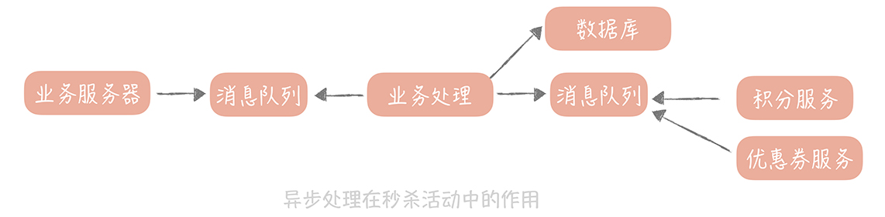

# 17丨消息队列：秒杀时如何处理每秒上万次的下单请求？

在课程一开始，我就带你了解了高并发系统设计的三个目标：性能、可用性和可扩展性，而在提升系统性能方面，我们一直关注的是系统的查询性能。也用了很多的篇幅去讲解数据库的分布式改造，各类缓存的原理和使用技巧。 **究其原因在于，** 我们遇到的大部分场景都是读多写少， **尤其是在一个系统的初级阶段。**

比如说，一个社区的系统初期一定是只有少量的种子用户在生产内容，而大部分的用户都在「围观」别人在说什么。此时，整体的流量比较小，而写流量可能只占整体流量的百分之一，那么即使整体的 QPS 到了  `10000 次 / 秒`，写请求也只是到了每秒 100 次，如果要对写请求做性能优化，它的性价比确实不太高。

但是，随着业务的发展，你可能会遇到一些存在 **高并发写请求的场景，其中秒杀抢购就是最典型的场景。** 假设你的商城策划了一期秒杀活动，活动在第五天的 00:00 开始，仅限前 200 名，那么秒杀即将开始时，后台会显示用户正在疯狂地刷新 APP 或者浏览器来保证自己能够尽量早的看到商品。

这时，你面对的依旧是读请求过高， **那么应对的措施有哪些呢？**

因为用户查询的是少量的商品数据，属于 **查询的热点数据** ，你可以采用缓存策略，将请求尽量挡在上层的缓存中，能被静态化的数据，比如说商城里的图片和视频数据，**尽量做到静态化，这样就可以命中 CDN 节点缓存** ，减少 Web 服务器的查询量和带宽负担。Web 服务器比如 Nginx 可以直接访问分布式缓存节点，这样可以避免请求到达 Tomcat 等业务服务器。

当然，你可以加上一些限流的策略，比如，对于短时间之内来自某一个用户、某一个 IP 或者某一台设备的重复请求做丢弃处理。

通过这几种方式，你发现自己可以将请求尽量挡在数据库之外了。

稍微缓解了读请求之后，00:00 分秒杀活动准时开始，用户瞬间向电商系统请求生成订单，扣减库存，用户的这些写操作都是不经过缓存直达数据库的。1 秒钟之内，有 1 万个数据库连接同时达到，系统的数据库濒临崩溃，寻找能够应对如此高并发的写请求方案迫在眉睫。这时你想到了消息队列。

## 我所理解的消息队列

关于消息队列是什么，你可能有所了解了，所以有关它的概念讲解，就不是本节课的重点，这里只聊聊我自己对消息队列的看法。在我历年的工作经历中，我一直把消息队列看作暂时存储数据的一个容器，认为消息队列是一个平衡低速系统和高速系统处理任务时间差的工具， **我给你举个形象的例子。**

比方说，古代的臣子经常去朝见皇上陈述一些国家大事，等着皇上拍板做决策。但是大臣很多，如果同时去找皇上，你说一句我说一句，皇上肯定会崩溃。后来变成臣子到了午门之后要原地等着皇上将他们一个一个地召见进大殿商议国事，这样就可以缓解皇上处理事情的压力了。你可以把午门看作一个暂时容纳臣子的容器，也就是我们所说的消息队列。

其实，你在一些组件中都会看到消息队列的影子：

- 在 Java 线程池中我们就会使用一个队列来暂时存储提交的任务，等待有空闲的线程处理这些任务；

- 操作系统中，中断的下半部分也会使用工作队列来实现延后执行；

- 我们在实现一个 RPC 框架时，也会将从网络上接收到的请求写到队列里，再启动若干个工作线程来处理。

- ……

总之，队列是在系统设计时一种常见的组件。

那么我们如何用消息队列解决秒杀场景下的问题呢？接下来，我们来结合具体的例子来看看消息队列在秒杀场景下起到的作用。

## 削去秒杀场景下的峰值写流量

刚才提到，在秒杀场景下，短时间之内数据库的写流量会很高，那么依照我们以前的思路应该对数据做分库分表。如果已经做了分库分表，那么就需要扩展更多的数据库来应对更高的写流量。但是无论是分库分表，还是扩充更多的数据库，都会比较复杂，原因是你需要将数据库中的数据做迁移，这个时间就要按天甚至按周来计算了。

而在秒杀场景下，高并发的写请求并不是持续的，也不是经常发生的，而只有在秒杀活动开始后的几秒或者十几秒时间内才会存在。**为了应对这十几秒的瞬间写高峰** ，就要花费几天甚至几周的时间来扩容数据库，再在秒杀之后花费几天的时间来做缩容， **这无疑是得不偿失的。**

**所以，我们的思路是：** 将秒杀请求暂存在消息队列中，然后业务服务器会响应用户 「秒杀结果正在计算中」，释放了系统资源之后再处理其它用户的请求。

我们会在后台启动若干个队列处理程序，消费消息队列中的消息，再执行校验库存、下单等逻辑。**因为只有有限个队列处理线程在执行，所以落入后端数据库上的并发请求是有限的** 。而请求是可以在消息队列中被短暂地堆积， **当库存被消耗完之后，消息队列中堆积的请求就可以被丢弃了** 。

这就是消息队列在秒杀系统中最主要的作用： **削峰填谷，** 也就是说它可以削平短暂的流量高峰，虽说堆积会造成请求被短暂延迟处理，但是只要我们时刻监控消息队列中的堆积长度，在堆积量超过一定量时，增加队列处理机数量，来提升消息的处理能力就好了，而且秒杀的用户对于短暂延迟知晓秒杀的结果，也是有一定容忍度的。

**这里需要注意一下，** 我所说的是 「 **短暂** 」延迟，如果长时间没有给用户公示秒杀结果，那么用户可能就会怀疑你的秒杀活动有猫腻了。所以，在使用消息队列应对流量峰值时，需要对队列处理的时间、前端写入流量的大小，数据库处理能力做好评估，然后根据不同的量级来决定部署多少台队列处理程序。

比如你的秒杀商品有 1000 件，处理一次购买请求的时间是 500ms，那么总共就需要 500s 的时间。这时，你部署 10 个队列处理程序，那么秒杀请求的处理时间就是 50s，也就是说用户需要等待 50s 才可以看到秒杀的结果，这是可以接受的。这时会并发 10 个请求到达数据库，并不会对数据库造成很大的压力。

## 通过异步处理简化秒杀请求中的业务流程

其实，在大量的写请求 「攻击」你的电商系统的时候，消息队列除了发挥主要的削峰填谷的作用之外，还可以实现 **异步处理** 来简化秒杀请求中的业务流程，提升系统的性能。

你想，在刚才提到的秒杀场景下，我们在处理购买请求时，需要 500ms。这时，你分析了一下整个的购买流程，发现 **这里面会有主要的业务逻辑，也会有次要的业务逻辑：** 比如说，主要的流程是生成订单、扣减库存；次要的流程可能是我们在下单购买成功之后会给用户发放优惠券，会增加用户的积分。

假如发放优惠券的耗时是 50ms，增加用户积分的耗时也是 50ms，那么如果我们将发放优惠券、增加积分的操作放在另外一个队列处理机中执行，那么整个流程就缩短到了 400ms，性能提升了 20%，处理这 1000 件商品的时间就变成了 400s。如果我们还是希望能在 50s 之内看到秒杀结果的话，只需要部署 8 个队列程序就好了。

经过将一些业务流程异步处理之后，我们的秒杀系统部署结构也会有所改变：

## 解耦实现秒杀系统模块之间松耦合

除了异步处理和削峰填谷以外，消息队列在秒杀系统中起到的另一个作用是 **解耦合** 。

比如数据团队对你说，在秒杀活动之后想要统计活动的数据，借此来分析活动商品的受欢迎程度、购买者人群的特点以及用户对于秒杀互动的满意程度等等指标。 **而我们需要将大量的数据发送给数据团队** ，那么要怎么做呢？

**一个思路是：** 可以使用 HTTP 或者 RPC 的方式来同步地调用，也就是数据团队这边提供一个接口，我们实时将秒杀的数据推送给它， **但是这样调用会有两个问题：**

- 整体系统的耦合性比较强，当数据团队的接口发生故障时，会影响到秒杀系统的可用性。

- 当数据系统需要新的字段，就要变更接口的参数，那么秒杀系统也要随着一起变更。

这时，我们可以考虑使用消息队列降低业务系统和数据系统的直接耦合度。

秒杀系统产生一条购买数据后，我们可以先把全部数据发送给消息队列，然后数据团队再订阅这个消息队列的话题，这样它们就可以接收到数据，然后再做过滤和处理了。

秒杀系统在这样解耦合之后，数据系统的故障就不会影响到秒杀系统了，同时，当数据系统需要新的字段时，只需要解析消息队列中的消息，拿到需要的数据就好了。

**异步处理、解耦合和削峰填谷** 是消息队列在秒杀系统设计中起到的主要作用，其中，

- 异步处理可以简化业务流程中的步骤，提升系统性能；
- 削峰填谷可以削去到达秒杀系统的峰值流量，让业务逻辑的处理更加缓和；
- 解耦合可以将秒杀系统和数据系统解耦开，这样两个系统的任何变更都不会影响到另一个系统，

如果你的系统想要提升写入性能，实现系统的低耦合，想要抵挡高并发的写流量，那么你就可以考虑使用消息队列来完成。

## 课程小结

本节课，我结合自己的实际经验，主要带你了解了，消息队列在高并发系统设计中起到的作用，以及一些注意事项，你需要了解的重点如下：

- 削峰填谷是消息队列最主要的作用， **但是会造成请求处理的延迟** 。

- 异步处理是提升系统性能的神器，但是你需要分清同步流程和异步流程的边界，同时消息存在着丢失的风险，我们需要考虑如何确保消息一定到达。

- 解耦合可以提升你的整体系统的鲁棒性。

当然，你要知道，在使用消息队列之后虽然可以解决现有的问题，但是系统的复杂度也会上升。比如上面提到的业务流程中，同步流程和异步流程的边界在哪里？消息是否会丢失，是否会重复？请求的延迟如何能够减少？消息接收的顺序是否会影响到业务流程的正常执行？如果消息处理流程失败了之后是否需要补发？ **这些问题都是我们需要考虑的。** 

我会利用接下来的两节课，针对最主要的两个问题来讲讲解决思路：一个是如何处理消息的丢失和重复，另一个是如何减少消息的延迟。

引入了消息队列的同时也会引入了新的问题，需要新的方案来解决，这就是系统设计的挑战，也是系统设计独有的魅力，而我们也会在这些挑战中不断提升技术能力和系统设计能力。

## 思考时间

在今天的课程中，我提到了消息队列在高并发系统设计中起到的作用。那么你在开发过程中会在什么样的场景下使用消息队列呢？