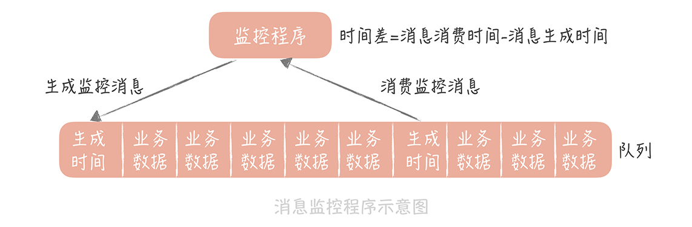
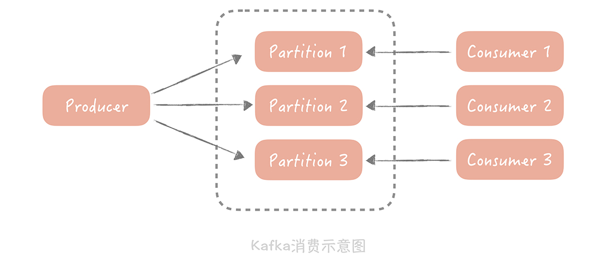
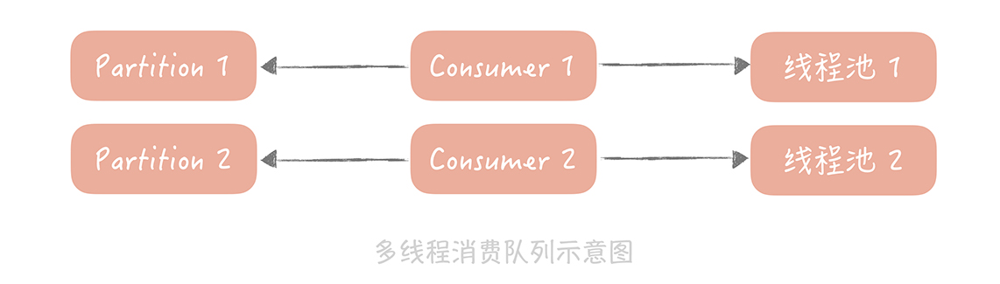
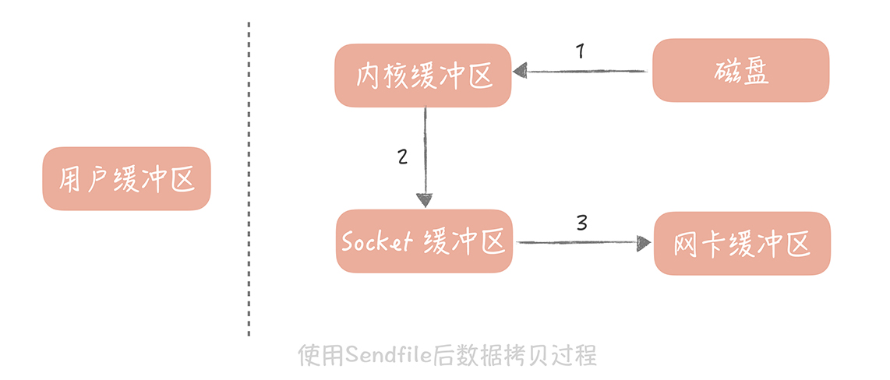

# 19丨消息队列：如何降低消息队列系统中消息的延迟？

学完前面两节课之后，相信你对在垂直电商项目中，如何使用消息队列应对秒杀时的峰值流量已经有所了解。当然了，你也应该知道要如何做，才能保证消息不会丢失，尽量避免消息重复带来的影响。 **那么我想让你思考一下：** 除了这些内容，你在使用消息队列时还需要关注哪些点呢？

**先来看一个场景：** 在你的垂直电商项目中，你会在用户下单支付之后，向消息队列里面发送一条消息，队列处理程序消费了消息后，会增加用户的积分，或者给用户发送优惠券。那么用户在下单之后，等待几分钟或者十几分钟拿到积分和优惠券是可以接受的，但是一旦消息队列出现大量堆积，用户消费完成后几小时还拿到优惠券，那就会有用户投诉了。

这时，你要关注的就是消息队列中， **消息的延迟** 了，这其实是消费性能的问题，那么你要如何提升消费性能，保证更短的消息延迟呢？ 在我看来， **你首先需要掌握如何来监控消息的延迟** ，因为有了数据之后，你才可以知道目前的延迟数据是否满足要求，也可以评估优化之后的效果。然后，你要掌握使用消息队列的正确姿势，以及关注消息队列本身是如何保证消息尽快被存储和投递的。

接下来，我们先来看看第一点：如何监控消息延迟。

## 如何监控消息延迟

在我看来，监控消息的延迟有两种方式：

- 使用消息队列提供的工具，通过监控消息的堆积来完成；

- 通过生成监控消息的方式来监控消息的延迟情况。

接下来，我带你实际了解一下。

假设在开篇的场景之下，电商系统中的消息队列已经堆积了大量的消息，那么你要想监控消息的堆积情况，首先需要从原理上了解， **在消息队列中消费者的消费进度是多少** ，因为这样才方便计算当前的消费延迟是多少。比方说，生产者向队列中一共生产了 1000 条消息，某一个消费者消费进度是 900 条，那么这个消费者的消费延迟就是 100 条消息。

**在 Kafka 中，消费者的消费进度在不同的版本上是不同的。**

在 Kafka0.9 之前的版本中，消费进度是存储在 ZooKeeper 中的，消费者在消费消息的时候，先要从 ZooKeeper 中获取最新的消费进度，再从这个进度的基础上消费后面的消息。

在 Kafka0.9 版本之后，消费进度被迁入到 Kakfa 的一个专门的 topic 叫 `__consumer_offsets` 里面。所以，如果你了解 kafka 的原理，你可以依据不同的版本，从不同的位置，获取到这个消费进度的信息。

当然，作为一个成熟的组件，Kafka 也提供了一些工具来获取这个消费进度的信息，帮助你实现自己的监控，这个工具主要有两个

### kafka-consumer-groups.sh

首先，Kafka 提供了工具叫做 `kafka-consumer-groups.sh`（它在 Kafka 安装包的 bin 目录下）。

为了帮助你理解，我简单地搭建了一个 Kafka 节点，并且写入和消费了一些信息，然后我来使用命令看看消息累积情况，具体的命令如下：

```bash

./bin/kafka-consumer-groups.sh --bootstrap-server localhost:9092 --describe --group test-consumer-group
```

结果如下：


- TOPIC、PARITION：话题名和分区名；

- CURRENT-OFFSET：当前消费者的消费进度；

- LOG-END-OFFSET：当前生产消息的总数；

- LAG：消费消息的堆积数（也就是 LOG-END-OFFSET - CURRENT-OFFSET）

通过这个命令你可以很方便地了解消费者的消费情况。

### JMX

Kafka 通过 JMX 暴露了消息堆积的数据，我在本地启动了一个 console consumer，然后使用 jconsole 连接这个 consumer，你就可以看到这个 consumer 的堆积数据了（就是下图中红框里的数据）。这些数据你可以写代码来获取，这样也可以方便地输出到监控系统中， **我比较推荐这种方式。**


除了使用消息队列提供的工具以外，你还可以通过生成监控消息的方式，来监控消息的延迟。 **具体怎么做呢？**

### 生成监控消息

1. 你先定义一种特殊的消息

2. 然后启动一个监控程序，将这个消息定时地循环写入到消息队列中

   消息的内容可以是生成消息的时间戳，并且也会作为队列的消费者消费数据。

3. 业务处理程序消费到这个消息时直接丢弃掉，而监控程序在消费到这个消息时， **就可以和这个消息的生成时间做比较** ，如果时间差达到某一个阈值就可以向我们报警。



这两种方式都可以监控消息的消费延迟情况， **而从我的经验出来，我比较推荐两种方式结合来使用。** 比如在我的实际项目中，我会优先在监控程序中获取 JMX 中的队列堆积数据，做到 dashboard 报表中，同时也会启动探测进程，确认消息的延迟情况是怎样的。

在我看来，消息的堆积是对于消息队列的基础监控，这是你无论如何都要做的。但是，了解了消息的堆积情况，并不能很直观地了解消息消费的延迟，你也只能利用经验来确定堆积的消息量到了多少才会影响到用户的体验；而第二种方式对于消费延迟的监控则更加直观，而且从时间的维度来做监控也比较容易确定报警阈值。

了解了消息延迟的监控方式之后，我们再来看看如何提升消息的写入和消费性能，这样才会让异步的消息得到尽快的处理。

## 减少消息延迟的正确姿势

想要减少消息的处理延迟，我们需要在 **消费端和消息队列** 两个层面来完成。

在消费端，我们的目标是提升消费者的消息处理能力，你能做的是：

- 优化消费代码提升性能；

- 增加消费者的数量（这个方式比较简单）。

不过，第二种方式会受限于消息队列的实现。比如说，如果消息队列使用的是 Kafka 就无法通过增加消费者数量的方式，来提升消息处理能力。

因为在 Kafka 中，一个 Topic（话题）可以配置多个 Partition（分区），数据会被平均或者按照生产者指定的方式，写入到多个分区中，那么在消费的时候，Kafka 约定一个分区只能被一个消费者消费，为什么要这么设计呢？在我看来，如果有多个 consumer（消费者）可以消费一个分区的数据，那么在操作这个消费进度的时候就需要加锁，可能会对性能有一定的影响。

所以说，话题的分区数量决定了消费的并行度，增加多余的消费者也是没有用处的，那么你可以通过增加分区来提高消费者的处理能力。



那么，如何在不增加分区的前提下提升消费能力呢？

既然不能增加 consumer，那么你可以在一个 consumer 中提升处理消息的并行度，所以可以考虑使用多线程的方式来增加处理能力：你可以预先创建一个或者多个线程池，在接收到消息之后，把消息丢到线程池中来异步地处理，这样，原本串行的消费消息的流程就变成了并行的消费，可以提高消息消费的吞吐量，在并行处理的前提下，我们就可以在一次和消息队列的交互中多拉取几条数据，然后分配给多个线程来处理。



另外，你在消费队列中数据的时候还需要注意消费线程空转的问题。

**我是最初在测试自己写的一个消息中间件的时候发现的。** 当时，我发现运行消费客户端的进程会偶发地出现 CPU 跑满的情况，于是打印了 JVM 线程堆栈，找到了那个跑满 CPU 的线程。这个时候才发现，原来是消息队列中，有一段时间没有新的消息，于是消费客户端拉取不到新的消息就会不间断地轮询拉取消息，这个线程就把 CPU 跑满了。

所以，你在写消费客户端的时候要考虑这种场景，拉取不到消息可以等待一段时间再来拉取，等待的时间不宜过长，否则会增加消息的延迟。我一般建议固定的 10ms~100ms，也可以按照一定步长递增，比如第一次拉取不到消息等待 10ms，第二次 20ms，最长可以到 100ms，直到拉取到消息再回到 10ms。

说完了消费端的做法之后， **再来说说消息队列本身在读取性能优化方面做了哪些事情。**

我曾经也做过一个消息中间件，在最初设计中间件的时候，我主要从两方面考虑读取性能问题：

- 消息的存储；

- 零拷贝技术。

**针对第一点，** 我最初在设计的时候为了实现简单，使用了普通的数据库来存储消息，但是受限于数据库的性能瓶颈，读取 QPS 只能到 2000，后面我重构了存储模块，使用本地磁盘作为存储介质。Page Cache 的存在就可以提升消息的读取速度，即使要读取磁盘中的数据，由于消息的读取是顺序的，并且不需要跨网络读取数据，所以读取消息的 QPS 提升了一个数量级。

**另外一个优化点是零拷贝技术，** 说是零拷贝，其实，我们不可能消灭数据的拷贝，只是尽量减少拷贝的次数。在读取消息队列的数据的时候，其实就是把磁盘中的数据通过网络发送给消费客户端，在实现上会有四次数据拷贝的步骤：

1. 数据从磁盘拷贝到内核缓冲区；

2. 系统调用将内核缓存区的数据拷贝到用户缓冲区；

3. 用户缓冲区的数据被写入到 Socket 缓冲区中；

4. 操作系统再将 Socket 缓冲区的数据拷贝到网卡的缓冲区中。


操作系统提供了 Sendfile 函数，可以减少数据被拷贝的次数。使用了 Sendfile 之后，在内核缓冲区的数据不会被拷贝到用户缓冲区，而是直接被拷贝到 Socket 缓冲区，节省了一次拷贝的过程，提升了消息发送的性能。高级语言中对于 Sendfile 函数有封装，比如说在 Java 里面的 `java.nio.channels.FileChannel` 类就提供了 transferTo 方法提供了 Sendfile 的功能。



## 课程小结

本节课我带你了解了，如何提升消息队列的性能来降低消息消费的延迟，这里我想让你明确的重点是：

- 我们可以使用消息队列提供的工具，或者通过发送监控消息的方式，来监控消息的延迟情况；

- 横向扩展消费者是提升消费处理能力的重要方式；

- 选择高性能的数据存储方式，配合零拷贝技术，可以提升消息的消费性能。

其实，队列是一种常用的组件，只要涉及到队列，任务的堆积就是一个不可忽视的问题， **我遇到过的很多故障都是源于此。**

比如说，前一段时间处理的一个故障，前期只是因为数据库性能衰减有少量的慢请求，结果这些慢请求占满了 Tomcat 线程池，导致整体服务的不可用。如果我们能对 Tomcat 线程池的任务堆积情况有实时地监控，或者说对线程池有一些保护策略，比方说线程全部使用之后丢弃请求，也许就会避免故障的发生。在此，我希望你在实际的工作中能够引以为戒，只要有队列就要监控它的堆积情况，把问题消灭在萌芽之中。

## 思考时间

在实际的项目中，你可能对于消息队列的使用已经很熟练了，那么结合今天的内容，你可以和我分享一下，在研发过程中，你在降低消息延迟方面做过哪些事情呢？

## 拓展思路

- 使用线程池的方式并行消费 kafka 的一个分区，肯定会有消息丢失的风险

  这个就是为了性能需要容忍一些消息的丢失

- 生成监控消息的策略

  我们可以一分钟生成一个监控消息，相对于业务每秒几十或则几百个消息来说，这个是微不足道的，不会造成性能上的损耗