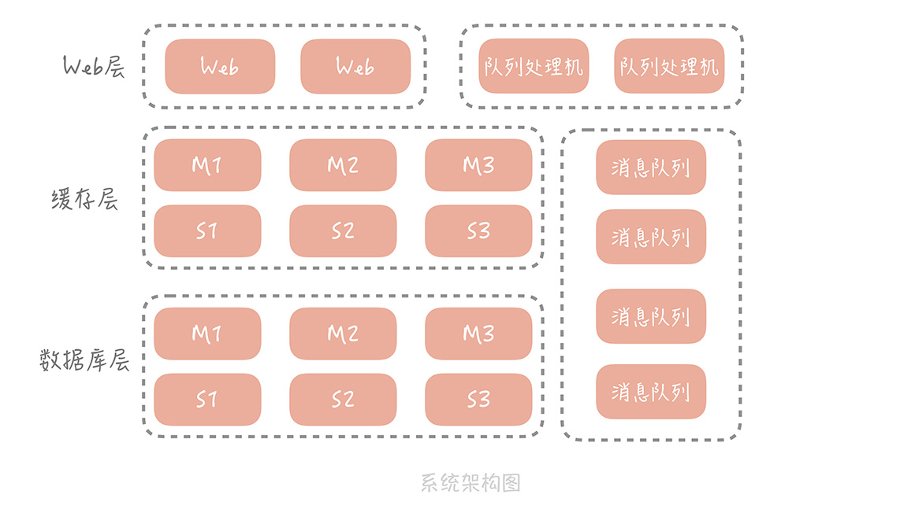
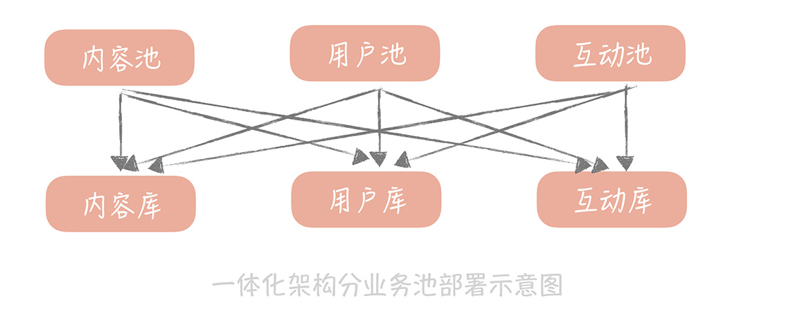

# 21丨系统架构：每秒 1 万次请求的系统要做服务化拆分吗？

通过前面几个篇章的内容，你已经从数据库、缓存和消息队列的角度对自己的垂直电商系统在性能、可用性和扩展性上做了优化。

现在，你的系统运行稳定，好评不断，每天高峰期的流量，已经达到了 10000/s 请求，DAU（（Daily Active User）日活跃用户数量） 也涨到了几十万。CEO 非常高兴，打算继续完善产品功能，以便进行新一轮的运营推广，争取在下个双十一可以将 DAU 冲击过百万。这时，你开始考虑，怎么通过技术上的优化改造，来支撑更高的并发流量，比如支撑过百万的 DAU。

于是，你重新审视了自己的系统架构，分析系统中有哪些可以优化的点。

目前来看，工程的部署方式还是采用一体化架构，也就是说所有的功能模块，比方说电商系统中的订单模块、用户模块、支付模块、物流模块等等，都被打包到一个大的 Web 工程中，然后部署在应用服务器上。

你隐约觉得这样的部署方式可能存在问题，于是，你 Google 了一下，发现当系统发展到一定阶段，都要做微服务化的拆分，你也看到淘宝的「五彩石」项目，对于淘宝整体架构的扩展性，带来的巨大影响。这一切让你心驰神往。

但是有一个问题一直萦绕在你的心里：**究竟是什么促使我们将一体化架构，拆分成微服务化架构？是不是说系统的整体 QPS 到了 1 万，或者到了 2 万，就一定要做微服务化拆分呢？**

## 一体化架构的痛点

先来回想一下，你当初为什么选用了一体化架构。

在电商项目刚刚启动的时候，你只是希望能够尽量快地将项目搭建起来，方便将产品更早地投放市场，快速完成验证。

在系统开发的初期，这种架构确实给你的开发运维，带来了很大的便捷，主要体现在：

- 开发简单直接，代码和项目集中式管理；

- 只需要维护一个工程，节省维护系统运行的人力成本；

- 排查问题的时候，只需要排查这个应用进程就可以了，目标性强。

但随着功能越来越复杂，开发团队规模越来越大，你慢慢感受到了一体化架构的一些缺陷，这主要体现在以下几个方面。

**首先，** 在技术层面上，数据库连接数可能成为系统的瓶颈。

在第 7 讲中我提到，数据库的连接是比较重的一类资源，不仅连接过程比较耗时，而且连接 MySQL 的客户端数量有限制， **最多可以设置为 16384** （在实际的项目中，可以依据实际业务来调整）。

这个数字看着很大，但是因为你的系统是按照一体化架构部署的，在部署结构上没有分层，应用服务器直接连接数据库，那么当前端请求量增加，部署的应用服务器扩容，数据库的连接数也会大增，给你举个例子。

**我之前维护的一个系统中，** 数据库的最大连接数设置为 8000，应用服务器部署在虚拟机上，数量大概是 50 个，每个服务器会和数据库建立 30 个连接，但是数据库的连接数，却远远大于 30 * 50 = 1500。

因为你不仅要支撑来自客户端的外网流量，还要部署单独的应用服务，支撑来自其它部门的内网调用，也要部署队列处理机，处理来自消息队列的消息，这些服务也都是与数据库直接连接的，林林总总加起来，在高峰期的时候，数据库的连接数要接近 3400。

所以，一旦遇到一些大的运营推广活动，服务器就要扩容，数据库连接数也随之增加，基本上就会处在最大连接数的边缘。这就像一颗定时炸弹，随时都会影响服务的稳定。

**第二点，** 一体化架构增加了研发的成本，抑制了研发效率的提升。

> 《人月神话》中曾经提到：一个团队内部沟通成本，和人员数量 n 有关，约等于 n(n-1)/2，也就是说随着团队人员的增加，沟通的成本呈指数级增长，一个 100 人的团队，需要沟通的渠道大概是 100（100-1）/2 = 4950。那么为了减少沟通成本，我们一般会把团队拆分成若干个小团队，每个小团队 5～7 人，负责一部分功能模块的开发和维护。

比方说，你的垂直电商系统团队就会被拆分为用户组、订单组、支付组、商品组等等。当如此多的小团队共同维护一套代码，和一个系统时，在配合时就会出现问题。

不同的团队之间沟通少，假如一个团队需要一个发送短信的功能，那么有的研发同学会认为最快的方式，不是询问其他团队是否有现成的，而是自己写一套，但是这种想法是不合适的，这样一来就会造成功能服务的重复开发。

由于代码部署在一起，每个人都向同一个代码库提交代码，代码冲突无法避免；同时，功能之间耦合严重，可能你只是更改了很小的逻辑，却导致其它功能不可用，从而在测试时需要对整体功能回归，延长了交付时间。

模块之间互相依赖，一个小团队中的成员犯了一个错误，就可能会影响到，其它团队维护的服务，对于整体系统稳定性影响很大。

**第三点， ** 一体化架构对于系统的运维也会有很大的影响。

想象一下，在项目初期，你的代码可能只有几千行，构建一次只需要一分钟，那么你可以很敏捷灵活地频繁上线变更修复问题。但是当你的系统扩充到几十万行，甚至上百万行代码的时候，一次构建的过程，包括编译、单元测试、打包和上传到正式环境，花费的时间可能达到十几分钟，并且，任何小的修改，都需要构建整个项目，上线变更的过程非常不灵活。

而我说的这些问题，都可以通过微服务化拆分来解决。

## 如何使用微服务化解决这些痛点

之前，我在做一个社区业务的时候，开始采用的架构也是一体化的架构，数据库已经做了垂直分库，分出了用户库、内容库和互动库，并且已经将工程拆分了业务池，拆分成了用户池、内容池和互动池。

当前端的请求量越来越大时，我们发现，无论哪个业务池子，用户模块都是请求量最大的模块儿，用户库也是请求量最大的数据库。这很好理解，无论是内容还是互动，都会查询用户库获取用户数据，所以，即使我们做了业务池的拆分，但实际上，每一个业务池子都需要连接用户库，并且请求量都很大，这就造成了用户库的连接数比其它都要多一些，容易成为系统的瓶颈。

**那么我们怎么解决这个问题呢？**

其实，可以把与用户相关的逻辑，部署成一个单独的服务，其它无论是用户池、内容池还是互动池，都连接这个服务来获取和更改用户信息，那么也就是说，只有这个服务可以连接用户库，其它的业务池都不直连用户库获取数据。

由于这个服务只处理和用户相关的逻辑，所以，不需要部署太多的实例就可以承担流量，这样就可以有效地控制用户库的连接数，提升了系统的可扩展性。那么如此一来，我们也可以将内容和互动相关的逻辑，都独立出来，形成内容服务和互动服务，这样，我们就通过 **按照业务做横向拆分** 的方式，解决了数据库层面的扩展性问题。

再比如，我们在做社区业务的时候，会有多个模块需要使用地理位置服务，将 IP 信息或者经纬度信息，转换为城市信息。比如，推荐内容的时候，可以结合用户的城市信息，做附近内容的推荐；展示内容信息的时候，也需要展示城市信息等等。

那么，如果每一个模块都实现这么一套逻辑就会导致代码不够重用。因此，我们可以把将 IP 信息或者经纬度信息，转换为城市信息，包装成单独的服务供其它模块调用，也就是， **我们可以将与业务无关的公用服务抽取出来，下沉成单独的服务。** 

按照以上两种拆分方式将系统拆分之后，每一个服务的功能内聚，维护人员职责明确，增加了新的功能只需要测试自己的服务就可以了，而一旦服务出了问题，也可以通过服务熔断、降级的方式减少对于其他服务的影响（我会在第 34 讲中系统地讲解）。

另外，由于每个服务都只是原有系统的子集，代码行数相比原有系统要小很多，构建速度上也会有比较大的提升。

当然，微服务化之后，原有单一系统被拆分成多个子服务，无论在开发，还是运维上都会引入额外的问题，那么这些问题是什么? 我们将如何解决呢？下一节课，我会带你来了解。

## 课程小结

本节课，我主要带你了解了，实际业务中会基于什么样的考虑，对系统做微服务化拆分，其实，系统的 QPS 并不是决定性的因素。影响的因素，我归纳为以下几点：

- 系统中，使用的资源出现扩展性问题，尤其是数据库的连接数出现瓶颈；

- 大团队共同维护一套代码，带来研发效率的降低，和研发成本的提升；

- 系统部署成本越来越高。