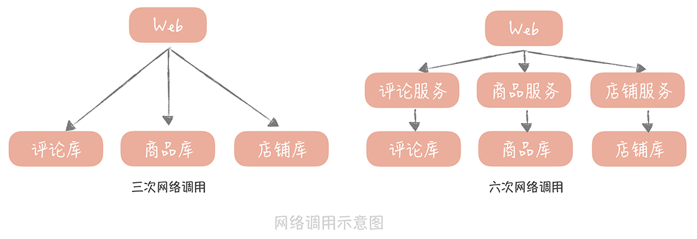
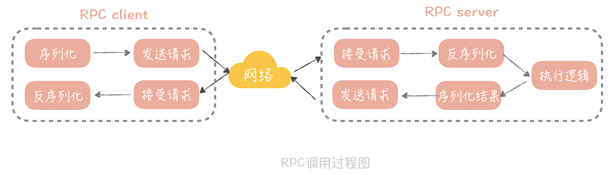

# 23丨RPC框架：10 万 QPS 下如何实现毫秒级的服务调用？

在 21 讲和 22 讲中，你的团队已经决定对垂直电商系统做服务化拆分，以便解决扩展性和研发成本高的问题。与此同时，你们在不断学习的过程中还发现，系统做了服务化拆分之后，会引入一些新的问题，这些问题我在上节课提到过，归纳起来主要是两点：

- 服务拆分单独部署后，引入的服务跨网络通信的问题；

- 在拆分成多个小服务之后，服务如何治理的问题。

如果想要解决这两方面问题，你需要了解，微服务化所需要的中间件的基本原理，和使用技巧，那么本节课，我会带你掌握，解决第一点问题的核心组件： **RPC 框架。**

**来思考这样一个场景： ** 你的垂直电商系统的 QPS 已经达到了每秒 2 万次，在做了服务化拆分之后，由于我们把业务逻辑，都拆分到了单独部署的服务中，那么假设你在完成一次完整的请求时，需要调用 4～5 次服务，计算下来，RPC 服务需要承载大概每秒 10 万次的请求。那么，你该如何设计 RPC 框架，来承载如此大的请求量呢？你要做的是：

- 选择合适的网络模型，有针对性地调整网络参数，以优化网络传输性能；

- 选择合适的序列化方式，以提升封包、解包的性能。

接下来，我从原理出发，让你对于 RPC 有一个理性的认识，这样你在设计 RPC 框架时，就可以清晰地知道自己的设计目标是什么了。

## 你所知道的 RPC

说到 RPC（Remote Procedure Call，远程过程调用），你不会陌生，它指的是通过网络，调用另一台计算机上部署服务的技术。

而 RPC 框架就封装了网络调用的细节，让你像调用本地服务一样，调用远程部署的服务。你也许觉得只有像 Dubbo、Grpc、Thrift 这些新兴的框架才算是 RPC 框架， **其实严格来说，你很早之前就接触到与 RPC 相关的技术了。**

比如，Java 原生就有一套远程调用框架 **叫做 RMI（Remote Method Invocation），**  它可以让 Java 程序通过网络，调用另一台机器上的 Java 对象的方法。它是一种远程调用的方法，也是 J2EE 时代大名鼎鼎的 EJB 的实现基础。

时至今日，你仍然可以通过 Spring 的 `RmiServiceExporter` 将 Spring 管理的 bean 暴露成一个 RMI 的服务，从而继续使用 RMI 来实现跨进程的方法调用。之所以 RMI 没有像 Dubbo，Grpc 一样大火， **是因为它存在着一些缺陷：**

- RMI 使用专为 Java 远程对象定制的协议 JRMP（Java Remote Messaging Protocol）进行通信，这限制了它的通信双方，只能是 Java 语言的程序，无法实现跨语言通信；

- RMI 使用 Java 原生的对象序列化方式，生成的字节数组空间较大，效率很差。

**另一个你可能听过的技术是 Web Service，** 它也可以认为是 RPC 的一种实现方式。它的优势是，使用 HTTP+SOAP 协议，保证了调用可以跨语言，跨平台。只要你支持 HTTP 协议，可以解析 XML，那么就能够使用 Web Service。在我来看，它由于使用 XML 封装数据，数据包大，性能还是比较差。

**借上面几个例子，我主要是想告诉你，** RPC 并不是互联网时代的产物，也不是服务化之后才衍生出来的技术，而是一种规范，只要是封装了网络调用的细节，能够实现远程调用其他服务，就可以算作是一种 RPC 技术了。

那么你的垂直电商项目在使用 RPC 框架之后， **会产生什么变化呢？**

在我来看，在性能上的变化是不可忽视的， **我给你举个例子。**  比方说，你的电商系统中，商品详情页面需要商品数据、评论数据还有店铺数据，如果在一体化的架构中，你只需要从商品库，评论库和店铺库获取数据就可以了，不考虑缓存的情况下有三次网络请求。

但是，如果独立出商品服务、评论服务和店铺服务之后，那么就需要分别调用这三个服务，而这三个服务又会分别调用各自的数据库，这就是六次网络请求。如果你服务拆分的更细粒度，那么多出的网络调用就会越多，请求的延迟就会更长，而这就是你为了提升系统的扩展性，在性能上所付出的代价。

那么，我们要如果优化 RPC 的性能，从而尽量减少网络调用，对于性能的影响呢？在这里，你首先需要了解一次 RPC 的调用都经过了哪些步骤，因为这样，你才可以针对这些步骤中可能存在的性能瓶颈点提出优化方案。 **步骤如下：**

- 在 一次 RPC 调用过程中，客户端首先会将调用的类名、方法名、参数名、参数值等信息，序列化成二进制流；

- 然后客户端将二进制流，通过网络发送给服务端；

- 服务端接收到二进制流之后，将它反序列化，得到需要调用的类名、方法名、参数名和参数值，再通过动态代理的方式，调用对应的方法得到返回值；

- 服务端将返回值序列化，再通过网络发送给客户端；

- 客户端对结果反序列化之后，就可以得到调用的结果了。

**过程图如下：**

从这张图中你可以看到，有网络传输的过程，也有将请求序列化和反序列化的过程， 所以，如果要提升 RPC 框架的性能，需要从 **网络传输和序列化** 两方面来优化。

## 如何提升网络传输性能

在网络传输优化中，你首要做的，是选择一种高性能的 I/O 模型。所谓 I/O 模型，就是我们处理 I/O 的方式。而一般单次 I/O 请求会分为两个阶段，每个阶段对于 I/O 的处理方式是不同的。

**首先，I/O 会经历一个等待资源的阶段，** 比方说，等待网络传输数据可用，在这个过程中我们对 I/O 会有两种处理方式：

- 阻塞。指的是在数据不可用时，I/O 请求一直阻塞，直到数据返回；

- 非阻塞。指的是数据不可用时，I/O 请求立即返回，直到被通知资源可用为止。

**然后是使用资源的阶段，** 比如说从网络上接收到数据，并且拷贝到应用程序的缓冲区里面。在这个阶段我们也会有两种处理方式：

- 同步处理。指的是 I/O 请求在读取或者写入数据时会阻塞，直到读取或者写入数据完成；

- 异步处理。指的是 I/O 请求在读取或者写入数据时立即返回，当操作系统处理完成 I/O 请求，并且将数据拷贝到用户提供的缓冲区后，再通知应用 I/O 请求执行完成。

将这两个阶段的四种处理方式，做一些排列组合，再做一些补充，就得到了我们常见的五种 I/O 模型：

- 同步阻塞 I/O

- 同步非阻塞 I/O

- 同步多路 I/O 复用

- 信号驱动 I/O

- 异步 I/O

这五种 I/O 模型，你需要理解它们的区别和特点，不过在理解上你可能会有些难度，所以我来做个比喻，方便你理解。

我们来把 I/O 过程比喻成烧水倒水的过程，等待资源（就是烧水的过程），使用资源（就是倒水的过程）：

- 如果你站在炤台边上一直等着（等待资源）水烧开，然后倒水（使用资源），那么就是同步阻塞 I/O；

- 如果你偷点儿懒，在烧水的时候躺在沙发上看会儿电视（不再时时刻刻等待资源），但是还是要时不时的去看看水开了没有，一旦水开了，马上去倒水（使用资源），那么这就是同步非阻塞 I/O；

- 如果你想要洗澡，需要同时烧好多壶水，那你就在看电视的间隙去看看哪壶水开了（等待多个资源），哪一壶开了就先倒哪一壶，这样就加快了烧水的速度，这就是同步多路 I/O 复用；

- 不过你发现自己总是跑厨房去看水开了没，太累了，于是你考虑给你的水壶加一个报警器（信号），只要水开了就马上去倒水，这就是信号驱动 I/O；

- 最后一种就高级了，你发明了一个智能水壶，在水烧好后自动就可以把水倒好，这就是异步 I/O。

这五种 I/O 模型中最被广泛使用的是 **多路 I/O 复用，** Linux 系统中的 select、epoll 等系统调用都是支持多路 I/O 复用模型的，Java 中的高性能网络框架 Netty 默认也是使用这种模型。所以，我们可以选择它。

那么，选择好了一种高性能的 I/O 模型，是不是就能实现，数据在网络上的高效传输呢？其实并没有那么简单，网络性能的调优涉及很多方面， **其中不可忽视的一项就是网络参数的调优，** 接下来，我带你了解其中一个典型例子。当然，你可以结合网络基础知识，以及成熟 RPC 框架（比如 Dubbo）的源码来深入了解，网络参数调优的方方面面。

**在之前的项目中，** 我的团队曾经写过一个简单的 RPC 通信框架。在进行测试的时候发现，远程调用一个空业务逻辑的方法时，平均响应时间居然可以到几十毫秒，这明显不符合我们的预期，在我们看来，运行一个空的方法，应该在 1 毫秒之内可以返回。于是，我先在测试的时候使用 tcpdump 抓了包，发现一次请求的 Ack 包竟然要经过 40ms 才返回。在网上 google 了一下原因，发现原因和一个叫做 tcp_nodelay 的参数有关。 **这个参数是什么作用呢？**

tcp 协议的包头有 20 字节，ip 协议的包头也有 20 字节，如果仅仅传输 1 字节的数据，在网络上传输的就有 20 + 20 + 1 = 41 字节，其中真正有用的数据只有 1 个字节，这对效率和带宽是极大的浪费。所以在 1984 年的时候，John Nagle 提出了以他的名字命名的 Nagle`s 算法， **他期望：**

> 如果是连续的小数据包，大小没有一个 MSS（Maximum Segment Size，最大分段大小），并且还没有收到之前发送的数据包的 Ack 信息，那么这些小数据包就会在发送端暂存起来，直到小数据包累积到一个 MSS，或者收到一个 Ack 为止。

这原本是为了减少不必要的网络传输，但是如果接收端开启了 DelayedACK（延迟 ACK 的发送，这样可以合并多个 ACK，提升网络传输效率），**那就会发生，** 发送端发送第一个数据包后，接收端没有返回 ACK，这时发送端发送了第二个数据包，因为 Nagle`s 算法的存在，并且第一个发送包的 ACK 还没有返回，所以第二个包会暂存起来。而 DelayedACK 的超时时间，默认是 40ms，所以一旦到了 40ms，接收端回给发送端 ACK，那么发送端才会发送第二个包， **这样就增加了延迟。**

**解决的方式非常简单：** 只要在 socket 上开启 tcp_nodelay 就好了，这个参数关闭了 Nagle`s 算法，这样发送端就不需要等到上一个发送包的 ACK 返回，直接发送新的数据包就好了。这对于强网络交互的场景来说非常的适用，基本上，如果你要自己实现一套网络框架，tcp_nodelay 这个参数最好是要开启的。

## 选择合适的序列化方式

在对网络数据传输完成调优之后，另外一个需要关注的点就是， **数据的序列化和反序列化。** 通常所说的序列化，是将传输对象转换成二进制串的过程，而反序列化则是相反的动作，是将二进制串转换成对象的过程。

从上面的 RPC 调用过程中你可以看到，一次 RPC 调用需要经历两次数据序列化的过程，和两次数据反序列化的过程，可见它们对于 RPC 的性能影响是很大的， **那么我们在选择序列化方式的时候需要考虑哪些因素呢？**

首先需要考虑的肯定是性能嘛，性能包括时间上的开销和空间上的开销，时间上的开销就是序列化和反序列化的速度，这是显而易见需要重点考虑的，而空间上的开销则是序列化后的二进制串的大小，过大的二进制串也会占据传输带宽，影响传输效率。

除去性能之外，我们需要考虑的是它是否可以跨语言，跨平台，这一点也非常重要，因为一般的公司的技术体系都不是单一的，使用的语言也不是单一的，那么如果你的 RPC 框架中传输的数据只能被一种语言解析，那么这无疑限制了框架的使用。

另外，扩展性也是一个需要考虑的重点问题。你想想，如果对象增加了一个字段就会造成传输协议的不兼容，导致服务调用失败，这会是多么可怕的事情。

综合上面的几个考虑点，在我看来， **我们的序列化备选方案主要有以下几种：**

首先是大家熟知的 JSON，它起源于 JavaScript，是一种最广泛使用的序列化协议，它的优势简单易用，人言可读，同时在性能上相比 XML 有比较大的优势。

另外的 Thrift 和 Protobuf 都是需要引入 IDL（Interface description language）的，也就是需要按照约定的语法写一个 IDL 文件，然后通过特定的编译器将它转换成各语言对应的代码，从而实现跨语言的特点。

**Thrift** 是 Facebook 开源的高性能的序列化协议，也是一个轻量级的 RPC 框架；**Protobuf** 是谷歌开源的序列化协议。它们的共同特点是，无论在空间上还是时间上都有着很高的性能，缺点就是由于 IDL 存在带来一些使用上的不方便。

那么，你要如何选择这几种序列化协议呢？ **这里我给你几点建议：**

- 如果对于性能要求不高，在传输数据占用带宽不大的场景下，可以使用 JSON 作为序列化协议；

- 如果对于性能要求比较高，那么使用 Thrift 或者 Protobuf 都可以。而 Thrift 提供了配套的 RPC 框架，所以想要一体化的解决方案，你可以优先考虑 Thrift；

- 在一些存储的场景下，比如说你的缓存中存储的数据占用空间较大，那么你可以考虑使用 Protobuf 替换 JSON，作为存储数据的序列化方式。

## 课程小结

为了优化 RPC 框架的性能，本节课，我带你了解了网络 I/O 模型和序列化方式的选择，它们是实现高并发 RPC 框架的要素，总结起来有三个要点：

1. 选择高性能的 I/O 模型，这里我推荐使用同步多路 I/O 复用模型；

2. 调试网络参数，这里面有一些经验值的推荐。比如将 tcp_nodelay 设置为 true，也有一些参数需要在运行中来调试，比如接受缓冲区和发送缓冲区的大小，客户端连接请求缓冲队列的大小（back log）等等；

3. 序列化协议依据具体业务来选择。如果对性能要求不高，可以选择 JSON，否则可以从 Thrift 和 Protobuf 中选择其一。

在学习本节课的过程中，我建议你阅读一下，成熟的 RPC 框架的源代码。比如，阿里开源的 Dubbo，微博的 Motan 等等，理解它们的实现原理和细节，这样你会更有信心维护好你的微服务系统；同时，你也可以从优秀的代码中，学习到代码设计的技巧，比如说 Dubbo 对于 RPC 的抽象，SPI 扩展点的设计，这样可以有助你提升代码能力。

当然了，本节课我不仅仅想让你了解 RPC 框架实现的一些原理，更想让你了解在做网络编程时，需要考虑哪些关键点，这样你在设计此类型的系统时，就会有一些考虑的方向和思路了。

## 一课一思

你在实际的工作中可能已经使用过一些 RPC 框架，那么结合你的实际经验，可以和我说说在 RPC 框架使用过程中，遇到了哪些问题吗？又是如何排查和解决的呢？