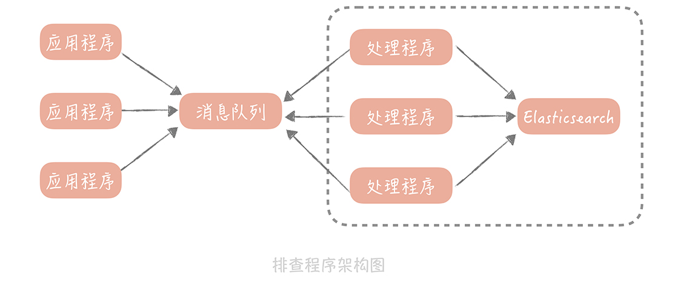

# 25丨分布式 Trace：横跨几十个分布式组件的慢请求要如何排查？

经过前面几节课的学习，你的垂直电商系统在引入 RPC 框架，和注册中心之后已经完成基本的服务化拆分了，系统架构也有了改变：


现在，你的系统运行平稳，老板很高兴，你也安心了很多。而且你认为，在经过了服务化拆分之后，服务的可扩展性增强了很多，可以通过横向扩展服务节点的方式，进行平滑地扩容了，对于应对峰值流量也更有信心了。

**但是这时出现了问题：** 你通过监控发现，系统的核心下单接口在晚高峰的时候，会有少量的慢请求，用户也投诉在 APP 上下单时，等待的时间比较长。而下单的过程可能会调用多个 RPC 服务，或者使用多个资源，一时之间，你很难快速判断，究竟是哪个服务或者资源出了问题，从而导致整体流程变慢， **于是，你和你的团队开始想办法如何排查这个问题。**

## 一体化架构中的慢请求排查如何做

因为在分布式环境下，请求要在多个服务之间调用，所以对于慢请求问题的排查会更困难， **我们不妨从简单的入手，** 先看看在一体化架构中，是如何排查这个慢请求的问题的。

最简单的思路是：打印下单操作的每一个步骤的耗时情况，然后通过比较这些耗时的数据，找到延迟最高的一步，然后再来看看这个步骤要如何的优化。如果有必要的话，你还需要针对步骤中的子步骤，再增加日志来继续排查， **简单的代码就像下面这样：**

```java
long start = System.currentTimeMillis();
processA();
Logs.info("process A cost " + (System.currentTimeMillis() - start));// 打印 A 步骤的耗时
start = System.currentTimeMillis();
processB();
Logs.info("process B cost " + (System.currentTimeMillis() - start));// 打印 B 步骤的耗时
start = System.currentTimeMillis();
processC();
Logs.info("process C cost " + (System.currentTimeMillis() - start));// 打印 C 步骤的耗时
```

这是最简单的实现方式，打印出日志后，我们可以登录到机器上，搜索关键词来查看每个步骤的耗时情况。

**虽然这个方式比较简单，但你可能很快就会遇到问题：** 由于同时会有多个下单请求并行处理，所以，这些下单请求的每个步骤的耗时日志，是相互穿插打印的。你无法知道这些日志，哪些是来自于同一个请求，也就不能很直观地看到，某一次请求耗时最多的步骤是哪一步了。那么，你要如何把单次请求，每个步骤的耗时情况串起来呢？

**一个简单的思路是：** 给同一个请求的每一行日志，增加一个相同的标记。这样，只要拿到这个标记就可以查询到这个请求链路上，所有步骤的耗时了，我们把这个标记叫做 **requestId**，我们可以在程序的入口处生成一个 requestId，然后把它放在线程的上下文中，这样就可以在需要时，随时从线程上下文中获取到 requestId 了。简单的代码实现就像下面这样：

```java

String requestId = UUID.randomUUID().toString();
ThreadLocal<String> tl = new ThreadLocal<String>(){
    @Override
    protected String initialValue() {
        return requestId;
    }
}; //requestId 存储在线程上下文中
long start = System.currentTimeMillis();
processA();
Logs.info("rid : " + tl.get() + ", process A cost " + (System.currentTimeMillis() - start)); // 日志中增加 requestId
start = System.currentTimeMillis();
processB();
Logs.info("rid : " + tl.get() + ", process B cost " + (System.currentTimeMillis() - start));
start = System.currentTimeMillis();
processC();
Logs.info("rid : " + tl.get() + ", process C cost " + (System.currentTimeMillis() - start));
```

有了 requestId，你就可以清晰地了解一个调用链路上的耗时分布情况了。

于是，你给你的代码增加了大量的日志，来排查下单操作缓慢的问题。 **很快，**  你发现是某一个数据库查询慢了才导致了下单缓慢，然后你优化了数据库索引，问题最终得到了解决。

**正当你要松一口气的时候，问题接踵而至：** 又有用户反馈某些商品业务打开缓慢；商城首页打开缓慢。你开始焦头烂额地给代码中增加耗时日志，而这时你意识到，每次排查一个接口就需要增加日志、重启服务， **这并不是一个好的办法，于是你开始思考解决的方案。**

**其实，从我的经验出发来说，** 一个接口响应时间慢，一般是出在跨网络的调用上，比如说请求数据库、缓存或者依赖的第三方服务。所以，我们只需要针对这些调用的客户端类，做切面编程，通过插入一些代码打印它们的耗时就好了。

说到切面编程（AOP）你应该并不陌生，它是面向对象编程的一种延伸，可以在不修改源代码的前提下，给应用程序添加功能，比如说鉴权，打印日志等等。如果你对切面编程的概念理解的还不透彻，那我给你做个比喻， **帮你理解一下。**

这就像开发人员在向代码仓库提交代码后，他需要对代码编译、构建、执行单元测试用例，以保证提交的代码是没有问题的。但是，如果每个人提交了代码都做这么多事儿，无疑会对开发同学造成比较大的负担，那么你可以配置一个持续集成的流程，在提交代码之后，自动帮你完成这些操作，这个持续集成的流程就可以认为是一个切面。

**一般来说，切面编程的实现分为两类：**

- 一类是静态代理，典型的代表是 AspectJ，它的特点是在编译期做切面代码注入；

- 另一类是动态代理，典型的代表是 Spring AOP，它的特点是在运行期做切面代码注入。

**这两者有什么差别呢？** 以 Java 为例，源代码 Java 文件先被 Java 编译器，编译成 Class 文件，然后 Java 虚拟机将 Class 装载进来之后，进行必要的验证和初始化后就可以运行了。

静态代理是在编译期插入代码，增加了编译的时间，给你的直观感觉就是启动的时间变长了，但是一旦在编译期插入代码完毕之后，在运行期就基本对于性能没有影响。

而动态代理不会去修改生成的 Class 文件，而是会在运行期生成一个代理对象，这个代理对象对源对象做了字节码增强，来完成切面所要执行的操作。由于在运行期需要生成代理对象，所以动态代理的性能要比静态代理要差。

我们做切面的原因，是想生成一些调试的日志，所以我们期望尽量减少对于原先接口性能的影响。 **因此，我推荐采用静态代理的方式，实现切面编程。**

如果你的系统中需要增加切面，来做一些校验、限流或者日志打印的工作， **我也建议你考虑使用静态代理的方式，** 使用 AspectJ 做切面的简单代码实现就像下面这样：

```java
@Aspect
public class Tracer {
    @Around(value = "execution(public methodsig)", argNames = "pjp") //execution 内替换要做切面的方法签名
    public Object trace(ProceedingJoinPoint pjp) throws Throwable {
        TraceContext traceCtx = TraceContext.get(); // 获取追踪上下文，上下文的初始化可以在程序入口处
        String requestId = reqCtx.getRequestId(); // 获取 requestId
        String sig = pjp.getSignature().toShortString(); // 获取方法签名
        boolean isSuccessful = false;
        String errorMsg = "";
        Object result = null;
        long start = System.currentTimeMillis();
        try {
            result = pjp.proceed();
            isSuccessful = true;
            return result;
        } catch (Throwable t) {
            isSuccessful = false;
            errorMsg = t.getMessage();
            return result;
        } finally {
            long elapseTime = System.currentTimeMillis() - start;
            Logs.info("rid : " + requestId + ", start time: " + start + ", elapseTime: " + elapseTime + ", sig: " + sig + ", isSuccessful: " + isSuccessful + ", errorMsg: " + errorMsg  );
        }
    }
}
```

这样，你就在你的系统的每个接口中，打印出了所有访问数据库、缓存、外部接口的耗时情况，一次请求可能要打印十几条日志，如果你的电商系统的 QPS 是 10000 的话，就是每秒钟会产生十几万条日志，对于磁盘 I/O 的负载是巨大的， **那么这时，你就要考虑如何减少日志的数量。**

**你可以考虑对请求做采样，** 采样的方式也简单，比如你想采样 10% 的日志，那么你可以只打印 `requestId%10==0` 的请求。

有了这些日志之后，当给你一个 requestId 的时候，你发现自己并不能确定这个请求到了哪一台服务器上，所以你不得不登陆所有的服务器，去搜索这个 requestId 才能定位请求。**这样无疑会增加问题排查的时间。**

**你可以考虑的解决思路是：** 把日志不打印到本地文件中，而是发送到消息队列里，再由消息处理程序写入到集中存储中，比如 Elasticsearch。这样，你在排查问题的时候，只需要拿着 requestId 到 Elasticsearch 中查找相关的记录就好了。在加入消息队列和 Elasticsearch 之后，我们这个排查程序的架构图也会有所改变：



我来总结一下，为了排查单次请求响应时间长的原因，我们主要做了哪些事情：

1. 在记录打点日志时，我们使用 requestId 将日志串起来，这样方便比较一次请求中的多个步骤的耗时情况；

2. 我们使用静态代理的方式做切面编程，避免在业务代码中，加入大量打印耗时的日志的代码，减少了对于代码的侵入性，同时编译期的代码注入可以减少；

3. 我们增加了日志采样率，避免全量日志的打印；

4. 最后为了避免在排查问题时，需要到多台服务器上搜索日志，我们使用消息队列，将日志集中起来放在了 Elasticsearch 中。

## 如何来做分布式 Trace

你可能会问：题目既然是「分布式 Trace：横跨几十个分布式组件的慢请求要如何排查？」，那么我为什么要花费大量的篇幅，来说明在一体化架构中如何排查问题呢？ **这是因为在分布式环境下，** 你基本上也是依据上面，我提到的这几点来构建分布式追踪的中间件的。

在一体化架构中，单次请求的所有的耗时日志，都被记录在一台服务器上，而在微服务的场景下，单次请求可能跨越多个 RPC 服务，这就造成了，单次的请求的日志会分布在多个服务器上。

当然，你也可以通过 requestId 将多个服务器上的日志串起来，但是仅仅依靠 requestId 很难表达清楚服务之间的调用关系，所以从日志中，就无法了解服务之间是谁在调用谁。因此，我们采用  `traceId + spanId`  这两个数据维度来记录服务之间的调用关系（这里 traceId 就是 requestId），也就是使用 traceId 串起单次请求，用 spanId 记录每一次 RPC 调用。  **说起来可能比较抽象，我给你举一个具体的例子。**

比如，你的请求从用户端过来，先到达 A 服务，A 服务会分别调用 B 和 C 服务，B 服务又会调用 D 和 E 服务。


我来给你讲讲图中的内容：

- 用户到 A 服务之后会初始化一个 traceId 为 100，spanId 为 1；

- A 服务调用 B 服务时，traceId 不变，而 spanId 用 1.1 标识，代表上一级的 spanId 是 1，这一级的调用次序是 1；

- A 调用 C 服务时，traceId 依然不变，spanId 则变为了 1.2，代表上一级的 spanId 还是 1，而调用次序则变成了 2，以此类推。

通过这种方式，我们可以在日志中，清晰地看出服务的调用关系是如何的，方便在后续计算中调整日志顺序，打印出完整的调用链路。

**那么 spanId 是何时生成的，又是如何传递的呢？** 这部分内容可以算作一个延伸点，能够帮你了解分布式 trace 中间件的实现原理。

首先，A 服务在发起 RPC 请求服务 B 前，先从线程上下文中获取当前的 traceId 和 spanId，然后，依据上面的逻辑生成本次 RPC 调用的 spanId，再将 spanId 和 traceId 序列化后，装配到请求体中，发送给服务方 B。

服务方 B 获取请求后，从请求体中反序列化出 spanId 和 traceId，同时设置到线程上下文中，以便给下次 RPC 调用使用。在服务 B 调用完成返回响应前，计算出服务 B 的执行时间发送给消息队列。

当然，在服务 B 中，你依然可以使用切面编程的方式，得到所有调用的数据库、缓存、HTTP 服务的响应时间，只是在发送给消息队列的时候，要加上当前线程上下文中的 spanId 和 traceId。

这样，无论是数据库等资源的响应时间，还是 RPC 服务的响应时间就都汇总到了消息队列中，在经过一些处理之后，最终被写入到 Elasticsearch 中以便给开发和运维同学查询使用。

而在这里，你大概率会遇到的问题还是性能的问题，也就是因为引入了分布式追踪中间件，导致对于磁盘 I/O 和网络 I/O 的影响， **而我给你的「避坑」指南就是：**  如果你是自研的分布式 trace 中间件，那么一定要提供一个开关，方便在线上随时将日志打印关闭；如果使用开源的组件，可以开始设置一个较低的日志采样率，观察系统性能情况再调整到一个合适的数值。

## 课程小结

本节课我带你了解了在一体化架构和服务化架构中，你要如何排查单次慢请求中，究竟哪一个步骤是瓶颈，这里你需要了解的主要有以下几个重点：

- 服务的追踪的需求主要有两点：
  - 一点对代码要无侵入，你可以使用切面编程的方式来解决；
  - 另一点是性能上要低损耗，我建议你采用静态代理和日志采样的方式，来尽量减少追踪日志对于系统性能的影响；

- 无论是单体系统还是服务化架构，无论是服务追踪还是业务问题排查，你都需要在日志中增加 requestId，这样可以将你的日志串起来，给你呈现一个完整的问题场景。如果 requestId 可以在客户端上生成，在请求业务接口的时候传递给服务端，那么就可以把客户端的日志体系也整合进来，对于问题的排查帮助更大。

其实，分布式追踪系统不是一项新的技术，而是若干项已有技术的整合，在实现上并不复杂，却能够帮助你实现跨进程调用链展示、服务依赖分析，在性能优化和问题排查方面提供数据上的支持。所以，在微服务化过程中，它是一个必选项，无论是采用 Zipkin，Jaeger 这样的开源解决方案，还是团队内自研，你都应该在微服务化完成之前，尽快让它发挥应有的价值。

## 一课一思

你在项目中是否接入过分布式追踪系统呢？在使用过程中它帮助你排查了哪些问题呢？