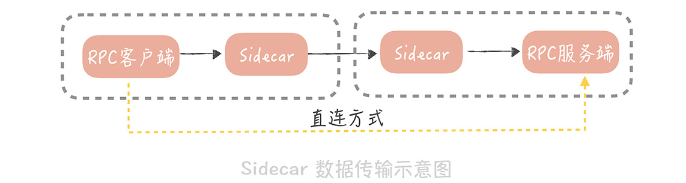
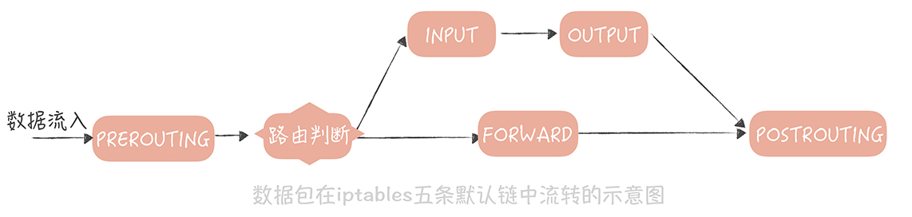
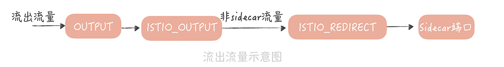
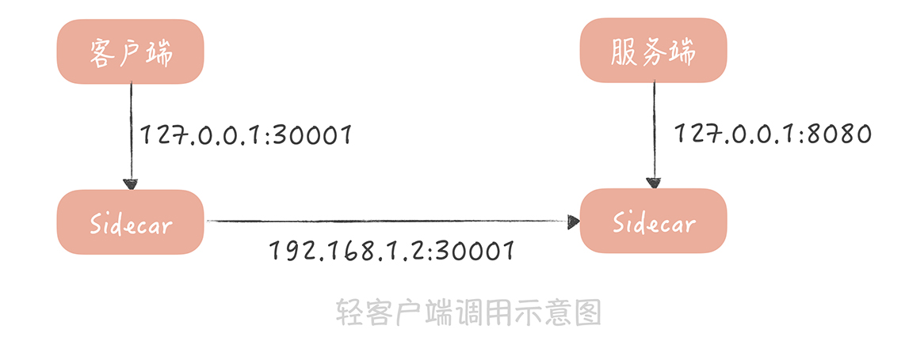

# 29丨ServiceMesh：如何屏蔽服务化系统的服务治理细节？

在分布式服务篇的前几节课程中，我带你了解了在微服务化过程中，要使用哪些中间件解决服务之间通信和服务治理的问题，其中就包括：

- 用 RPC 框架解决服务通信的问题；

- 用注册中心解决服务注册，和发现的问题；

- 使用分布式 Trace 中间件，排查跨服务调用慢请求；

- 使用负载均衡服务器，解决服务扩展性的问题；

- 在 API 网关中植入服务熔断、降级和流控等服务治理的策略。

经历了这几环之后，你的垂直电商系统基本上，已经完成了微服务化拆分的改造。不过，目前来看，你的系统使用的语言还是以 Java 为主，之前提到的服务治理的策略，和服务之间通信协议也是使用 Java 语言来实现的。

**那么这会存在一个问题：** 一旦你的团队中，有若干个小团队开始尝试使用 Go 或者 PHP，来开发新的微服务，那么在微服务化过程中，一定会受到挑战。

## 跨语言体系带来的挑战

其实，一个公司的不同团队，使用不同的开发语言是比较常见的。比如，微博的主要开发语言是 Java 和 PHP，近几年也有一些使用 Go 开发的系统。而使用不同的语言开发出来的微服务， **在相互调用时会存在两方面的挑战：**

一方面，服务之间的通信协议上，要对多语言友好，要想实现跨语言调用，关键点是选择合适的序列化方式。 **我给你举一个例子。**

比如，你用 Java 开发一个 RPC 服务，使用的是 Java 原生的序列化方式，这种序列化方式对于其它语言并不友好，那么，你使用其它语言，调用这个 RPC 服务时，就很难解析序列化之后的二进制流。 **所以，我建议你，** 在选择序列化协议时，考虑序列化协议是否对多语言友好，比如，你可以选择 Protobuf、Thrift，这样一来，跨语言服务调用的问题，就可以很容易地解决了。

另一方面，使用新语言开发的微服务，无法使用之前积累的，服务治理的策略。比如说，RPC 客户端在使用注册中心，订阅服务的时候，为了避免每次 RPC 调用都要与注册中心交互，一般会在 RPC 客户端，缓存节点的数据。如果注册中心中的服务节点发生了变更，那么 RPC 客户端的节点缓存会得到通知，并且变更缓存数据。

而且，为了减少注册中心的访问压力，在 RPC 客户端上，我们一般会考虑使用多级缓存（内存缓存和文件缓存）来保证节点缓存的可用性。而这些策略在开始的时候，都是使用 Java 语言来实现的，并且封装在注册中心客户端里，提供给 RPC 客户端使用。如果更换了新的语言，这些逻辑就都要使用新的语言实现一套。

除此之外，负载均衡、熔断降级、流量控制、打印分布式追踪日志等等，这些服务治理的策略都需要重新实现，而使用其它语言重新实现这些策略无疑会带来巨大的工作量，也是中间件研发中，一个很大的痛点。

那么，你要如何屏蔽服务化架构中，服务治理的细节，或者说， **如何让服务治理的策略在多语言之间复用呢？**

可以考虑将服务治理的细节，从 RPC 客户端中拆分出来，形成一个代理层单独部署。这个代理层可以使用单一的语言实现，所有的流量都经过代理层，来使用其中的服务治理策略。这是一种 **关注点分离** 的实现方式，**也是 Service Mesh 的核心思想。**

## Service Mesh 是如何工作的

### 1. 什么是 Service Mesh

Service Mesh 主要处理服务之间的通信，它的主要实现形式就是在应用程序同主机上部署一个代理程序，一般来讲，我们将这个代理程序称为 **Sidecar（边车）**，服务之间的通信也从之前的，客户端和服务端直连，变成了下面这种形式：



在这种形式下，RPC 客户端将数据包先发送给，与自身同主机部署的 Sidecar，在 Sidecar 中经过服务发现、负载均衡、服务路由、流量控制之后，再将数据发往指定服务节点的 Sidecar，在服务节点的 Sidecar 中，经过记录访问日志、记录分布式追踪日志、限流之后，再将数据发送给 RPC 服务端。

这种方式，可以把业务代码和服务治理的策略隔离开，将服务治理策略下沉，让它成为独立的基础模块。这样一来，不仅可以实现跨语言，服务治理策略的复用，还能对这些 Sidecar 做统一的管理。

**目前，业界提及最多的 Service Mesh 方案当属 istio ** ，它的玩法是这样的：


它将组件分为 **数据平面** 和 **控制平面**：

- 数据平面就是我提到的 Sidecar（Istio 使用 Envoy 作为 Sidecar 的实现）。
- 控制平面主要负责服务治理策略的执行，在 Istio 中，主要分为 Mixer、Pilot 和 Istio-auth 三部分。

你可以先不了解每一部分的作用，只知道它们共同构成了服务治理体系就可以了。

然而，在 Istio 中，每次请求都需要经过控制平面，也就是说，每次请求都需要跨网络的调用 Mixer，这会极大地影响性能。

因此，国内大厂开源出来的 Service Mesh 方案中，一般只借鉴 Istio 的数据平面和控制平面的思路，然后将服务治理策略做到了 Sidecar 中，控制平面只负责策略的下发，这样就不需要每次请求都经过控制平面，性能上会改善很多。

### 2. 如何将流量转发到 Sidecar 中

在 Service Mesh 的实现中，一个主要的问题，是如何尽量无感知地引入 Sidecar 作为网络代理，也就是说，无论是数据流入还是数据流出时，都要将数据包重定向到 Sidecar 的端口上。 **实现思路一般有两个：**

第一种，**使用 iptables 的方式来实现流量透明的转发** ，而 Istio 就默认了，使用 iptables 来实现数据包的转发。为了能更清晰的说明流量转发的原理，我们先简单地回顾一下什么是 iptables。

Iptables 是 Linux 内核中，防火墙软件 Netfilter 的管理工具，它位于用户空间，可以控制 Netfilter，实现地址转换的功能。在 iptables 中默认有五条链，你可以把这五条链，当作数据包流转过程中的五个步骤，依次为 PREROUTING，INPUT，FORWARD，OUTPUT 和 POSTROUTING。数据包传输的大体流程如下：



从图中可以看到，数据包以 PREROUTING 链作为入口，当数据包目的地为本机时，它们也都会流经到 OUTPUT 链。所以，我们可以在这两个链上，增加一些规则，将数据包重定向。我以 Istio 为例，带你看看如何使用 iptables 实现流量转发。

在 Istio 中，有一个叫做 `istio-iptables.sh` 的脚本，这个脚本在 Sidecar 被初始化的时候执行，主要是设置一些 iptables 规则。

我摘录了一些关键点来说明一下：

```bash
# 流出流量处理
iptables -t nat -N ISTIO_REDIRECT   # 增加 ISTIO_REDIRECT 链处理流出流量
iptables -t nat -A ISTIO_REDIRECT -p tcp -j REDIRECT --to-port "${PROXY_PORT}" # 重定向流量到 Sidecar 的端口上
iptables -t nat -N ISTIO_OUTPUT # 增加 ISTIO_OUTPUT 链处理流出流量
iptables -t nat -A OUTPUT -p tcp -j ISTIO_OUTPUT # 将 OUTPUT 链的流量重定向到 ISTIO_OUTPUT 链上
for uid in ${PROXY_UID}; do
	# Sidecar 本身的流量不转发
    iptables -t nat -A ISTIO_OUTPUT -m owner --uid-owner "${uid}" -j RETURN 
done
for gid in ${PROXY_GID}; do
	# Sidecar 本身的流量不转发
    iptables -t nat -A ISTIO_OUTPUT -m owner --gid-owner "${gid}" -j RETURN  
done
iptables -t nat -A ISTIO_OUTPUT -j ISTIO_REDIRECT # 将 ISTIO_OUTPUT 链的流量转发到 ISTIO_REDIRECT

# 流入流量处理
iptables -t nat -N ISTIO_IN_REDIRECT  # 增加 ISTIO_IN_REDIRECT 链处理流入流量
iptables -t nat -A ISTIO_IN_REDIRECT -p tcp -j REDIRECT --to-port "${PROXY_PORT}" # 将流入流量重定向到 Sidecar 端口
iptables -t ${table} -N ISTIO_INBOUND # 增加 ISTIO_INBOUND 链处理流入流量
iptables -t ${table} -A PREROUTING -p tcp -j ISTIO_INBOUND # 将 PREROUTING 的流量重定向到 ISTIO_INBOUND 链
iptables -t nat -A ISTIO_INBOUND -p tcp --dport "${port}" -j ISTIO_IN_REDIRECT # 将 ISTIO_INBOUND 链上指定目的端口的流量重定向到 ISTIO_IN_REDIR
```

假设服务的节点部署在 9080 端口上，Sidecar 开发的端口是 15001，那么流入流量的流向如下：


流出流量的流量图如下：



**Iptables 方式的优势在于，** 对于业务完全透明，业务甚至不知道有 Sidecar 存在，这样会减少业务接入的时间。不过，它也有缺陷，那就是它是在高并发下，性能上会有损耗，因此国内大厂采用了另外一种方式： **轻量级客户端。**

在这种方式下，RPC 客户端会通过配置的方式，知道 Sidecar 的部署端口，然后通过一个轻量级客户端，将调用服务的请求发送给 Sidecar，Sidecar 在转发请求之前，先执行一些服务治理的策略，比如说，从注册中心中，查询到服务节点信息并且缓存起来，然后从服务节点中，使用某种负载均衡的策略选出一个节点等等。

请求被发送到服务端的 Sidecar 上后，然后在服务端记录访问日志，和分布式追踪日志，再把请求转发到真正的服务节点上。当然，服务节点在启动时，会委托服务端 Sidecar，向注册中心注册节点，Sidecar 也就知道了真正服务节点部署的端口是多少。整个请求过程如图所示：



当然，除了 iptables 和轻量级客户端两种方式外，目前在探索的方案还有 Cilium，这个方案可以从 Socket 层面实现请求的转发，也就可以避免 iptables 方式在性能上的损耗。 **在这几种方案中，我建议你使用轻量级客户端的方式，** 这样虽然会有一些改造成本，但是却在实现上最简单，可以快速的让 Service Mesh 在你的项目中落地。

当然，无论采用哪种方式，你都可以实现将 Sidecar 部署到，客户端和服务端的调用链路上，让它代理进出流量，这样，你就可以使用运行在 Sidecar 中的服务治理的策略了。至于这些策略我在前面的课程中都带你了解过（你可以回顾 23 至 26 讲的课程），这里就不再赘述了。

与此同时，我也建议你了解目前业界一些开源的 Service Mesh 框架，这样在选择方案时可以多一些选择。目前在开源领域比较成熟的 Service Mesh 框架有下面几个，你可以通过阅读它们的文档来深入了解，作为本节课的引申阅读。

- Istio 这个框架在业界最为著名，它提出了数据平面和控制平面的概念，是 Service Mesh 的先驱，缺陷就是刚才提到的 Mixer 的性能问题。

- Linkerd 是第一代的 Service Mesh，使用 Scala 语言编写，其劣势就是内存的占用。

- SOFAMesh 是蚂蚁金服开源的 Service Mesh 组件，在蚂蚁金服已经有大规模落地的经验。

## 课程小结

本节课，为了解决跨语言场景下，服务治理策略的复用问题，我带你了解了什么是 Service Mesh 以及如何在实际项目中落地，你需要的重点内容如下：

1. Service Mesh 分为数据平面和控制平面。数据平面主要负责数据的传输；控制平面用来控制服务治理策略的植入。出于性能的考虑，一般会把服务治理策略植入到数据平面中，控制平面负责服务治理策略数据的下发。

2. Sidecar 的植入方式目前主要有两种实现方式，一种是使用 iptables 实现流量的劫持；另一种是通过轻量级客户端来实现流量转发。

目前，在一些大厂中，比如微博、蚂蚁金服，Service Mesh 已经开始在实际项目中大量的落地实践，而我建议你持续关注这项技术。它本身是一种将业务与通信基础设施分离的技术，如果你的业务上遇到多语言环境下，服务治理的困境，如果你的遗留服务，需要快速植入服务治理策略，如果你想要将你在服务治理方面积累的经验，快速地与其他团队共享，那么 Service Mesh 就是你的一个不错的选择。

## 一课一思

你在实际的工作中，是否使用过 Service Mesh 解决过，跨语言的服务治理的问题呢？

## 拓展阅读

- istio 中需要使用 Kubernetes 这个，必须这样？

  现在是的

- istio 和 spring boot 有联系和区别吗

  他们应该不是一个东西，istio 是 service mesh 的实现，spring boot 是开发框架

