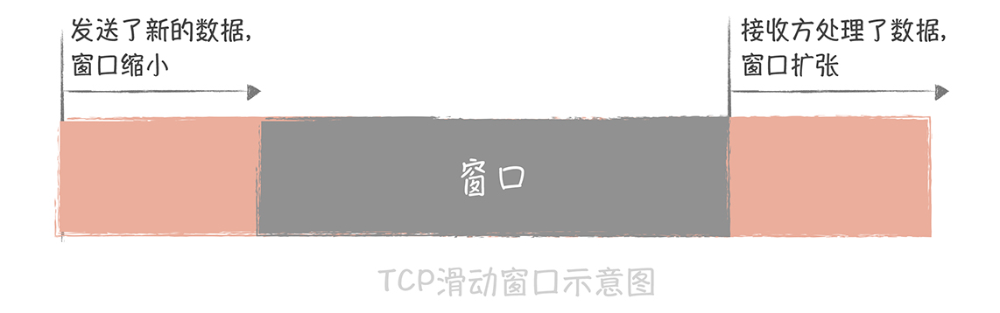
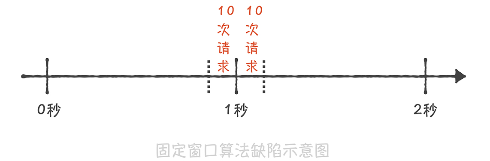
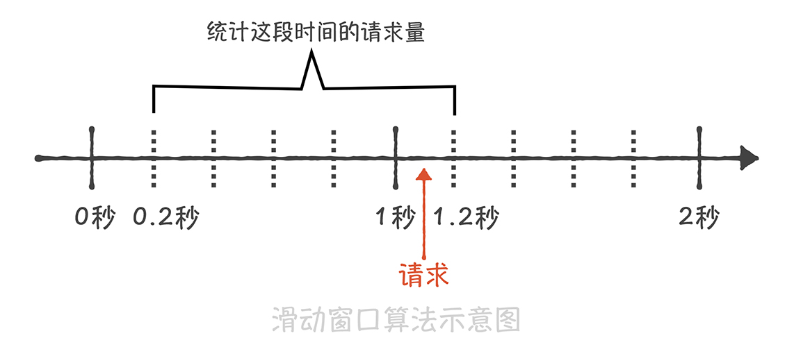
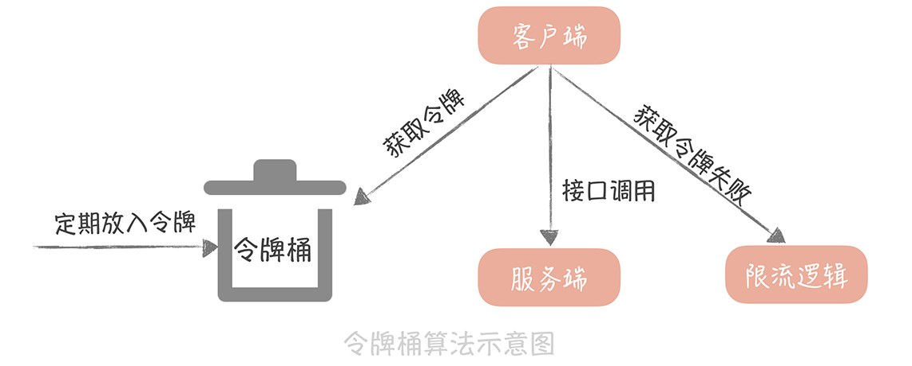

# 35丨流量控制：高并发系统中我们如何操纵流量？

上一节课里，我带你了解了微服务架构中常见的 **两种有损的服务保护策略：熔断和降级**。它们都是通过暂时关闭某些非核心服务或者组件从而保护核心系统的可用性。但是，**并不是所有的场景下都可以使用熔断降级的策略 **，比如，电商系统在双十一、618 大促的场景。

这种场景下，系统的峰值流量会超过了预估的峰值，对于核心服务也产生了比较大的影响，而你总不能把核心服务整体降级吧？那么在这个时候要如何保证服务的稳定性呢？你认为可以使用限流的方案。而提到限流，我相信你多多少少在以下几个地方出错过：

- 限流算法选择不当，导致限流效果不好；

- 开启了限流却发现整体性能有损耗；

- 只实现了单机的限流却没有实现整体系统的限流。

说白了，你之所以出现这些问题还是对限流的算法以及实际应用不熟练，而本节课，我将带你了解这些内容，期望你能将这些经验应用到实际项目中，从而提升整体系统的鲁棒性。

## 究竟什么是限流

限流指的是通过限制到达系统的并发请求数量，保证系统能够正常响应部分用户请求，**而对于超过限制的流量，则只能通过拒绝服务的方式保证整体系统的可用性** 。限流策略一般部署在服务的入口层，比如 API 网关中，这样可以对系统整体流量做塑形。而在微服务架构中，你也可以在 RPC 客户端中引入限流的策略，来保证单个服务不会被过大的流量压垮。

其实，无论在实际工作生活中还是在之前学习过的知识中，你都可能对限流策略有过应用，我给你举几个例子。

比如，到了十一黄金周的时候你想去九寨沟游玩，结果到了九寨沟才发现景区有了临时的通知，每天仅仅售卖 10 万张门票，而当天没有抢到门票的游客就只能第二天起早继续来抢了。这就是一种常见的限流策略，也就是对一段时间内（在这里是一天）流量做整体的控制，它可以避免出现游客过多导致的景区环境受到影响的情况，也能保证游客的安全。而且，如果你挤过地铁，就更能感同身受了。北京早高峰的地铁都会限流，想法很直接，就是控制进入地铁的人数，保证地铁不会被挤爆，也可以尽量保障人们的安全。

再比如，在 TCP 协议中有一个滑动窗口的概念，可以实现对网络传输流量的控制。你可以想象一下，如果没有流量控制，当流量接收方处理速度变慢而发送方还是继续以之前的速率发送数据，那么必然会导致流量拥塞。而 TCP 的滑动窗口实际上可以理解为接收方所能提供的缓冲区的大小。

在接收方回复发送方的 ACK 消息中，会带上这个窗口的大小。这样，发送方就可以通过这个滑动窗口的大小决定发送数据的速率了。如果接收方处理了一些缓冲区的数据，那么这个滑动窗口就会变大，发送方发送数据的速率就会提升；反之，如果接收方接收了一些数据还没有来得及处理，那么这个滑动窗口就会减小，发送方发送数据的速率就会减慢。



而无论是在一体化架构还是微服务化架构中，我们也可以在多个维度上对到达系统的流量做控制，比如：

- 你可以对系统每分钟处理多少请求做限制；

- 可以针对单个接口设置每分钟请求流量的限制；

- 可以限制单个 IP、用户 ID 或者设备 ID 在一段时间内发送请求的数量；

- 对于服务于多个第三方应用的开放平台来说，每一个第三方应用对于平台方来说都有一个唯一的 appkey 来标识，那么你也可以限制单个 appkey 的访问接口的速率。

而实现上述限制速率的方式是基于一些限流算法的，那么常见的限流的算法有哪些呢？你在实现限流的时候都有哪些方式呢？

## 你应该知道的限流算法

### 固定窗口与滑动窗口的算法

我们知道，限流的目的是限制一段时间内发向系统的总体请求量，比如，限制一分钟之内系统只能承接 1 万次请求，那么最暴力的一种方式就是记录这一分钟之内访问系统的请求量有多少，如果超过了 1 万次的限制，那么就触发限流的策略返回请求失败的错误。**如果这一分钟的请求量没有达到限制，那么在下一分钟到来的时候先重置请求量的计数，再统计这一分钟的请求量是否超过限制** 。

这种算法叫做 **固定窗口算法** ，在实现它的时候，首先要启动一个定时器定期重置计数，比如你需要限制每秒钟访问次数，那么简单的实现代码是这样的：

```java

private AtomicInteger counter;
ScheduledExecutorService timer = Executors.newSingleThreadScheduledExecutor();
timer.scheduleAtFixedRate(new Runnable(){
    @Override
    public void run() {
        counter.set(0);
    }
}, 0, 1, TimeUnit.SECONDS);
```

而限流的逻辑就非常简单了，只需要比较计数值是否大于阈值就可以了：

```java
public boolena isRateLimit() {
  return counter.incrementAndGet() >= allowedLimit;
}
```

**这种算法虽然实现非常简单，但是却有一个很大的缺陷** ：无法限制短时间之内的集中流量。假如我们需要限制每秒钟只能处理 10 次请求，如果前一秒钟产生了 10 次请求，这 10 次请求全部集中在最后的 10 毫秒中，而下一秒钟的前 10 毫秒也产生了 10 次请求，那么在这 20 毫秒中就产生了 20 次请求，超过了限流的阈值。但是因为这 20 次请求分布在两个时间窗口内，所以没有触发限流，这就造成了限流的策略并没有生效。



**为了解决这个缺陷，就有了基于滑动窗口的算法。 **  这个算法的原理是将时间的窗口划分为多个小窗口，每个小窗口中都有单独的请求计数。比如下面这张图，我们将 1s 的时间窗口划分为 5 份，每一份就是 200ms；那么当在 1s 和 1.2s 之间来了一次新的请求时，我们就需要统计之前的一秒钟内的请求量，也就是 0.2s～1.2s 这个区间的总请求量，如果请求量超过了限流阈值那么就执行限流策略。



滑动窗口的算法解决了 **临界时间点上突发流量无法控制的问题**，但是却因为要存储每个小的时间窗口内的计数，所以空间复杂度有所增加。

虽然滑动窗口算法解决了窗口边界的大流量的问题，但是它和固定窗口算法一样，还是无法限制短时间之内的集中流量，也就是说无法控制流量让它们更加平滑。 **因此，在实际的项目中，我很少使用基于时间窗口的限流算法，而是使用其他限流的算法：一种算法叫做漏桶算法，一种叫做令牌筒算法。**

### 漏桶算法与令牌筒算法

漏桶算法的原理很简单，它就像在流量产生端和接收端之间增加一个漏桶，流量会进入和暂存到漏桶里面，而漏桶的出口处会按照一个固定的速率将流量漏出到接收端（也就是服务接口）。

如果流入的流量在某一段时间内大增，超过了漏桶的承受极限，那么多余的流量就会触发限流策略，被拒绝服务。

经过了漏桶算法之后，随机产生的流量就会被整形成为比较平滑的流量到达服务端，从而避免了突发的大流量对于服务接口的影响。 **这很像倚天屠龙记里，九阳真经的口诀：他强由他强，清风拂山岗，他横由他横，明月照大江 。**  也就是说，无论流入的流量有多么强横，多么不规则，经过漏桶处理之后，流出的流量都会变得比较平滑。

而在实现时，我们一般会使用消息队列作为漏桶的实现，流量首先被放入到消息队列中排队，由固定的几个队列处理程序来消费流量，如果消息队列中的流量溢出，那么后续的流量就会被拒绝。这个算法的思想是不是与消息队列削峰填谷的作用相

似呢？

另一种令牌桶算法的基本算法是这样的：

- 如果我们需要在一秒内限制访问次数为 N 次，那么就每隔 1/N 的时间，往桶内放入一个令牌；

- 在处理请求之前先要从桶中获得一个令牌，如果桶中已经没有了令牌，那么就需要等待新的令牌或者直接拒绝服务；

- 桶中的令牌总数也要有一个限制，如果超过了限制就不能向桶中再增加新的令牌了。这样可以限制令牌的总数，一定程度上可以避免瞬时流量高峰的问题。



如果要从这两种算法中做选择，我更倾向于使用令牌桶算法，**原因是漏桶算法在面对突发流量的时候，采用的解决方式是缓存在漏桶中，**  这样流量的响应时间就会增长，这就与互联网业务低延迟的要求不符；而令牌桶算法可以在令牌中暂存一定量的令牌，能够应对一定的突发流量，所以一般我会使用令牌桶算法来实现限流方案，而 Guava 中的限流方案就是使用令牌桶算法来实现的。

你可以看到，使用令牌桶算法就需要存储令牌的数量，如果是单机上实现限流的话，可以在进程中使用一个变量来存储；但是如果在分布式环境下，不同的机器之间无法共享进程中的变量，我们就一般会使用 Redis 来存储这个令牌的数量。这样的话，每次请求的时候都需要请求一次 Redis 来获取一个令牌，会增加几毫秒的延迟，性能上会有一些损耗。 **因此，一个折中的思路是：**  我们可以在每次取令牌的时候，不再只获取一个令牌，而是获取一批令牌，这样可以尽量减少请求 Redis 的次数。

## 课程小结

以上就是本节课的全部内容了。本节课我带你了解了限流的定义和作用，以及常见的几种限流算法，你需要了解的重点是：

1. 限流是一种常见的服务保护策略，你可以在整体服务、单个服务、单个接口、单个 IP 或者单个用户等多个维度进行流量的控制；

2. 基于时间窗口维度的算法有固定窗口算法和滑动窗口算法，两者虽然能一定程度上实现限流的目的，但是都无法让流量变得更平滑；

3. 令牌桶算法和漏桶算法则能够塑形流量，让流量更加平滑，但是令牌桶算法能够应对一定的突发流量，所以在实际项目中应用更多。

限流策略是微服务治理中的标配策略，只是你很难在实际中确认限流的阈值是多少，设置的小了容易误伤正常的请求，设置的大了则达不到限流的目的。所以，一般在实际项目中，我们会把阈值放置在配置中心中方便动态调整；同时，我们可以通过定期地压力测试得到整体系统以及每个微服务的实际承载能力，然后再依据这个压测出来的值设置合适的阈值。

## 一课一思

在你的实际项目中，有没有使用过限流的方式，来保护系统不被高并发大流量压垮呢？