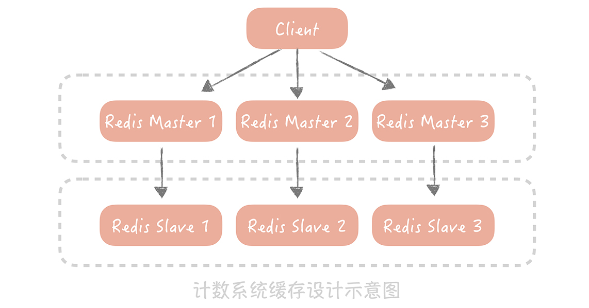

# 37丨计数系统设计 1：面对海量数据的计数器要如何做？

从今天开始，我们正式进入最后的实战篇。在之前的课程中，我分别从数据库、缓存、消息队列和分布式服务化的角度，带你了解了面对高并发的时候要如何保证系统的高性能、高可用和高可扩展。课程中虽然有大量的例子辅助你理解理论知识，但是没有一个完整的实例帮你把知识串起来。

所以，为了将我们提及的知识落地，在实战篇中，我会以微博为背景，用两个完整的案例带你从实践的角度应对高并发大流量的冲击，期望给你一个更加具体的感性认识，为你在实现类似系统的时候提供一些思路。今天我要讲的第一个案例是如何设计一个支持高并发大存储量的计数系统。

**来看这样一个场景：** 在地铁上，你也许会经常刷微博、点赞热搜，如果有抽奖活动，再转发一波，而这些与微博息息相关的数据，其实就是微博场景下的 **计数数据**，细说起来，它主要有几类：

1. 微博的评论数、点赞数、转发数、浏览数、表态数等等；

2. 用户的粉丝数、关注数、发布微博数、私信数等等。

微博维度的计数代表了这条微博受欢迎的程度，用户维度的数据（尤其是粉丝数），代表了这个用户的影响力，因此大家会普遍看重这些计数信息。并且在很多场景下，我们都需要查询计数数据（比如首页信息流页面、个人主页面），计数数据访问量巨大，所以需要设计计数系统维护它。

但在设计计数系统时，不少人会出现性能不高、存储成本很大的问题，比如，把计数与微博数据存储在一起，这样每次更新计数的时候都需要锁住这一行记录，降低了写入的并发。在我看来，之所以出现这些问题，还是因为你对计数系统的设计和优化不甚了解，所以要想解决痛点，你有必要形成完备的设计方案。

## 计数在业务上的特点

首先，你要了解这些计数在业务上的特点是什么，这样才能针对特点设计出合理的方案。在我看来，主要有这样几个特点。

- 数据量巨大

  据我所知，微博系统中微博条目的数量早已经超过了千亿级别，仅仅计算微博的转发、评论、点赞、浏览等核心计数，其数据量级就已经在几千亿的级别。更何况微博条目的数量还在不断高速地增长，并且随着微博业务越来越复杂，微博维度的计数种类也可能会持续扩展（比如说增加了表态数），因此，仅仅是微博维度上的计数量级就已经过了万亿级别。除此之外，微博的用户量级已经超过了 10 亿，用户维度的计数量级相比微博维度来说虽然相差很大，但是也达到了百亿级别。那么如何存储这些过万亿级别的数字，对我们来说就是一大挑战。

- 访问量大，对于性能的要求高

  微博的日活用户超过 2 亿，月活用户接近 5 亿，核心服务（比如首页信息流）访问量级到达每秒几十万次，计数系统的访问量级也超过了每秒百万级别，而且在性能方面，它要求要毫秒级别返回结果。

- 最后，对于可用性、数字的准确性要求高

  一般来讲，用户对于计数数字是非常敏感的，比如你直播了好几个月，才涨了 1000 个粉，突然有一天粉丝数少了几百个，那么你是不是会琢磨哪里出现问题，或者打电话投诉直播平台？

那么，面临着高并发、大数据量、数据强一致要求的挑战，微博的计数系统是如何设计和演进的呢？你又能从中借鉴什么经验呢？

## 支撑高并发的计数系统要如何设计

刚开始设计计数系统的时候，微博的流量还没有现在这么夸张，我们本着 KISS（Keep It Simple and Stupid）原则，尽量将系统设计的简单易维护，所以，我们使用 MySQL 存储计数的数据，因为它是我们最熟悉的，团队在运维上经验也会比较丰富。举个具体的例子。

假如要存储微博维度（微博的计数，转发数、赞数等等）的数据，你可以这么设计表结构：以微博 ID 为主键，转发数、评论数、点赞数和浏览数分别为单独一列，这样在获取计数时用一个 SQL 语句就搞定了。

```sql
select repost_count, comment_count, praise_count, view_count from t_weibo_count where weibo_id = ?
```

在数据量级和访问量级都不大的情况下，这种方式最简单，所以如果你的系统量级不大，你可以直接采用这种方式来实现。

后来，随着微博的不断壮大，之前的计数系统面临了很多的问题和挑战。

比如微博用户量和发布的微博量增加迅猛，计数存储数据量级也飞速增长，而 MySQL 数据库单表的存储量级达到几千万的时候，性能上就会有损耗。所以我们考虑使用分库分表的方式分散数据量，提升读取计数的性能。

我们用 「weibo_id」作为分区键，在选择分库分表的方式时，考虑了下面两种：

- 一种方式是选择一种哈希算法对 weibo_id 计算哈希值，然后依据这个哈希值计算出需要存储到哪一个库哪一张表中，具体的方式你可以回顾一下第 9 讲数据库分库分表的内容；

- 另一种方式是按照 weibo_id 生成的时间来做分库分表，我们在第 10 讲谈到发号器的时候曾经提到，ID 的生成最好带有业务意义的字段，比如生成 ID 的时间戳。所以在分库分表的时候，可以先依据发号器的算法反解出时间戳，然后按照时间戳来做分库分表，比如，一天一张表或者一个月一张表等等。

因为越是最近发布的微博，计数数据的访问量就越大，所以虽然我考虑了两种方案，但是按照时间来分库分表会造成数据访问的不均匀，最后用了哈希的方式来做分库分表。


与此同时，计数的访问量级也有质的飞越。在微博最初的版本中，首页信息流里面是不展示计数数据的，那么使用 MySQL 也可以承受当时读取计数的访问量。但是后来在首页信息流中也要展示转发、评论和点赞等计数数据了。而信息流的访问量巨大，仅仅靠数据库已经完全不能承担如此高的并发量了。于是我们 **考虑使用 Redis 来加速读请求** ，通过部署多个从节点来提升可用性和性能，并且通过 Hash 的方式对数据做分片，也基本上可以保证计数的读取性能。然而，**这种数据库 + 缓存的方式有一个弊端：无法保证数据的一致性** ，比如，如果数据库写入成功而缓存更新失败，就会导致数据的不一致，影响计数的准确性。所以，我们完全抛弃了 MySQL，全面使用 Redis 来作为计数的存储组件。



除了考虑计数的读取性能之外，由于热门微博的计数变化频率相当快，**也需要考虑如何提升计数的写入性能 **。比如，每次在转发一条微博的时候，都需要增加这条微博的转发数，那么如果明星发布结婚、离婚的微博，瞬时就可能会产生几万甚至几十万的转发。如果是你的话，要如何降低写压力呢？

你可能已经想到用消息队列来削峰填谷了，也就是说，我们在转发微博的时候向消息队列写入一条消息，然后在消息处理程序中给这条微博的转发计数加 1。 **这里需要注意的一点，**  我们可以通过批量处理消息的方式进一步减小 Redis 的写压力，比如像下面这样连续更改三次转发数（我用 SQL 来表示来方便你理解）：

```sql
UPDATE t_weibo_count SET repost_count = repost_count + 1 WHERE weibo_id = 1; 
UPDATE t_weibo_count SET repost_count = repost_count + 1 WHERE weibo_id = 1;  
UPDATE  t_weibo_count SET repost_count = repost_count +1 WHERE weibo_id = 1; 
```

这个时候，你可以把它们合并成一次更新：

```sql
UPDATE t_weibo_count SET repost_count = repost_count + 3 WHERE weibo_id = 1; 
```

## 如何降低计数系统的存储成本

讲到这里，我其实已经告诉你一个支撑高并发查询请求的计数系统是如何实现的了。但是在微博的场景下，计数的量级是万亿的级别，这也给我们提了更高的要求，**就是如何在有限的存储成本下实现对于全量计数数据的存取。**

你知道，Redis 是使用内存来存储信息，相比于使用磁盘存储数据的 MySQL 来说，存储的成本不可同日而语，比如一台服务器磁盘可以挂载到 2 个 T，但是内存可能只有 128G，这样磁盘的存储空间就是内存的 16 倍。而 Redis 基于通用性的考虑，对于内存的使用比较粗放，存在大量的指针以及额外数据结构的开销，如果要存储一个 KV 类型的计数信息，Key 是 8 字节 Long 类型的 weibo_id，Value 是 4 字节 int 类型的转发数，存储在 Redis 中之后会占用超过 70 个字节的空间，空间的浪费是巨大的。 **如果你面临这个问题，要如何优化呢？**

我建议你先对原生 Redis 做一些改造，采用新的数据结构和数据类型来存储计数数据。我在改造时，主要涉及了两点：

- 一是原生的 Redis 在存储 Key 时是按照字符串类型来存储的，比如一个 8 字节的 Long 类型的数据，需要 8（sdshdr 数据结构长度）+ 19（8 字节数字的长度）+1（`\0`）= 28 个字节，如果我们使用 Long 类型来存储就只需要 8 个字节，会节省 20 个字节的空间；

- 二是去除了原生 Redis 中多余的指针，如果要存储一个 KV 信息就只需要 8（weibo_id）+4（转发数）=12 个字节，相比之前有很大的改进。

同时，我们也会使用一个大的数组来存储计数信息，存储的位置是基于 weibo_id 的哈希值来计算出来的，具体的算法像下面展示的这样：

```java
插入时:
h1 = hash1(weibo_id) // 根据微博 ID 计算 Hash
h2 = hash2(weibo_id) // 根据微博 ID 计算另一个 Hash，用以解决前一个 Hash 算法带来的冲突
for s in 0,1000
   pos = (h1 + h2*s) % tsize // 如果发生冲突，就多算几次 Hash2
     if(isempty(pos) || isdelete(pos))
         t[ pos ] = item  // 写入数组
查询时:
for s in 0,1000
   pos = (h1 + h2*s) % tsize  // 依照插入数据时候的逻辑，计算出存储在数组中的位置
      if(!isempty(pos) && t[pos]==weibo_id)
         return t[pos]
return 0 
删除时:
insert(FFFF) // 插入一个特殊的标
```

笔者没太看明白上面这个伪代码的含义是什么，计算几次 hash 不是固定次数吗？查询里面也是循环 1000，找到就返回，如果次数不固定，hash 冲突不就拿到错误的了？

在对原生的 Redis 做了改造之后，你还需要进一步考虑如何节省内存的使用。比如，微博的计数有转发数、评论数、浏览数、点赞数等等，如果每一个计数都需要存储 weibo_id，那么总共就需要 8（weibo_id）x4（4 个微博 ID）+ 4（转发数） + 4（评论数） + 4（点赞数） + 4（浏览数）= 48 字节。但是我们可以把相同微博 ID 的计数存储在一起，这样就只需要记录一个微博 ID，省掉了多余的三个微博 ID 的存储开销，存储空间就进一步减少了。

不过，即使经过上面的优化，由于计数的量级实在是太过巨大，并且还在以极快的速度增长，所以如果我们以全内存的方式来存储计数信息，就需要使用非常多的机器来支撑。

**然而微博计数的数据具有明显的热点属性：越是最近的微博越是会被访问到，时间上久远的微博被访问的几率很小** 。所以为了尽量减少服务器的使用，我们考虑给计数服务增加 SSD 磁盘，然后将时间上比较久远的数据 dump 到磁盘上，内存中只保留最近的数据。当我们要读取冷数据的时候，使用单独的 I/O 线程异步地将冷数据从 SSD 磁盘中加载到一块儿单独的 Cold  Cache（冷缓存） 中。


在经过了上面这些优化之后，我们的计数服务就可以支撑高并发大数据量的考验，无论是在性能上、成本上和可用性上都能够达到业务的需求了。

总的来说，我用微博设计计数系统的例子，并不是仅仅告诉你计数系统是如何做的，而是想告诉你在做系统设计的时候需要了解自己系统目前的痛点是什么，然后再针对痛点来做细致的优化。比如，微博计数系统的痛点是存储的成本，那么我们后期做的事情很多都是围绕着如何使用有限的服务器存储全量的计数数据，即使是对开源组件（Redis）做深度的定制会带来很大的运维成本，也只能被认为是为了实现计数系统而必须要做的权衡。

## 课程小结

以上就是本节课的全部内容了。本节课我以微博为例带你了解了如何实现一套存储千亿甚至万亿数据的高并发计数系统，这里你需要了解的重点如下：

1. 数据库 + 缓存的方案是计数系统的初级阶段，完全可以支撑中小访问量和存储量的存储服务。如果你的项目还处在初级阶段，量级还不是很大，那么你一开始可以考虑使用这种方案。

2. 通过对原生 Redis 组件的改造，我们可以极大地减小存储数据的内存开销。

3. 使用 SSD+ 内存的方案可以最终解决存储计数数据的成本问题。这个方式适用于冷热数据明显的场景，你在使用时需要考虑如何将内存中的数据做换入换出。

其实，随着互联网技术的发展，已经有越来越多的业务场景需要使用上百 G 甚至几百 G 的内存资源来存储业务数据，但是对于性能或者延迟并没有那么高的要求，如果全部使用内存来存储无疑会带来极大的成本浪费。因此，在业界有一些开源组件也在支持使用 SSD 替代内存存储冷数据，比如 Pika，SSDB，这两个开源组件，我建议你可以了解一下它们的实现原理，这样可以在项目中需要的时候使用。而且，在微博的计数服务中也采用了类似的思路，如果你的业务中也需要使用大量的内存，存储热点比较明显的数据，不妨也可以考虑使用类似的思路。