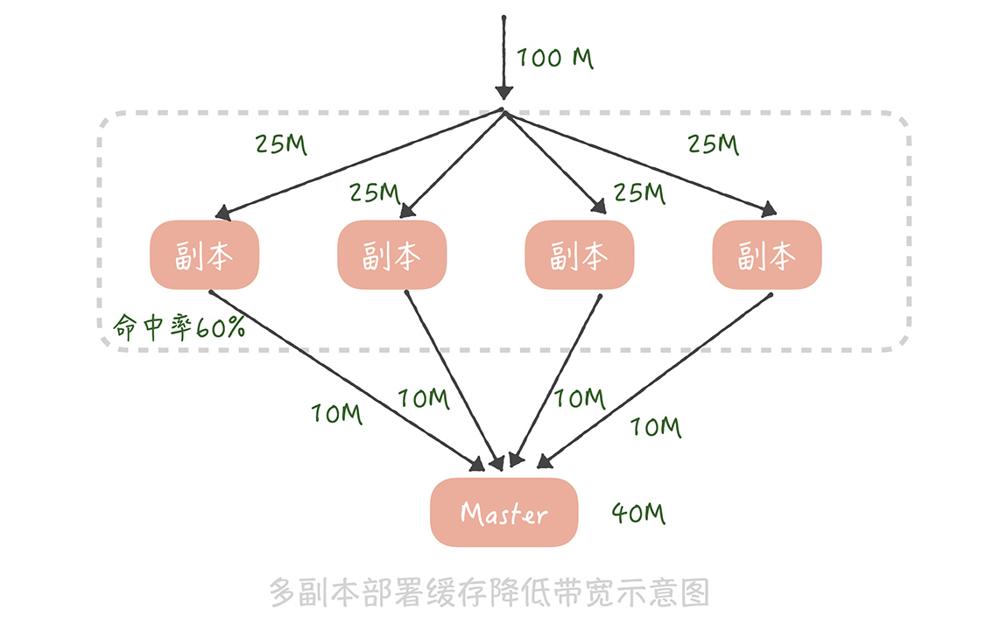
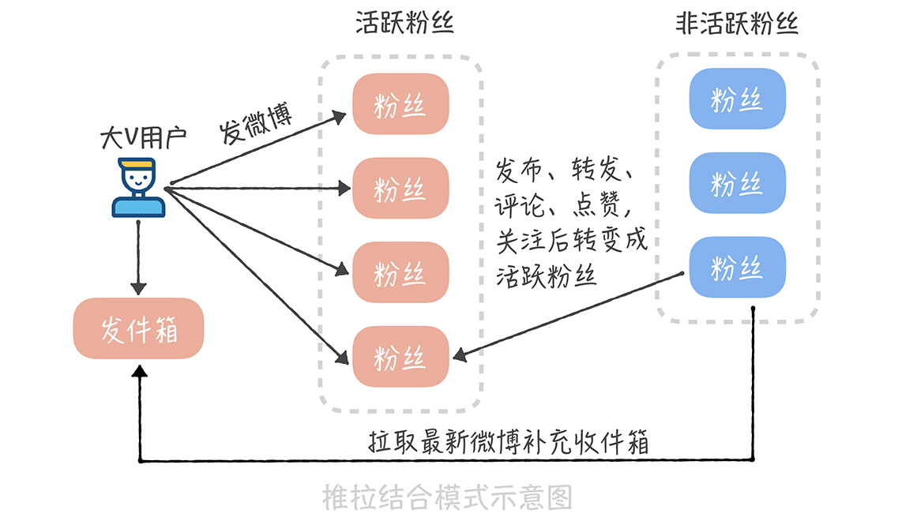

# 40丨信息流设计 2：通用信息流系统的拉模式要如何做？

在前一节课中，我带你了解了如何用推模式来实现信息流系统，从中你应该了解到了推模式存在的问题，比如它在面对需要支撑很大粉丝数量的场景时，会出现 **消息推送延迟、存储成本高、方案可扩展性差等问题** 。虽然我们也会有一些应对的措施，比如说选择插入性能更高的数据库存储引擎来提升数据写入速度，降低数据推送延迟；定期删除冷数据以减小存储成本等等，但是由于微博大 V 用户粉丝量巨大，如果我们使用推模式实现信息流系统，那么只能缓解这些用户的微博推送延迟问题，没有办法彻底解决。

这个时候你可能会问了：那么有没有一种方案可以一劳永逸地解决这个问题呢？当然有了，你不妨试试用拉模式来实现微博信息流系统。那么具体要怎么做呢？

## 如何使用拉模式设计信息流系统

所谓拉模式，就是指用户主动拉取他关注的所有人的微博，将这些微博按照发布时间的倒序进行排序和聚合之后，生成信息流数据的方法。

按照这个思路实现微博信息流系统的时候你会发现：用户的收件箱不再有用，因为信息流数据不再出自收件箱，而是出自发件箱。发件箱里是用户关注的所有人数据的聚合。因此用户在发微博的时候就只需要写入自己的发件箱，而不再需要推送给粉丝的收件箱了，这样在获取信息流的时候，就要查询发件箱的数据了。

这个逻辑我还用 SQL 的形式直观地表达出来，方便你理解。假设用户 A 关注了用户 B、C、D，那么当用户 B 发送一条微博的时候，他会执行这样的操作：

```sql
insert into outbox(userId, feedId, create_time) values("B", $feedId, $current_time); // 写入 B 的发件箱
```

当用户 A 想要获取他的信息流的时候，就要聚合 B、C、D 三个用户收件箱的内容了：

```sql
select feedId from outbox where userId in (select userId from follower where fanId = "A") order by create_time desc
```

**你看，拉模式的实现思想并不复杂，并且相比推模式来说，它有几点明显的优势。**

首先，拉模式彻底解决了推送延迟的问题，大 V 发微博的时候不再需要推送到粉丝的收件箱，自然就不存在延迟的问题了。

其次，存储成本大大降低了。在推模式下，谢娜的粉丝有 1.2 亿，那么谢娜发送一条微博就要被复制 1.2 亿条，写入到存储系统中。在拉模式下只保留了发件箱，微博数据不再需要复制，成本也就随之降低了。

最后，功能扩展性更好了。比如，微博增加了分组的功能，而你想把关注的 A 和 B 分成一个单独的组，那么 A 和 B 发布的微博就形成了一个新的信息流，这个信息流要如何实现呢？很简单，你只需要查询这个分组下所有用户（也就是 A 和 B），然后查询这些用户的发件箱，再把发件箱中的数据，按照时间倒序重新排序聚合就好了。

```java

List<Long> uids = getFromGroup(groupId); // 获取分组下的所有用户
Long<List<Long>> ids = new ArrayList<List<Long>>();
for(Long id : uids) {
  ids.add(getOutboxByUid(id)); // 获取发件箱的内容 id 列表
}
return merge(ids); // 合并排序所有的 id
```

拉模式之所以可以解决推模式下的所有问题，是因为在业务上关注数始终是有上限的，那么它是不是一个无懈可击的方案呢？ **当然不是，拉模式也会有一些问题，在我看来主要有这样两点。**

第一点，不同于推模式下获取信息流的时候，只是简单地查询收件箱中的数据，在拉模式下，我们需要对多个发件箱的数据做聚合，这个查询和聚合的成本比较高。微博的关注上限是 2000，假如你关注了 2000 人，就要查询这 2000 人发布的微博信息，然后再对查询出来的信息做聚合。

那么，如何保证在毫秒级别完成这些信息的查询和聚合呢？答案还是缓存。我们可以把用户发布的微博 ID 放在缓存中，不过如果把全部用户的所有微博都缓存起来，消耗的硬件成本也是很高的。所以我们需要关注用户浏览信息流的特点，看看是否可能对缓存的存储成本做一些优化。

在实际执行中，**我们对用户的浏览行为做了抽量分析，发现 97% 的用户都是在浏览最近 5 天之内的微博** ，也就是说，用户很少翻看五天之前的微博内容，所以我们只缓存了每个用户最近 5 天发布的微博 ID。假设我们部署 6 个缓存节点来存储这些微博 ID，在每次聚合时并行从这几个缓存节点中批量查询多个用户的微博 ID，获取到之后再在应用服务内存中排序后就好了，这就是对缓存的 6 次请求，可以保证在 5 毫秒之内返回结果。

第二，缓存节点的带宽成本比较高。你想一下，假设微博信息流的访问量是每秒 10 万次请求，也就是说，每个缓存节点每秒要被查询 10 万次。假设一共部署 6 个缓存节点，用户人均关注是 90，平均来说每个缓存节点要存储 15 个用户的数据。如果每个人平均每天发布 2 条微博，5 天就是发布 10 条微博，15 个用户就要存储 150 个微博 ID。每个微博 ID 要是 8 个字节，150 个微博 ID 大概就是 1kB 的数据，单个缓存节点的带宽就是 1kB * 10 万 = 100MB，基本上跑满了机器网卡带宽了。 **那么我们要如何对缓存的带宽做优化呢？**

在14 讲中我提到，部署多个缓存副本提升缓存可用性，其实，缓存副本也可以分摊带宽的压力。我们知道在部署缓存副本之后，请求会先查询副本中的数据，只有不命中的请求才会查询主缓存的数据。假如原本缓存带宽是 100M，我们部署 4 组缓存副本，缓存副本的命中率是 60%，那么主缓存带宽就降到 100M * 40% = 40M，而每组缓存副本的带宽为 100M / 4 = 25M，这样每一组缓存的带宽都降为可接受的范围之内了。



在经过了上面的优化之后，基本上完成了基于拉模式信息流系统方案的设计，你在设计自己的信息流系统时可以参考借鉴这个方案。另外，使用缓存副本来抗流量也是一种常见的缓存设计思路，你在项目中必要的时候也可以使用。

## 推拉结合的方案是怎样的

但是，有的同学可能会说：我在系统搭建初期已经基于推模式实现了一套信息流系统，如果把它推倒重新使用拉模式实现的话，系统的改造成本未免太高了。有没有一种基于推模式的折中的方案呢？

其实我在网易微博的时候，网易微博的信息流就是基于推模式来实现的，当用户的粉丝量大量上涨之后， **我们通过对原有系统的改造实现了一套推拉结合的方案，也能够基本解决推模式存在的问题，具体怎么做呢？**

方案的核心在于大 V 用户在发布微博的时候，不再推送到全量用户，而是只推送给活跃的用户。这个方案在实现的时候有几个关键的点。

首先，**我们要如何判断哪些是大 V 用户呢？** 或者说，哪些用户在发送微博时需要推送全量用户，哪些用户需要推送活跃用户呢？在我看来，还是应该以粉丝数作为判断标准，比如，粉丝数超过 50 万就算作大 V，需要只推送活跃用户。

其次，**我们要如何标记活跃用户呢？** 活跃用户可以定义为最近几天内在微博中有过操作的用户，比如说刷新过信息流、发布过微博、转发评论点赞过微博，关注过其他用户等等，一旦有用户有过这些操作，我们就把他标记为活跃的用户。

而对大 V 来说，我们可以存储一个活跃粉丝的列表，这个列表里面就是我们标记的活跃用户。当某一个用户从不活跃用户变为活跃用户时，我们会查询这个用户的关注者中哪些是大 V，然后把这个用户写入到这些大 V 的活跃粉丝列表里面，这个活跃粉丝列表是定长的，如果活跃粉丝数量超过了长度，就把最先加入的粉丝从列表里剔除，这样可以保证推送的效率。

最后，一个用户被从活跃粉丝列表中剔除，或者是他从不活跃变成了活跃后，由于他不在大 V 用户的活跃粉丝列表中，所以也就不会收到微博的实时推送，因此，我们需要异步地把大 V 用户最近发布的微博插入到他的收件箱中，保证他的信息流数据的完整性。



采用推拉结合的方式可以一定程度上弥补推模式的缺陷，不过也带来了一些维护的成本，比如说系统需要维护用户的在线状态，还需要多维护一套活跃的粉丝列表数据，在存储上的成本就更高了。

因此，这种方式一般适合中等体量的项目，当粉丝量级在百万左右，活跃粉丝数量在 10 万级别时，一般可以实现比较低的信息传播延迟以及信息流获取延迟，但是当你的粉丝数量继续上涨，流量不断提升之后，无论是活跃粉丝的存储还是推送的延迟都会成为瓶颈，所以改成拉模式会更好的支撑业务。

## 课程小结

以上就是本节课的全部内容了。本节课我带你了解了基于拉模式和推拉结合模式实现信息流系统的方案，这里你需要了解的几个重点是：

1. 在拉模式下，我们只需要保存用户的发件箱，用户的信息流是通过 **聚合关注者发件箱数据** 来实现的；

2. 拉模式会有比较大的聚合成本，缓存节点也会存在带宽的瓶颈，所以我们可以通过一些权衡策略尽量减少获取数据的大小，以及部署缓存副本的方式来抗并发；

3. 推拉结合的模式核心是只推送活跃的粉丝用户，需要维护用户的在线状态以及活跃粉丝的列表，所以需要增加多余的空间成本来存储，这个你需要来权衡。

拉模式和推拉结合模式比较适合微博这种粉丝量很大的业务场景，因为它们都会有比较可控的消息推送延迟。你可以看到，在这两节课程中我们灵活使用数据库分库分表、缓存消息队列、发号器等技术，实现了基于推模式、拉模式以及推拉结合模式的信息流系统，你在做自己系统的方案设计时，应该充分发挥每种技术的优势，权衡业务自身的特性，最终实现技术和业务上的平衡，也就是既能在业务上满足用户需求，又能在技术上保证系统的高性能和高可用。