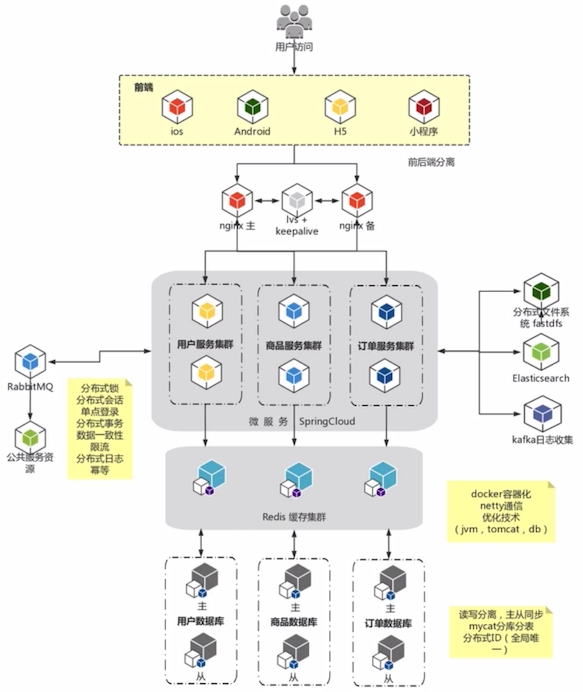

# 架构师所需要具备的技术栈与能力

整体架构为前后端分离架构

- 前端请求会通过 **负载均衡器** 分发到后端微服务

  这里的负载均衡器使用 lvs + keepalive + nginx 主备实现

- Spring cloud 微服务

- Redis 缓存集群

- 数据库

- 公共资源

  如短信、邮件、物流等，一般通过 MQ 异步调用

在分布式系统中，就需要考虑：

- 分布式锁：解决一些超卖等问题
- 分布式会话：http 请求是无状态的，我们的系统是分布式系统，所以需要准备分布式会话
- 单点登录：由于是分布式会话，在一个系统登录之后，需要让其他系统也能直接使用
- 等等

另一部分：

- 分布式文件系统

  这些子系统都有很多使用到图片等文件的场景，比如用户头像，商品图片等

- Elasticsearch

  为用户提供多样性的搜索

- kafka 日志收集

  当服务器到达上百、上千时，如何管理这么多服务的日志呢？

- docker 容器化、netty 通信、优化技术

- 读写分离、主从同步、分库分表、分布式 ID

以上是一些大企业中的一些技术栈。

  ## 架构师需要具备的能力

- 技术全面、有广度

  需要了解更多技术，使用更合适更匹配的技术选型，来实现和解决问题

- 关注前言技术

  可以通过阅读一些英文咨询来获取最新的技术信息

- 全局观、预判

  对各个业务点有全局的掌控
  
- 把控团队，忙而不乱

  技术担当、会管理、会管人，做到人多而不乱
  
- 系统分解与模块拆分

  拆分与解耦是最基本最常见的一个模式，很好的把业务分离，才能很好的把代码解耦，在微服务阶段可以得到体现
  
- 指导与培训

  指导和培训新人
  
- 沟通与协调能力

  架构师也是一个管理者，需要与老板进行沟通，还会和下属进行沟通，合格的架构师会综合考虑上下级的想法，才能很好的做出一个决策

- 抽象、举例、画图

  就是在和不懂技术的老板或则技术能力不够的开发沟通的时候，需要多抽象、多举例、多画图的方式，能让他们明白

- 软技能

  偏向项目管理，团队协作、团队凝聚力，比如可以组织聚餐团建、爬山活动之类的。
  
  只要在职场，姿态（拍马屁）和城府一定是要有的，所谓有人的地方就有竞争。
  
- 谈判能力：体现在沟通上

  如下属离职，沟通留下来，等等

