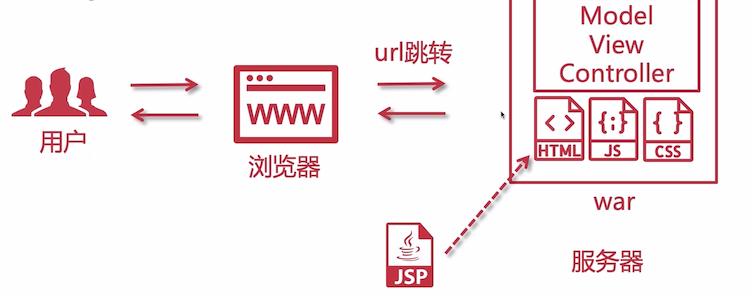
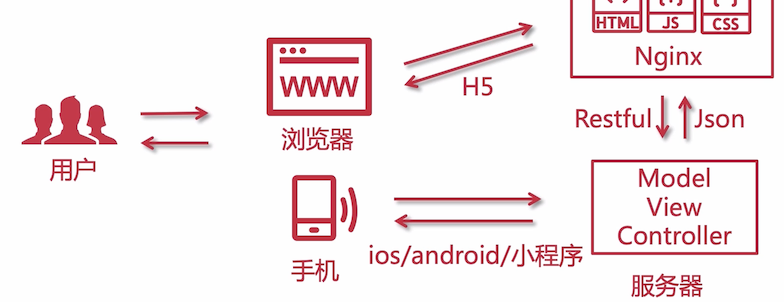

# 前后端分离开发模式

聊一聊前后端分离开发模式

## 早期传统 javaweb 开发

JAVA 代码与 HTML 等代码是在同一个 war 包中，而且这里的 HTML 指的是 JSP，JSP 是由后端服务器来渲染的，当用户量多的时候会造成服务器性能的影响，因为会进行大量的 JSP 渲染。

同时，页面之前的跳转是通过 URL 地址跳转。

## 前后端单页面交互 MVVM 开发模式

用户访问浏览器，Nginx 返回 H5 页面，这些静态资源一般都会通过 Nginx 来提供，页面中发出的请求是用户请求，通过 Restful 方式去后端服务器请求数据，后端服务器一般会返回 JSON 格式的数据。

这就做了一个前后端的分隔，对于手机来说，一般能显示 H5 ，也可以在手机上进行访问。

当然网站页面不一定兼容移动端，所以可能会在移动端开发 app 程序，这些 app 程序也是通过 restful 和 json 来与服务器交互的，那么这个时候的优点就体现出来了：**不管前端有多少样式，后端代码只是一份，不用重复开发**，唯一的区别是 **针对不同端进行一些接口上的微调处理**

## 总结

前后端分离的优点几乎上大于缺点，让各自领域的专业人员进行开发，还可以并行开发，提高开发速度。

前后端分离不仅是一种开发模式，也是一种架构。

