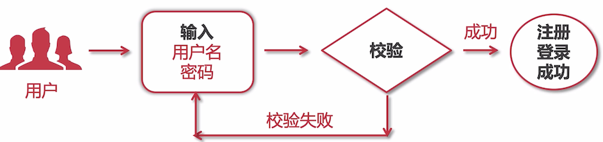
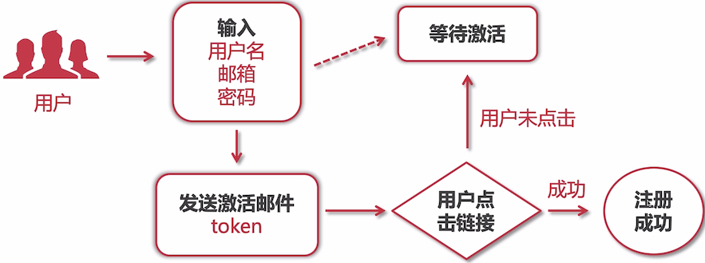
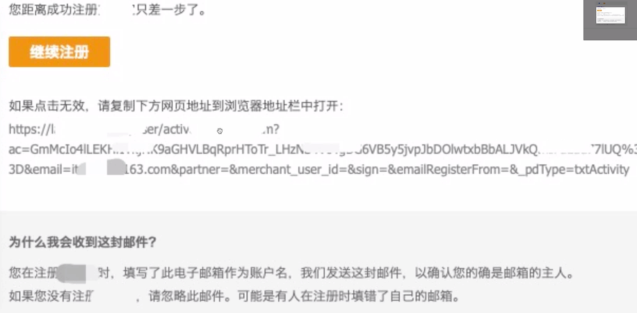
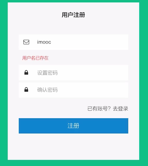

# 用户注册/登录流程详情与功能开发

从本章开始，主要要实现 **单体电商核心功能**，功能如下：

- 用户注册与登录

- Cookie 与 Session

- 集成 Swagger2 api

- 分类设计与实现：商品的类别

- 首页商品推荐

- 商品搜索与分页

- 商品详情与评论渲染

  订单完成之后，可以对订单进行评价，在商品页面进行评价

- 购物车与订单

- 微信与支付宝支付

## 用户名注册登录流程



## 邮箱注册流程



使用邮箱注册主要是用邮箱接受一个激活链接，以此证明该邮箱是你本人的，如下图所示：



一般来说，该 token 会有一定的时效性，不是永久都有效的。

## 手机号注册登录流程


本课程使用用户名密码这个流程，其他的流程会造成额外的开发与对接第三方：

- 邮箱：主要是可信度问题，要么你自己搭建邮件服务器（邮箱后缀与自己品牌完美匹配），要么去使用邮件平台发送（发送量不受限）
- 短信：需要购买第三方的收费服务

## 判断用户名是否存在



注册的时候，有一个异步判定用户是否已经存在的接口。

```java
package cn.mrcode.foodiedev.service.impl;

import cn.mrcode.foodiedev.mapper.UsersMapper;
import cn.mrcode.foodiedev.pojo.Users;
import cn.mrcode.foodiedev.service.UserService;
import org.springframework.beans.factory.annotation.Autowired;
import org.springframework.stereotype.Service;
import org.springframework.transaction.annotation.Propagation;
import org.springframework.transaction.annotation.Transactional;
import tk.mybatis.mapper.entity.Example;

@SuppressWarnings("SpringJavaInjectionPointsAutowiringInspection")
@Service
public class UserServiceImpl implements UserService {
    @Autowired
    private UsersMapper usersMapper;

    @Transactional(propagation = Propagation.SUPPORTS)
    @Override
    public boolean queryUsernameIsExist(String username) {
        Example example = new Example(Users.class);
        Example.Criteria criteria = example.createCriteria();
        criteria.andEqualTo("username", username);

        Users result = usersMapper.selectOneByExample(example);
        return result != null;
    }
}

```

```java
package cn.mrcode.foodiedev.api.controller;

import cn.mrcode.foodiedev.service.UserService;
import org.apache.commons.lang3.StringUtils;
import org.springframework.beans.factory.annotation.Autowired;
import org.springframework.web.bind.annotation.GetMapping;
import org.springframework.web.bind.annotation.RequestMapping;
import org.springframework.web.bind.annotation.RequestParam;
import org.springframework.web.bind.annotation.RestController;

@RestController
@RequestMapping("passport")
public class PassportController {
    @Autowired
    private UserService userService;

    @GetMapping("/usernameIsExist")
    public int usernameIsExist(@RequestParam String username) {
        // 1. 判断用户名不能为空
        if (StringUtils.isBlank(username)) {
            return 500;
        }

        // 2. 查找注册的用户名是否存在
        boolean isExist = userService.queryUsernameIsExist(username);
        if (isExist) {
            return 500;
        }
        return 200;
    }
}
```

对于工具类的使用，这里使用 apache 相关的

```xml
<!-- apache 工具类 -->
<dependency>
  <groupId>commons-codec</groupId>
  <artifactId>commons-codec</artifactId>
  <version>1.11</version>
</dependency>
<dependency>
  <groupId>org.apache.commons</groupId>
  <artifactId>commons-lang3</artifactId>
  <version>3.4</version>
</dependency>
<dependency>
  <groupId>org.apache.commons</groupId>
  <artifactId>commons-io</artifactId>
  <version>1.3.2</version>
</dependency>
```

测试接口

```
GET http://localhost:8088/passport/usernameIsExist?username=mrcode

HTTP/1.1 200 
Content-Type: application/json;charset=UTF-8
Transfer-Encoding: chunked
Date: Sat, 13 Feb 2021 03:37:05 GMT

200

Response code: 200; Time: 901ms; Content length: 3 bytes
```

## 统一结果返回工具类

```java
package cn.mrcode.foodiedev.common.util;

import com.fasterxml.jackson.annotation.JsonIgnore;
import com.fasterxml.jackson.databind.ObjectMapper;

/**
 * @Description: 自定义响应数据结构
 * <pre>
 * 				本类可提供给 H5/ios/安卓/公众号/小程序 使用
 * 				前端接受此类数据（json object)后，可自行根据业务去实现相关功能
 *
 * 				200：表示成功
 * 				500：表示错误，错误信息在msg字段中
 * 				501：bean 验证错误，不管多少个错误都以 map 形式返回
 * 				502：拦截器拦截到用户 token 出错
 * 				555：异常抛出信息
 * 				556: 用户 qq 校验异常
 * </pre>
 */
public class JSONResult {

    // 定义jackson对象
    private static final ObjectMapper MAPPER = new ObjectMapper();

    // 响应业务状态
    private Integer status;

    // 响应消息
    private String msg;

    // 响应中的数据
    private Object data;

    @JsonIgnore
    private String ok;    // 不使用

    public static JSONResult build(Integer status, String msg, Object data) {
        return new JSONResult(status, msg, data);
    }

    public static JSONResult build(Integer status, String msg, Object data, String ok) {
        return new JSONResult(status, msg, data, ok);
    }

    public static JSONResult ok(Object data) {
        return new JSONResult(data);
    }

    public static JSONResult ok() {
        return new JSONResult(null);
    }

    public static JSONResult errorMsg(String msg) {
        return new JSONResult(500, msg, null);
    }

    public static JSONResult errorMap(Object data) {
        return new JSONResult(501, "error", data);
    }

    public static JSONResult errorTokenMsg(String msg) {
        return new JSONResult(502, msg, null);
    }

    public static JSONResult errorException(String msg) {
        return new JSONResult(555, msg, null);
    }

    public static JSONResult errorUserQQ(String msg) {
        return new JSONResult(556, msg, null);
    }

    public JSONResult() {

    }

    public JSONResult(Integer status, String msg, Object data) {
        this.status = status;
        this.msg = msg;
        this.data = data;
    }

    public JSONResult(Integer status, String msg, Object data, String ok) {
        this.status = status;
        this.msg = msg;
        this.data = data;
        this.ok = ok;
    }

    public JSONResult(Object data) {
        this.status = 200;
        this.msg = "OK";
        this.data = data;
    }

    public Boolean isOK() {
        return this.status == 200;
    }

    public Integer getStatus() {
        return status;
    }

    public void setStatus(Integer status) {
        this.status = status;
    }

    public String getMsg() {
        return msg;
    }

    public void setMsg(String msg) {
        this.msg = msg;
    }

    public Object getData() {
        return data;
    }

    public void setData(Object data) {
        this.data = data;
    }

    public String getOk() {
        return ok;
    }

    public void setOk(String ok) {
        this.ok = ok;
    }

}

```

这里使用统计结果返回类包装返回结果，状态以 http 状态码作为参考。

##  改造后的判断用户名是否存在

```java
    @GetMapping("/usernameIsExist")
    public JSONResult usernameIsExist(@RequestParam String username) {
        // 1. 判断用户名不能为空
        if (StringUtils.isBlank(username)) {
            return JSONResult.errorMsg("用户名不能为空");
        }

        // 2. 查找注册的用户名是否存在
        boolean isExist = userService.queryUsernameIsExist(username);
        if (isExist) {
            return JSONResult.errorMsg("用户名已存在");
        }
      	// 3. 用户名没有重复
        return JSONResult.ok();
    }
```

## 用户注册

首先我们要接受前端传递过来的参数，就需要定义接收容器，这里使用 BO 来作为标识

```java
package cn.mrcode.foodiedev.pojo.bo;

/**
 * BO：前端传递给后端的业务对象
 *
 * @author mrcode
 * @date 2021/2/13 11:53
 */
public class UserBO {
    private String username;
    private String password;
    private String confirmPassword;
}

```

```java
    /**
     * 用户默认的头像图片
     */
    public static final String USER_FACE = "http://localhost:900/xx.jpg";

    /**
     * id 生成器，需要在启动类上使用 @SpringBootApplication(scanBasePackages = {"cn.mrcode.foodiedev", "org.n3r.idworker"}) 扫描
     */
    @Autowired
    private Sid sid;

	  @Transactional(propagation = Propagation.REQUIRED)
    @Override
    public Users createUser(UserBO userBO) {
        Users users = new Users();
        users.setUsername(userBO.getUsername());
        try {
            // 使用自定义工具类对密码进行 MD5 加密
            users.setPassword(MD5Utils.getMD5Str(userBO.getPassword()));
        } catch (Exception e) {
            e.printStackTrace();
        }
        // 使用 ID 生成器生成 ID
        users.setId(sid.nextShort());
        // 默认同用户昵称一样
        users.setNickname(userBO.getUsername());
        // 设置用户默认头像
        users.setFace(USER_FACE);
        // 默认生日为：1900-01-01
        users.setBirthday(DateUtil.stringToDate("1900-01-01"));
        // 使用 枚举代替数字类型
        users.setSex(Sex.secret.type);
        users.setCreatedTime(new Date());
        users.setUpdatedTime(new Date());

        usersMapper.insert(users);
        // 返回用户是为了方便前端展示一些信息
        return users;
    }
```

里面使用了一些工具类还有 ID 生成器，详细代码请查看 [练习项目](https://github.com/zq99299/foodie-dev)

```java
    @PostMapping("/regist")
    public JSONResult regist(@RequestBody UserBO userBO) {
        String username = userBO.getUsername();
        String password = userBO.getPassword();
        String confirmPassword = userBO.getConfirmPassword();
        // 0. 判断用户名和密码必须不为空
        if (StringUtils.isBlank(username) ||
                StringUtils.isBlank(password) ||
                StringUtils.isBlank(confirmPassword)) {
            return JSONResult.errorMsg("用户名或密码不能为空");
        }
        // 1. 查询用户名是否存在
        boolean isExist = userService.queryUsernameIsExist(username);
        if (isExist) {
            return JSONResult.errorMsg("用户名已经存在");
        }
        // 2. 密码长度不能少于 6 位
        if (password.length() < 6) {
            return JSONResult.errorMsg("密码长度不能少于 6");
        }
        // 3. 判断两次密码是否一致
        if (!password.equals(confirmPassword)) {
            return JSONResult.errorMsg("两次密码输入不一致");
        }
        // 4. 实现注册
        Users user = userService.createUser(userBO);
        return JSONResult.ok(user);
    }
```

很普通的写法，这里总结下：

1. 前端与后端传值使用 BO
2. 在 controller 中判断逻辑，都通过后，调用服务层入库

接口测试

```http
POST http://localhost:8088/passport/regist

HTTP/1.1 200 
Content-Type: application/json;charset=UTF-8
Transfer-Encoding: chunked
Date: Sat, 13 Feb 2021 04:56:31 GMT

{
  "status": 200,
  "msg": "OK",
  "data": {
    "id": "21021396KH1FZWBC",
    "username": "mrcode",
    "password": "4QrcOUm6Wau+VuBX8g+IPg==",
    "nickname": "mrcode",
    "realname": null,
    "face": "http://localhost:900/xx.jpg",
    "mobile": null,
    "email": null,
    "sex": 2,
    "birthday": "1899-12-31T16:00:00.000+0000",
    "createdTime": "2021-02-13T04:56:31.783+0000",
    "updatedTime": "2021-02-13T04:56:31.783+0000"
  }
}
```


