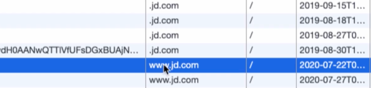

# 实现用户信息在页面显示


登录成功之后，跳转到的首页，缺没有显示登录成功的信息，这是是由于前后分离后，这部分信息需要前端来处理。

目前这个前端使用的是多页，来看看它的实现方式是什么。

## 回顾 cookie 和 session

### cookie

- 以键值对的形式存储信息在浏览器

- cookie 不能跨域，当前及其父级域名可以取值

  

  比如京东网站的 cookie，jd.com 是一级，www.jd.com 是二级域名，一级域名的 cookie 信息，起子域名都可以访问

- cookie 可以设置有效期

- cookie 可以设置 path

  表示只有某个地址可以访问到该 path 下的 cookie 值。一般会设置 `/` ，表示所有路径都可以共享 cookie

### session

- 基于服务器内存的缓存（非持久化），可保存请求会话

  此种 session 是有状态的，本课程后面不会使用此种类型，会使用分布式 redis session 

- 每个 session 通过 sessionid 来区分不同请求

- session 可设置过期时间

- session 也是以键值对形式存储值的

## 用户信息在页面显示

同样可以去看看 京东 登录后，将我们的用户信息放置在哪里了？当你清空 cookie 后，刷新页面，会发现登录信息没有了。

这就可以证明，京东这种大厂也是将信息存储在 cookie 中的，只不过它的值是加密的。不是明文。

将用户信息保存在 cookie 中，在前端和后端都可以操作，这里使用在后端操作，改造后的登录接口如下

```java

    @ApiOperation(value = "用户登录")
    @PostMapping("/login")
    public JSONResult login(@RequestBody UserBO userBO,
                            HttpServletRequest request,
                            HttpServletResponse response) throws Exception {
        String username = userBO.getUsername();
        String password = userBO.getPassword();
        // 0. 判断用户名和密码必须不为空
        if (StringUtils.isBlank(username) ||
                StringUtils.isBlank(password)) {
            return JSONResult.errorMsg("用户名或密码不能为空");
        }
        password = MD5Utils.getMD5Str(password);
        Users user = userService.queryUserForLogin(username, password);
        if (user == null) {
            return JSONResult.errorMsg("用户名或密码不正确");
        }

        // 脱敏信息
        setNullProperty(user);

        // 设置 cookie
        CookieUtils.setCookie(request, response, "user", JsonUtils.objectToJson(user), true);

        return JSONResult.ok(user);
    }

    /**
     * <pre>
     * 由于目前响应对象是 数据库实体对象，不适用适用 @JsonIgone 直接抹去不显示该字段信息
     * 直接重置为空
     * </pre>
     *
     * @param user
     */
    private void setNullProperty(Users user) {
        user.setPassword(null);
        user.setMobile(null);
        user.setEmail(null);
        user.setCreatedTime(null);
        user.setUpdatedTime(null);
        user.setBirthday(null);
    }
```

编码之后的 json 字符串变成了下面这样

```
%7B%22id%22%3A%22210213BX4KY0M5AW%22%2C%22username%22%3A%22test%22%2C%22password%22%3Anull%2C%22nickname%22%3A%22test%22%2C%22realname%22%3Anull%2C%22face%22%3A%22http%3A%2F%2Flocalhost%3A900%2Fxx.jpg%22%2C%22mobile%22%3Anull%2C%22email%22%3Anull%2C%22sex%22%3A2%2C%22birthday%22%3Anull%2C%22createdTime%22%3Anull%2C%22updatedTime%22%3Anull%7D
```

值的注意的是：该注册业务，在注册成功后，跳转到首页，就自动登录成功了，也使用的是 cookie，将用户信息存储下来页面上进行的显示。（这里暂时还没有与前后端请求对应上的功能编码，仅仅是说注册成功后的自动登录者一表现）