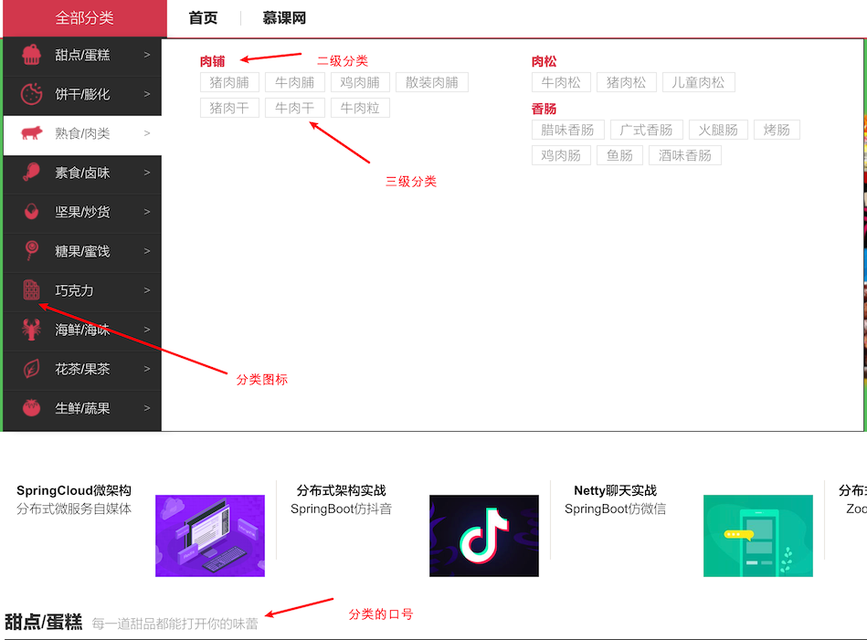
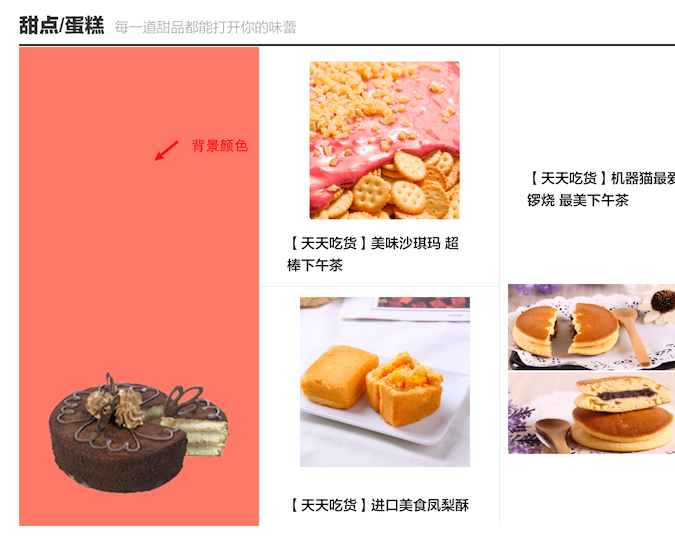

# 商品分类实现

## 需求分析



通过以上分析，有如下几个特定：

- 多级分类，这里是 3 级
- 分类有小图标
- 分类有口号（简短描述）

表设计如下：


- 父 ID：使用父 ID 方式，达到多级别方式
- 背景颜色：和轮播图类似
- 分类图：该类别的商品图，如下图所示
- 图标：左侧的小图标



如何提供这个分类接口呢？在首页上图来说（第一张图，全部分类那一块），它是有多级的，鼠标移动上去才会显示子分类。

那么我们这里使用延迟加载方式加载。

- `/index/cats`：查询顶级分类
- `/index/subCat`：查询子级分类，子级需要全部返回

## 一级分类接口

本阶段这里也是相对的很简单。

```java
package cn.mrcode.foodiedev.service.impl;

import cn.mrcode.foodiedev.mapper.CategoryMapper;
import cn.mrcode.foodiedev.pojo.Carousel;
import cn.mrcode.foodiedev.pojo.Category;
import cn.mrcode.foodiedev.service.CategoryService;
import org.springframework.beans.factory.annotation.Autowired;
import org.springframework.stereotype.Service;
import tk.mybatis.mapper.entity.Example;

import java.util.List;

/**
 * @author mrcode
 * @date 2021/2/13 22:10
 */
@SuppressWarnings("SpringJavaInjectionPointsAutowiringInspection")
@Service
public class CategoryServiceImpl implements CategoryService {
    @Autowired
    private CategoryMapper categoryMapper;

    @Transactional(propagation = Propagation.SUPPORTS)
    @Override
    public List<Category> queryAllRootLeveCat() {
        Example example = new Example(Category.class);
        Example.Criteria criteria = example.createCriteria();
        criteria.andEqualTo("type", 1);
        List<Category> list = categoryMapper.selectByExample(example);
        return list;
    }
}
```

```java
public class IndexController {    
@ApiOperation(value = "获取商品一级分类")
    @GetMapping("/cats")
    public JSONResult cats() {
        List<Category> list = categoryService.queryAllRootLeveCat();
        return JSONResult.ok(list);
    }
```

## 子级分类接口

这里需要安装一级分类 ID，获取该分类下的所有子级（包括 2 级、3 级），单表操作就没有办法实现了.

我们这里的思路是：通过 SQL 将 2、3 级分类都查询出来，然后程序里面去处理好层级关系。

SQL 如下：

```sql
select f.id        as id,
       f.name      as name,
       f.type      as type,
       f.father_id as fatherId,
       c.id        as subId,
       c.name      as subName,
       c.type      as subType,
       c.father_id as subFatherId
from category f
         left join category c on f.id = c.father_id
where f.father_id = 1
```

| id | name | type | fatherId | subId | subName | subType | subFatherId |
| :--- | :--- | :--- | :--- | :--- | :--- | :--- | :--- |
| 26 | 巧克力 | 2 | 7 | 125 | 黑巧克力 | 3 | 26 |
| 26 | 巧克力 | 2 | 7 | 126 | 白巧克力 | 3 | 26 |
| 26 | 巧克力 | 2 | 7 | 127 | 夹心巧克力 | 3 | 26 |
| 26 | 巧克力 | 2 | 7 | 128 | 榛果巧克力 | 3 | 26 |
| 26 | 巧克力 | 2 | 7 | 129 | 日本生巧 | 3 | 26 |
| 27 | 果冻 | 2 | 7 | 130 | 果肉布丁 | 3 | 27 |
| 27 | 果冻 | 2 | 7 | 131 | 果冻碎碎冰 | 3 | 27 |
| 27 | 果冻 | 2 | 7 | 132 | 果汁果冻 | 3 | 27 |

左边的都是二级分类，右边的都是三级分类。

## 自定义 mapper 实现加载子分类数据

由于前面的二级分类大部分都是重复数据，我们需要封装一下（这里可以直接使用 **mybatis 提供的 collection 标签实现映射**），返回的数据格式如下：

这里使用 VO 来往前面传递自定义对象

```java
package cn.mrcode.foodiedev.pojo.vo;

import javax.persistence.Column;
import javax.persistence.Id;
import java.util.List;

/**
 * 二级分类 VO：后端发往前端的数据传输对象
 */
public class CategoryVO {
    private Integer id;
    private String name;
    private Integer type;
    private Integer fatherId;
    private List<SubCategoryVO> subCatList;
```

```java
/**
 * 三级分类 VO
 *
 * @author mrcode
 * @date 2021/2/13 22:33
 */
public class SubCategoryVO {
    private Integer subId;
    private String subName;
    private Integer subType;
    private Integer subFatherId;
```

编写自定义 mapper 接口和 mapper.xml

```java
package cn.mrcode.foodiedev.mapper;

import cn.mrcode.foodiedev.pojo.vo.CategoryVO;

import java.util.List;

/**
 * @author mrcode
 * @date 2021/2/13 22:25
 */
public interface CategoryMapperCustom {
    /**
     * 获取子级分类
     *
     * @param rootCatId
     * @return
     */
    List<CategoryVO> getSubCatList(@Param("rootCatId") Integer rootCatId);
}

```

```xml
<?xml version="1.0" encoding="UTF-8"?>
<!DOCTYPE mapper PUBLIC "-//mybatis.org//DTD Mapper 3.0//EN" "http://mybatis.org/dtd/mybatis-3-mapper.dtd">
<mapper namespace="cn.mrcode.foodiedev.mapper.CategoryMapperCustom">
    <resultMap id="myCategoryVO" type="cn.mrcode.foodiedev.pojo.vo.CategoryVO">
        <id column="id" property="id"/>
        <result column="name" property="name"/>
        <result column="type" property="type"/>
        <result column="fatherId" property="fatherId"/>
        <collection property="subCatList" ofType="cn.mrcode.foodiedev.pojo.vo.SubCategoryVO">
            <id column="subId" property="subId"/>
            <result column="subName" property="subName"/>
            <result column="subType" property="subType"/>
            <result column="subFatherId" property="subFatherId"/>
        </collection>
    </resultMap>
    <select id="getSubCatList" resultMap="myCategoryVO" parameterType="int">
        select f.id        as id,
               f.name      as name,
               f.type      as type,
               f.father_id as fatherId,
      				 c.id        as subId,
               c.name      as subName,
               c.type      as subType,
               c.father_id as subFatherId
        from category f
                 left join category c on f.id = c.father_id
        where f.father_id = #{rootCatId}
    </select>
</mapper>
```

相关代码

```java
    @Transactional(propagation = Propagation.SUPPORTS)
    @Override
    public List<CategoryVO> getSubCatList(Integer rootCatId) {
        return categoryMapperCustom.getSubCatList(rootCatId);
    }
```

```java
    @ApiOperation(value = "获取商品子级分类")
    @GetMapping("/subCat/{rootCatId}")
    public JSONResult subCat(
            @ApiParam(name = "rootCatId", value = "一级分类 ID", required = true)
            @PathVariable Integer rootCatId) {
        List<CategoryVO> list = categoryService.getSubCatList(rootCatId);
        return JSONResult.ok(list);
    }
```

