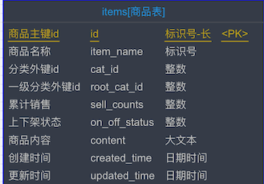
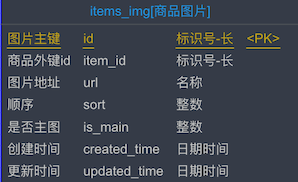

# 分类商品推荐

## 需求分析


在前面的分类列表，一级分类列表是有 10 个显示在轮播图的部分，那么在首页下方就会展示这 10 个分类的商品推荐，如上图所示。

页面上是懒加载模式，判定滚动到一定距离就去加载，核心代码如下

```javascript
		$(window).scroll(
			function() {
				// scrollTop为滚动条在Y轴上的滚动距离。
				// clientHeight为内容可视区域的高度。
				// scrollHeight为内容可视区域的高度加上溢出（滚动）的距离。
				var scrollTop = $(this).scrollTop();
				var scrollHeight = $(document).height();
				var windowHeight = $(this).height();
				if (scrollTop + windowHeight > (scrollHeight - 50) ) {
				// 此处是滚动条到底部时候触发的事件，在这里写要加载的数据，或者是拉动滚动条的操作
				// console.log("123");
				index.renderSixNewItems();
			}
		});
// 对于重复滚动去重是通过分类索引来控制的，也就是说，延迟加载是一次加载一个分类
// 核心代码如下
					var serverUrl = app.serverUrl;
					var categoryList = this.categoryList;  // 这个就是轮播图上方那个顶级分类列表
					var catIndex = this.catIndex;
					
					var rootCat = categoryList[catIndex];
					if (rootCat == undefined || rootCat == null || rootCat == '') {
						return;
					}
					var rootCatId = rootCat.id;

					catIndex++;  // 每次渲染完一个分类，就 + 1
					this.catIndex = catIndex;
```

## SQL 分析

一个商品详情主要是以下截图所示（还有一个商品内容截图中未展示）




- 分类外键 ID：最子级的分类
- 一级分类外键 ID：最顶级的分类 ID，可以在某些场景下少关联表查询



商品图片就是上图中的，一个商品可以有多张图片，有一张是首图主要被展示。

好了，那么推荐的商品需求则是按照 **最新上架** 的被推荐，SQL 如下：

```sql
select f.id           as rootCatId,
       f.name         as rootCatName,
       f.slogan       as slogan,
       f.cat_image    as catImage,
       f.bg_color     as bgColor,
       i.id           as itemId,
       i.item_name    as itemName,
       ii.url         as itemUrl,
       i.created_time as createdTime
from category f
         left join items i on f.id = i.root_cat_id
         left join items_img ii on i.id = ii.item_id
where f.type = 1     -- 一级分类
  and i.root_cat_id = 7
  and ii.is_main = 1 -- 商品主图
order by i.created_time desc
limit 0,6
```

这里关联 category 分类表，是因为需要查询到图片等相关信息，那么数据就如下

| rootCatId | rootCatName | slogan | catImage | bgColor | itemId | itemName | itemUrl | createdTime |
| :--- | :--- | :--- | :--- | :--- | :--- | :--- | :--- | :--- |
| 7 | 巧克力 | 美容养颜，男女都爱 | http://122.152.205.72:88/foodie/category/chocolate.png | #f8c375 | chocolate-1003 | 【天天吃货】巧克力甜甜圈 最棒下午茶 美眉最爱 | http://122.152.205.72:88/foodie/chocolate-1003/img1.png | 2019-09-09 14:45:34 |
| 7 | 巧克力 | 美容养颜，男女都爱 | http://122.152.205.72:88/foodie/category/chocolate.png | #f8c375 | chocolate-1005 | 【天天吃货】果肉布丁 最棒下午茶 儿童最爱 | http://122.152.205.72:88/foodie/chocolate-1005/img1.png | 2019-09-09 14:45:34 |
| 7 | 巧克力 | 美容养颜，男女都爱 | http://122.152.205.72:88/foodie/category/chocolate.png | #f8c375 | chocolate-1002 | 【天天吃货】黑巧克力豆 儿时记忆 好吃噢 | http://122.152.205.72:88/foodie/chocolate-1002/img1.png | 2019-09-09 14:45:34 |
| 7 | 巧克力 | 美容养颜，男女都爱 | http://122.152.205.72:88/foodie/category/chocolate.png | #f8c375 | chocolate-1004 | 【天天吃货】水果布丁果冻 最棒下午茶 儿童最爱 | http://122.152.205.72:88/foodie/chocolate-1004/img1.png | 2019-09-09 14:45:34 |
| 7 | 巧克力 | 美容养颜，男女都爱 | http://122.152.205.72:88/foodie/category/chocolate.png | #f8c375 | chocolate-1006 | 【天天吃货】玫瑰花水果布丁 最棒下午茶 美眉最爱 | http://122.152.205.72:88/foodie/chocolate-1006/img1.png | 2019-09-09 14:45:34 |
| 7 | 巧克力 | 美容养颜，男女都爱 | http://122.152.205.72:88/foodie/category/chocolate.png | #f8c375 | chocolate-1001 | 【天天吃货】黑巧克力 送人必备 最佳下午茶 | http://122.152.205.72:88/foodie/chocolate-1001/img1.png | 2019-09-09 14:45:34 |

可以看到，这里的结果和上一章中的商品子分类查询是一致的，可以利用 mybatis 的 collection 标签来完成嵌套对象的映射

## 分类商品接口

核心代码如下

```java
/**
 * 最新商品 VO
 *
 * @author mrcode
 * @date 2021/2/15 14:00
 */
public class NewItemsVo {
    private Integer rootCatId;
    private String rootCatName;
    private String slogan;
    private String catImage;
    private String bgColor;
    private List<SimpleItemVO> simpleItemList;
  
/**
 * 6 个最新商品数据
 *
 * @author mrcode
 * @date 2021/2/15 14:02
 */
public class SimpleItemVO {
    private String itemId;
    private String itemName;
    private String itemUrl;
```

mapper

```xml
    <resultMap id="myNewItemVo" type="cn.mrcode.foodiedev.pojo.vo.NewItemsVo">
        <id column="rootCatId" property="rootCatId"/>
        <result column="rootCatName" property="rootCatName"/>
        <result column="slogan" property="slogan"/>
        <result column="catImage" property="catImage"/>
        <result column="bgColor" property="bgColor"/>
        <collection property="simpleItemList" ofType="cn.mrcode.foodiedev.pojo.vo.SimpleItemVO">
            <id column="itemId" property="itemId"/>
            <result column="itemName" property="itemName"/>
            <result column="itemUrl" property="itemUrl"/>
        </collection>
    </resultMap>

        <select id="getSixNewItemsLazy" resultMap="myNewItemVo" parameterType="map">
        select f.id           as rootCatId,
               f.name         as rootCatName,
               f.slogan       as slogan,
               f.cat_image    as catImage,
               f.bg_color     as bgColor,
               i.id           as itemId,
               i.item_name    as itemName,
               ii.url         as itemUrl,
               i.created_time as createdTime
        from category f
                 left join items i on f.id = i.root_cat_id
                 left join items_img ii on i.id = ii.item_id
        where f.type = 1     -- 一级分类
          and i.root_cat_id = #{paramsMap.rootCatId}
          and ii.is_main = 1 -- 商品主图
        order by i.created_time desc limit 0,6
    </select>
```

```java
    /**
     * 获取一级分类下最新的 6 条商品数据
     *
     * @param map 使用对象参数的形式传参
     * @return
     */
    List<NewItemsVo> getSixNewItemsLazy(@Param("paramsMap") Map<String, Object> map);
```

service

```java
    @Transactional(propagation = Propagation.SUPPORTS)
    @Override
    public List<NewItemsVo> getSixNewItemsLazy(Integer rootCatId) {
        HashMap<String, Object> map = new HashMap<>();
        map.put("rootCatId", rootCatId);
        return categoryMapperCustom.getSixNewItemsLazy(map);
    }
```

controller

```java
    @ApiOperation(value = "获取一级分类下的最新 6 个商品")
    @GetMapping("/sixNewItems/{rootCatId}")
    public JSONResult sixNewItems(
            @ApiParam(name = "rootCatId", value = "一级分类 ID", required = true)
            @PathVariable Integer rootCatId) {
        List<NewItemsVo> list = categoryService.getSixNewItemsLazy(rootCatId);
        return JSONResult.ok(list);
    }
```

