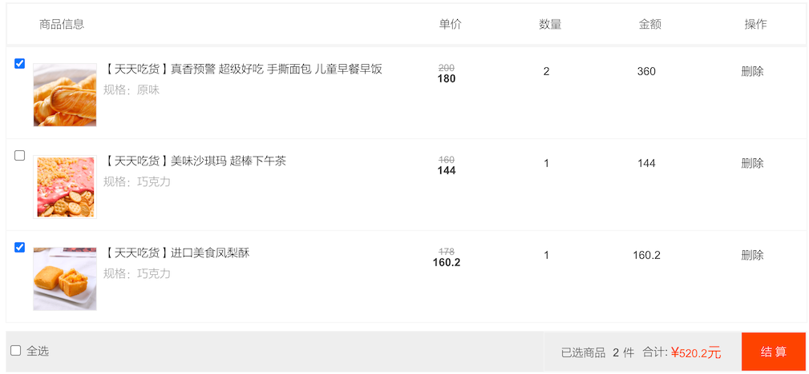
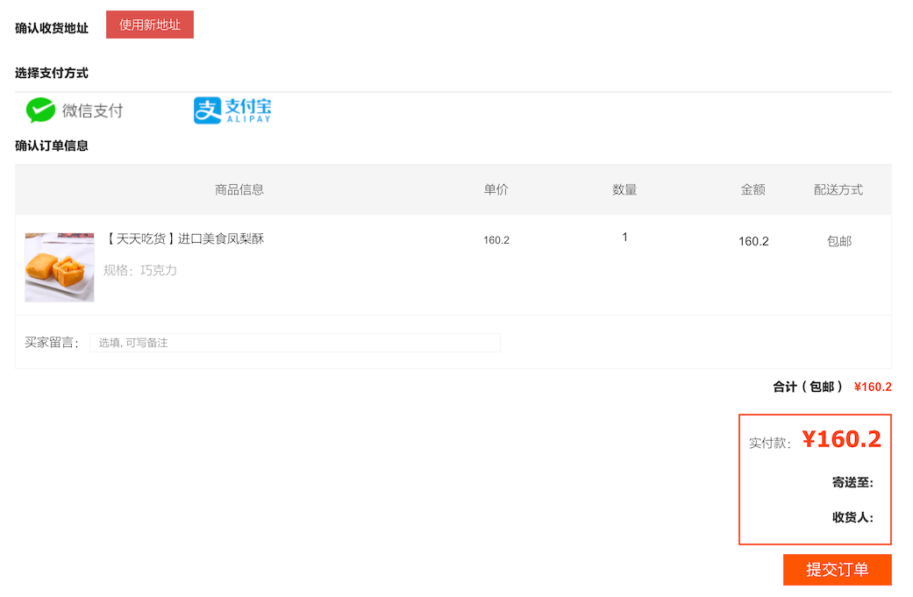

# 购物车

购物车是电商项目中核心功能之一。

- 线下：把商品放到购物车，然后去收银台结算
- 线上：把商品放到购物车，然后结算，会跳转到收银台页面

线上购物车，我们需要考虑两种情况：

- 用户已登录
- 用户未登录


## 购物车存储形式分析

### Cookie

- 特点：无需登录、无需查库、保存在浏览器端
- 优点：性能好、访问快，没有和数据库交互
- 缺点：
  - 换电脑时，购物车数据会丢失
  - 电脑被其他人登录，隐式安全

### Session

- 特点：用户登录后，购物车数据放入用户会话
- 优点：初期性能较好，访问快
- 缺点：
  - session 基于内存，用户量庞大影响服务器性能
  - 只能存在于当前会话，不适用集群与分布式系统

### 数据库

- 特点：用户登录后，购物车数据存入数据库
- 优点：数据持久化，可在任何地点任何时间访问
- 缺点：频繁读写数据库，造成数据库压力

### redis

- 特点：用户登录后，购物车数据存入 redis 缓存
- 优点：
  - 数据持久化，可在任何地点任何时间访问
  - 频繁读写只基于缓存，不会造成数据库压力
  - 适用于集群与分布式系统，可扩展性强

## 技术方案确定

本节将会使用如下方案：

- 未登录：存放 cookie

- 已登录：存放在 redis 中

  由于现阶段，还未讲解 redis，暂时不实现

 也可以去看看京东的购物车，它也是存放在 cookie 中的

## 添加商品到购物车

### 前端代码示例

前端主要代码如下

```javascript
	addToCart() {
					// 由于cookie大小限制为4k，另外课程第一阶段是没有redis的，所以相关暂存性内容会存入到cookie中
					var shopcartCounts = app.getShopcartItemCounts();
					if (shopcartCounts >= 8) {
						alert("您购物车中的食物太多啦~请把它们带回家吧~！");
						return;
					}

					// 创建购物车对象
					var item = this.item;
					var itemImgList = this.itemImgList;
					var selectedSku = this.selectedSku;

					var tmpBuyCounts = this.buyCounts;
					tmpBuyCounts = parseInt(tmpBuyCounts);
					if (typeof (tmpBuyCounts) != "number") {
						alert("购买数量不能为非数字！");
						// tmpBuyCounts = 1;
						this.buyCounts = 1;
						return;
					}

					// 构建购物车商品对象
					var shopcartItem = new app.ShopcartItem(item.id,
						itemImgList[0].url,
						item.itemName,
						selectedSku.id,
						selectedSku.name,
						tmpBuyCounts,
						selectedSku.priceDiscount,
						selectedSku.priceNormal);
					// console.log(shopcartItem);
					// 添加商品至购物车list
					app.addItemToShopcart(shopcartItem);

					// 购物车应该在登录/注册的时候同步

					// 判断当前用户是否登录，如果登录，则把购物车数据发送至后端（后端需要合并已存在的商品）
					var userIsLogin = this.userIsLogin;
					if (userIsLogin) {
						var userInfo = this.userInfo;
						var serverUrl = app.serverUrl;
						axios.defaults.withCredentials = true;
						axios.post(
								serverUrl + '/shopcart/add?userId=' + userInfo.id,
								shopcartItem, {
									headers: {
										'headerUserId': userInfo.id,
										'headerUserToken': userInfo.userUniqueToken
									}
								})
							.then(res => {
								if (res.data.status == 200) {

								} else if (res.data.status == 500) {
									alert(res.data.msg);
								}
							});
					}

					alert("商品添加至购物车成功！");

					// 以下仅供测试观察数据
					// var foodieShopcartCookie = app.getCookie("shopcart");
					// var foodieShopcart = [];
					// if (foodieShopcartCookie != null && foodieShopcartCookie != "" && foodieShopcartCookie != undefined) {
					// 	var foodieShopcartStr = decodeURIComponent(foodieShopcartCookie);
					// 	foodieShopcart = JSON.parse(foodieShopcartStr);
					// }
					// console.log(foodieShopcart);

					// 刷新购物车数量
					this.shopcartItemCounts = app.getShopcartItemCounts();
				},
```

这是操作 app.js 中 购物车 相关的代码

```javascript
  /**
   * 构建购物车商品对象
   */
  ShopcartItem: function (itemId, itemImgUrl, itemName, specId, specName, buyCounts, priceDiscount, priceNormal) {
    this.itemId = itemId
    this.itemImgUrl = itemImgUrl
    this.itemName = itemName
    this.specId = specId
    this.specName = specName
    this.buyCounts = buyCounts
    this.priceDiscount = priceDiscount
    this.priceNormal = priceNormal
  },

  addItemToShopcart (pendingItem) {
    // 判断有没有购物车，如果没有购物车，则new 一个购物车list
    // 如果有购物车，则直接把shopcartItem丢进去
    var foodieShopcartCookie = this.getCookie('shopcart')
    var foodieShopcart = []
    if (foodieShopcartCookie != null && foodieShopcartCookie != '' && foodieShopcartCookie != undefined) {
      var foodieShopcartStr = decodeURIComponent(foodieShopcartCookie)
      foodieShopcart = JSON.parse(foodieShopcartStr)

      // 如果不是对象，则重新复制为空数组
      if (typeof (foodieShopcart) != 'object') {
        foodieShopcart = []
      }

      var isHavingItem = false
      // 如果添加的商品已经存在与购物车中，则购物车中已经存在的商品数量累加新增的
      for (var i = 0; i < foodieShopcart.length; i++) {
        var tmpItem = foodieShopcart[i]
        var specId = tmpItem.specId
        if (specId == pendingItem.specId) {
          isHavingItem = true
          var newCounts = tmpItem.buyCounts + pendingItem.buyCounts
          tmpItem.buyCounts = newCounts
          // 删除主图在数组中的位置
          foodieShopcart.splice(i, 1, tmpItem)
        }
      }
      if (!isHavingItem) {
        foodieShopcart.push(pendingItem)
      }
    } else {
      foodieShopcart.push(pendingItem)
    }

    this.setCookie('shopcart', JSON.stringify(foodieShopcart))
  },

  /**
   * 获得购物车中的数量
   */
  getShopcartItemCounts () {
    // 判断有没有购物车，如果没有购物车，则new 一个购物车list
    // 如果有购物车，则直接把shopcartItem丢进去
    var foodieShopcartCookie = this.getCookie('shopcart')
    var foodieShopcart = []
    if (foodieShopcartCookie != null && foodieShopcartCookie != '' && foodieShopcartCookie != undefined) {
      var foodieShopcartStr = decodeURIComponent(foodieShopcartCookie)
      foodieShopcart = JSON.parse(foodieShopcartStr)

      // 如果不是对象，则重新复制为空数组
      if (typeof (foodieShopcart) != 'object') {
        foodieShopcart = []
      }
    }
    return foodieShopcart.length
  },
```

操作 cookie 相关的代码

```javascript
 getCookie: function (cname) {
    var name = cname + '='
    var ca = document.cookie.split(';')
    for (var i = 0; i < ca.length; i++) {
      var c = ca[i]
      // console.log(c)
      while (c.charAt(0) == ' ') c = c.substring(1)
      if (c.indexOf(name) != -1) {
        return c.substring(name.length, c.length)
      }
    }
    return ''
  },

  setCookie: function (name, value) {
    var Days = 365
    var exp = new Date()
    exp.setTime(exp.getTime() + Days * 24 * 60 * 60 * 1000)
    var cookieContent = name + '=' + encodeURIComponent(value) + ';path=/;'
    if (this.cookieDomain != null && this.cookieDomain != undefined && this.cookieDomain != '') {
      cookieContent += 'domain=' + this.cookieDomain
    }
    document.cookie = cookieContent
    // document.cookie = name + "="+ encodeURIComponent (value) + ";path=/;domain=" + cookieDomain;//expires=" + exp.toGMTString();
  },

  deleteCookie: function (name) {
    var cookieContent = name + '=; expires=Thu, 01 Jan 1970 00:00:00 UTC; path=/;'
    if (this.cookieDomain != null && this.cookieDomain != undefined && this.cookieDomain != '') {
      cookieContent += 'domain=' + this.cookieDomain
    }
    document.cookie = cookieContent
  },
```

唯一需要注意的是 `this.cookieDomain` 这个是 app.js 中的配置参数，它设置了 cookie 域，本地测试的话，需要清空该配置，否则购物车功能将看不到 cookie 相关数据。

### 后端保存购物数据接口

在每次添加商品到购物车时，有一个发往后端的请求 `'/shopcart/add?userId=' + userInfo.id,` 这个是当用户登录后，添加商品到购物车，则会触发该请求，所以尽管这里不涉及到 redis ，但是我们也需要先把接口实现，什么也不做.

```java
package cn.mrcode.foodiedev.api.controller;

import cn.mrcode.foodiedev.common.util.JSONResult;
import cn.mrcode.foodiedev.common.util.JsonUtils;
import cn.mrcode.foodiedev.pojo.bo.ShopcartBO;
import io.swagger.annotations.Api;
import org.springframework.web.bind.annotation.*;
import springfox.documentation.annotations.ApiIgnore;

import javax.servlet.http.HttpServletRequest;
import javax.servlet.http.HttpServletResponse;

@Api(value = "购物车接口")
@RestController
@RequestMapping("shopcart")
public class ShopcatController {
    @PostMapping("/add")
    public JSONResult add(
            @RequestParam String userId,
            @RequestBody ShopcartBO shopcartBO,
            HttpServletRequest request,
            HttpServletResponse response
    ) {
        System.out.println(JsonUtils.objectToJson(shopcartBO));
        // 这里需要校验是否登录之类的，后续再来完善该代码
        // 这里只简单的判定是否有传递 userId
        // TODO 前端用户在登录的情况下，添加商品到购物车，会同时在后端同步购物车到 redis 缓存
        return JSONResult.ok();
    }
}

```

定义 BO 对象，接受参数

```java
package cn.mrcode.foodiedev.pojo.bo;

public class ShopcartBO {

    private String itemId;
    private String itemImgUrl;
    private String itemName;
    private String specId;
    private String specName;
    private Integer buyCounts;
    private String priceDiscount;
    private String priceNormal;
```

然后现在，就可以登录账户，然后添加一个商品到购物车，查看接口是否有正确的接收到传递过来的加购商品信息

### 小结

- 前端：添加一个商品到购物车时时，需要判定是否是同一个商品（specId），如果是需要合并并累加数量
- 后端：在登录状态下，前端添加到购物车时，需要将这个商品发送到后端

## 购物车页面


如上图，则是购物车页面。

## 购物车页面-刷新渲染

从其他页面进入到购物车页面时，我们渲染购物车页面商品列表，是否可以直接使用 cookie 里面保存的商品信息呢？

这里一般不会直接使用 cookie 里面的商品信息，而是需要去后端查询最新的商品信息，再渲染。

### 前端代码

```javascript
renderShopcart() {
						var shopcartList = app.getShopcartList();

						// console.log(shopcartList);
						// this.shopcartList = shopcartList;

						if (shopcartList.length <= 0) {
							return;
						}

						// 刷新购物车中价格，以防长时间未登录网址，价格发生变动
						// 拼接规格ids
						var itemSpecIds = "";
						for (var i = 0 ; i < shopcartList.length ; i ++) {
							var tmpSpecId = shopcartList[i].specId;
							itemSpecIds += tmpSpecId;
							if (i < shopcartList.length-1) {
								itemSpecIds += ",";
							}
						}
						// 1001，2002，3003，4004

						// 请求后端获得最新数据
						var serverUrl = app.serverUrl;
							axios.defaults.withCredentials = true;
							axios.get(
									serverUrl + '/items/refresh?itemSpecIds=' + itemSpecIds, 
									{},)
									.then(res => {
										if (res.data.status == 200) {
											var newItemList = res.data.data;
											// 删除现有购物车cookie
											app.deleteCookie("shopcart");
											// console.log(newItemList);
											// 拿到最新商品数据以后，重新组合成购物车数据
											for (var i = 0 ; i < newItemList.length ; i ++) {
												var tmpNewItem = newItemList[i];
												var tmpNewItemSpecId = tmpNewItem.specId;
												var buyCounts = this.getBuyCountsFromCookieShopcartList(shopcartList, tmpNewItemSpecId);
												// console.log(buyCounts);

												// 构建购物车商品对象
												var shopcartItem = new app.ShopcartItem(tmpNewItem.itemId, 
																						tmpNewItem.itemImgUrl,
																						tmpNewItem.itemName, 
																						tmpNewItem.specId, 
																						tmpNewItem.specName, 
																						buyCounts, 
																						tmpNewItem.priceDiscount, 
																						tmpNewItem.priceNormal);
												// 添加商品至购物车list
												app.addItemToShopcart(shopcartItem);
											}
											// 重新获取cookie中的商品list渲染到页面
											shopcartList = app.getShopcartList();
											// console.log(shopcartList);
											this.shopcartList = shopcartList;	
										} else if (res.data.status == 500) {
											alert(res.data.msg);
										}
									});
						

					},
```

做的事情如下：

1. 从 cookie 中获取到了商品信息，并将规格 ID 拼接成参数列表
2. 去服务器端批量获取商品信息
3. 删除本地 cookie 中的购物车数据
4. 将从服务器端获取到的商品数据添加到购物中（只有购买数量是 cookie 里面的）

那么就要实现该接口

###  查询最新商品数据接口

```sql
SELECT t_items.id                  as itemId,
       t_items.item_name           as itemName,
       t_items_img.url             as itemImgUrl,
       t_items_spec.id             as specId,
       t_items_spec.`name`         as specName,
       t_items_spec.price_discount as priceDiscount,
       t_items_spec.price_normal   as priceNormal
FROM items_spec t_items_spec
         LEFT JOIN
     items t_items
     ON
         t_items.id = t_items_spec.item_id
         LEFT JOIN
     items_img t_items_img
     on
         t_items_img.item_id = t_items.id
WHERE t_items_img.is_main = 1
  AND t_items_spec.id IN ('bingan-1001-spec-1','bingan-1001-spec-2')
```

| itemId | itemName | itemImgUrl | specId | specName | priceDiscount | priceNormal |
| :--- | :--- | :--- | :--- | :--- | :--- | :--- |
| bingan-1001 | 【天天吃货】彩虹马卡龙 下午茶 美眉最爱 | http://122.152.205.72:88/foodie/bingan-1001/img1.png | bingan-1001-spec-1 | 巧克力 | 12000 | 15000 |
| bingan-1001 | 【天天吃货】彩虹马卡龙 下午茶 美眉最爱 | http://122.152.205.72:88/foodie/bingan-1001/img1.png | bingan-1001-spec-2 | 草莓水果 | 9000 | 15000 |

mapper

```java
    List<ShopcartVO> queryItemsBySpecIds(@Param("paramsList") List specIdsList);
```

```xml
<select id="queryItemsBySpecIds" parameterType="List" resultType="cn.mrcode.foodiedev.pojo.vo.ShopcartVO">
        SELECT t_items.id                  as itemId,
               t_items.item_name           as itemName,
               t_items_img.url             as itemImgUrl,
               t_items_spec.id             as specId,
               t_items_spec.`name`         as specName,
               t_items_spec.price_discount as priceDiscount,
               t_items_spec.price_normal   as priceNormal
        FROM items_spec t_items_spec
                 LEFT JOIN
             items t_items
             ON
                 t_items.id = t_items_spec.item_id
                 LEFT JOIN
             items_img t_items_img
             on
                 t_items_img.item_id = t_items.id
        WHERE t_items_img.is_main = 1
          AND t_items_spec.id IN
            <foreach collection="paramsList" index="index" item="specId" open="(" separator="," close=")">
                #{specId}
            </foreach>
    </select>
```

VO 

```java
public class ShopcartVO {

    private String itemId;
    private String itemImgUrl;
    private String itemName;
    private String specId;
    private String specName;
    private String priceDiscount;
    private String priceNormal;
```

service

```java
    @Transactional(propagation = Propagation.SUPPORTS)
    @Override
    public List<ShopcartVO> queryItemsBySpecIds(String specIds) {

        String ids[] = specIds.split(",");
        List<String> specIdsList = new ArrayList<>();
        Collections.addAll(specIdsList, ids);

        return itemsMapperCustom.queryItemsBySpecIds(specIdsList);
    }
```

controller

```java
    // 用于用户长时间未登录网站，刷新购物车中的数据（主要是商品价格），类似京东淘宝
    @ApiOperation(value = "根据商品规格 ids 查找最新的商品数据", notes = "根据商品规格 ids 查找最新的商品数据", httpMethod = "GET")
    @GetMapping("/refresh")
    public JSONResult refresh(
            @ApiParam(name = "itemSpecIds", value = "拼接的规格ids", required = true, example = "1001,1003,1005")
            @RequestParam String itemSpecIds) {

        if (StringUtils.isBlank(itemSpecIds)) {
            return JSONResult.ok();
        }

        List<ShopcartVO> list = itemService.queryItemsBySpecIds(itemSpecIds);

        return JSONResult.ok(list);
    }
```

## 购物车页面-选中商品业务



如上图，选中商品，计算他们的价格，这里代码是前端的一个效果。

## 购物车页面-删除商品业务

删除购物车商品时，同样需要考虑「登录」和「未登录」：

- 未登录：只需要删除本地  cookie 中的数据即可
- 已登录：还需要删除服务端购物车数据

### 前端代码

```javascript
					// 从购物车中删除商品
					delFromCart(specId) {
						// console.log(specId);

						var bool = window.confirm("确认从购物车中移除该商品吗？");
						if (!bool) {
							return;
						}
						
						// 删除cookie中的商品
						var shopcartList = app.getShopcartList();
						for (var i = 0 ; i < shopcartList.length ; i ++) {
							var tmpItem = shopcartList[i];
							if (tmpItem.specId == specId) {
								shopcartList.splice(i, 1);
								break;
							}
						}
						// 重新放入cookie，更新一下
						app.setCookie("shopcart", JSON.stringify(shopcartList));
						this.shopcartList = shopcartList;

						// 清除选中项
						var specIds = this.specIds;
						for (var i = 0 ; i < specIds.length ; i++) {
							var tmpSpecId = specIds[i];
							if (specId == tmpSpecId) {
								specIds.splice(i, 1);
							}
						}
            // 重新计算购物车中选中的件数以及总价格
						this.reCalItemsCountsAndAmount();

						// 如果用户是已经登录状态，需要再把redis中的购物车商品删除
						var userIsLogin = this.userIsLogin;
						if (userIsLogin) {
							var userInfo = this.userInfo;
							var serverUrl = app.serverUrl;
							axios.defaults.withCredentials = true;
							axios.post(
									serverUrl + '/shopcart/del?userId=' + userInfo.id + '&itemSpecId=' + specId, 
									{}, 
									{
										headers: {
											'headerUserId': userInfo.id,
											'headerUserToken': userInfo.userUniqueToken
										}
									})
									.then(res => {
										if (res.data.status == 200) {
											
										} else if (res.data.status == 500) {
											alert(res.data.msg);
										}
									});
						}

					},
```

大致步骤如下：

1. 获取 cookie 中的商品列表信息
2. 将选中删除的从列表中删除
3. 更新 cookie 的信息
4. 重新计算购物车中选中的件数以及总价格
5. 如果是已经登录用户，删除后端购物车中的数据

### 后端代码

`/shopcart/del?userId=' + userInfo.id + '&itemSpecId=' + specId`

后端接口提供了删除购物车中的数据。

```java
    @ApiOperation(value = "从购物车中删除商品", notes = "从购物车中删除商品", httpMethod = "POST")
    @PostMapping("/del")
    public JSONResult del(
            @RequestParam String userId,
            @RequestParam String itemSpecId,
            HttpServletRequest request,
            HttpServletResponse response
    ) {

        if (StringUtils.isBlank(userId) || StringUtils.isBlank(itemSpecId)) {
            return JSONResult.errorMsg("参数不能为空");
        }

        // TODO 用户在页面删除购物车中的商品数据，如果此时用户已经登录，则需要同步删除后端购物车中的商品

        return JSONResult.ok();
    }
```

由于后端涉及到 redis 与用户认证之类的信息，本阶段暂未涉及，只提供空接口实现即可

## 购物车页面-提交购物车至结算页

将选中的商品，点击结算，将跳转到结算页，这里需要先登录才能结算。如果点击结算时，没有登录，则会自动跳转到登录页面，登录成功后，会自动跳转到购物车页面。



### 前端结算页面

```javascript
				// 前往结算页面
					goPay() {
						var shopcartList = app.getShopcartList();
						if (shopcartList.length <= 0) {
							alert("购物车中没有商品，无法结算");
							return;
						}

						var selectedItemSpecIds = this.specIds;
						if (selectedItemSpecIds.length <= 0) {
							alert("请至少在购物车中选择一个商品后再结算");
							return;
						}

						// 判断是否登录
						var userIsLogin = this.userIsLogin;
						if (userIsLogin) {
							var specIdsStr = selectedItemSpecIds.toString();
							window.location.href = "pay.html?selectedItemSpecIds=" + specIdsStr;
						} else {
							var bool = window.confirm("请登录/注册后再进行结算操作噢~！");
							if (!bool) {
								return;
							} else {
								this.goLogin();
							}
						}
					},
```

大致流程：

1. 获取到已选商品 ID（specIds）
2. 判断是否登录，没有登录则跳转到登录页面
3. 已经登录，则直接跳转到 `"pay.html?selectedItemSpecIds=" + specIdsStr;` 页面

该功能不涉及到后端功能。

### 结算页面-渲染订单信息

从购物车点击 结算，后跳转到 结算页面，其中之一需要做的事情就是，显示提交的商品信息

```javascript
renderOrderInfoList() {
 var selectedItemSpecIds = app.getUrlParam("selectedItemSpecIds");
 if (selectedItemSpecIds == null || selectedItemSpecIds == '' || selectedItemSpecIds ==
  undefined) {
  app.goErrorPage();
 }

 var specIdsArray = new Array();
 specIdsArray = selectedItemSpecIds.split(",");

 var orderItemList = [];
 var totalAmount = 0;
 for (var i = 0; i < specIdsArray.length; i++) {
  var tmpSpecId = specIdsArray[i];
  var orderItem = this.getItemFromCookieShopcartList(tmpSpecId);
  orderItemList.push(orderItem);
  totalAmount += (orderItem.priceDiscount * orderItem.buyCounts);
 }
 // console.log(orderItemList);
 this.orderItemList = orderItemList;
 this.totalAmount = totalAmount;

 if (orderItemList.length <= 0) {
  alert("没有商品信息，或订单已经提交");
  window.location.href = "shopcart.html";
 }
},
```

大致流程如下：

1. 从 URL 中获得选择的商品 ID
2. 从 cookie 里面获取到商品信息，包装成 orderItem
3. 计算选中商品的总价格

结算中的其他业务则属于订单相关业务了，后续再继续讲解。

## 总结

购物车的主要业务如下：

1. 添加商品到购物车

   需要考虑到用户已登录或未登录的情况：

   - 未登录：只将选中商品数据存储在 cookie 中
   - 已登录：还需要将选中商品数据发往后端服务，存储在 redis 中

2. 查看购物中的商品

   这里不能直接使用 cookie 中的商品信息，需要从后端服务获取最新的商品信息，主要是商品价格，因为购物车的商品大部分情况下，不是即使被查看，有可能已经过了很久了

3. 选中购物车商品，查看总价格

   挑选想要购买的商品，查看选中商品的价格

4. 提交购物商品，到结算页面

   正式进入到订单业务