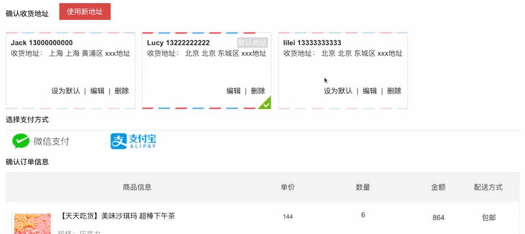
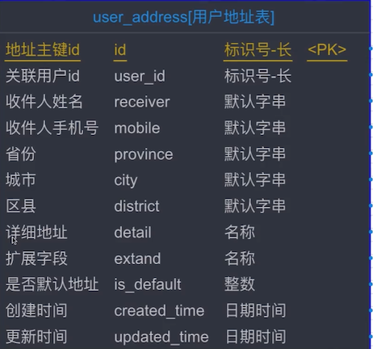

# 收货地址

## 需求分析



- 进入页面后，需要将所有的收货地址列出来
- 可以新增地址
- 可以修改之前的地址
- 可以设置为默认：默认会被选中

## 表设计



- 关联用户 ID：一个用户会有多个收货地址
- 扩展字段：可能会有详细地址 2

## 需要接口说明

用户在确认订单页面，可以针对收货地址做如下操作：

1. 查询用户的所有收货地址列表
2. 新增收货地址
3. 删除收货地址
4. 修改收货地址
5. 设置默认地址

另外在编辑地址时，所需要的省市区信息的维护：本课程是放在前端 js 中维护的，这种信息一般半年才维护一次，变动不太大。

## 查询用户的所有收货地址列表

controller

```java
    @ApiOperation(value = "根据用户id查询收货地址列表", notes = "根据用户id查询收货地址列表", httpMethod = "POST")
    @PostMapping("/list")
    public JSONResult list(
            @RequestParam String userId) {

        if (StringUtils.isBlank(userId)) {
            return JSONResult.errorMsg("");
        }

        List<UserAddress> list = addressService.queryAll(userId);
        return JSONResult.ok(list);
    }
```

service

```java
    @Transactional(propagation = Propagation.SUPPORTS)
    @Override
    public List<UserAddress> queryAll(String userId) {

        UserAddress ua = new UserAddress();
        ua.setUserId(userId);

        return userAddressMapper.select(ua);
    }
```

## 新增收货地址

新增与编辑这里分开了编写的。

controller

```java
    @ApiOperation(value = "用户新增地址", notes = "用户新增地址", httpMethod = "POST")
    @PostMapping("/add")
    public JSONResult add(@RequestBody AddressBO addressBO) {

        JSONResult checkRes = checkAddress(addressBO);
        if (checkRes.getStatus() != 200) {
            return checkRes;
        }

        addressService.addNewUserAddress(addressBO);

        return JSONResult.ok();
    }

    private JSONResult checkAddress(AddressBO addressBO) {
        String receiver = addressBO.getReceiver();
        if (StringUtils.isBlank(receiver)) {
            return JSONResult.errorMsg("收货人不能为空");
        }
        if (receiver.length() > 12) {
            return JSONResult.errorMsg("收货人姓名不能太长");
        }

        String mobile = addressBO.getMobile();
        if (StringUtils.isBlank(mobile)) {
            return JSONResult.errorMsg("收货人手机号不能为空");
        }
        if (mobile.length() != 11) {
            return JSONResult.errorMsg("收货人手机号长度不正确");
        }
        boolean isMobileOk = MobileEmailUtils.checkMobileIsOk(mobile);
        if (!isMobileOk) {
            return JSONResult.errorMsg("收货人手机号格式不正确");
        }

        String province = addressBO.getProvince();
        String city = addressBO.getCity();
        String district = addressBO.getDistrict();
        String detail = addressBO.getDetail();
        if (StringUtils.isBlank(province) ||
                StringUtils.isBlank(city) ||
                StringUtils.isBlank(district) ||
                StringUtils.isBlank(detail)) {
            return JSONResult.errorMsg("收货地址信息不能为空");
        }

        return JSONResult.ok();
    }
```

BO

```java
/**
 * 用户新增或修改地址的 BO
 */
public class AddressBO {

    private String addressId;

    private String userId;
    private String receiver;
    private String mobile;
    private String province;
    private String city;
    private String district;
    private String detail;
```

service

```java
    @Transactional(propagation = Propagation.REQUIRED)
    @Override
    public void addNewUserAddress(AddressBO addressBO) {

        // 1. 判断当前用户是否存在地址，如果没有，则新增为‘默认地址’
        Integer isDefault = 0;
        List<UserAddress> addressList = this.queryAll(addressBO.getUserId());
        if (addressList == null || addressList.isEmpty() || addressList.size() == 0) {
            isDefault = 1;
        }

        String addressId = sid.nextShort();

        // 2. 保存地址到数据库
        UserAddress newAddress = new UserAddress();
        BeanUtils.copyProperties(addressBO, newAddress);

        newAddress.setId(addressId);
        newAddress.setIsDefault(isDefault);
        newAddress.setCreatedTime(new Date());
        newAddress.setUpdatedTime(new Date());

        userAddressMapper.insert(newAddress);
    }
```

## 删除收货地址

controller

```java
 @ApiOperation(value = "用户删除地址", notes = "用户删除地址", httpMethod = "POST")
    @PostMapping("/delete")
    public JSONResult delete(
            @RequestParam String userId,
            @RequestParam String addressId) {

        if (StringUtils.isBlank(userId) || StringUtils.isBlank(addressId)) {
            return JSONResult.errorMsg("");
        }

        addressService.deleteUserAddress(userId, addressId);
        return JSONResult.ok();
    }
```

service

```java
    @Transactional(propagation = Propagation.REQUIRED)
    @Override
    public void deleteUserAddress(String userId, String addressId) {

        UserAddress address = new UserAddress();
        address.setId(addressId);
        address.setUserId(userId);

        userAddressMapper.delete(address);
    }
```

## 修改收货地址

controller

```java
    @ApiOperation(value = "用户修改地址", notes = "用户修改地址", httpMethod = "POST")
    @PostMapping("/update")
    public JSONResult update(@RequestBody AddressBO addressBO) {

        if (StringUtils.isBlank(addressBO.getAddressId())) {
            return JSONResult.errorMsg("修改地址错误：addressId不能为空");
        }

        JSONResult checkRes = checkAddress(addressBO);
        if (checkRes.getStatus() != 200) {
            return checkRes;
        }

        addressService.updateUserAddress(addressBO);

        return JSONResult.ok();
    }
```

service

```java
    @Transactional(propagation = Propagation.REQUIRED)
    @Override
    public void updateUserAddress(AddressBO addressBO) {

        String addressId = addressBO.getAddressId();

        UserAddress pendingAddress = new UserAddress();
        BeanUtils.copyProperties(addressBO, pendingAddress);

        pendingAddress.setId(addressId);
        pendingAddress.setUpdatedTime(new Date());

        userAddressMapper.updateByPrimaryKeySelective(pendingAddress);
    }
```

## 设置默认地址

controller

```java
    @ApiOperation(value = "用户设置默认地址", notes = "用户设置默认地址", httpMethod = "POST")
    @PostMapping("/setDefalut")
    public JSONResult setDefalut(
            @RequestParam String userId,
            @RequestParam String addressId) {

        if (StringUtils.isBlank(userId) || StringUtils.isBlank(addressId)) {
            return JSONResult.errorMsg("");
        }

        addressService.updateUserAddressToBeDefault(userId, addressId);
        return JSONResult.ok();
    }
```

service

```java
 @Transactional(propagation = Propagation.REQUIRED)
    @Override
    public void updateUserAddressToBeDefault(String userId, String addressId) {

        // 1. 查找默认地址，设置为不默认
        UserAddress queryAddress = new UserAddress();
        queryAddress.setUserId(userId);
        queryAddress.setIsDefault(YesOrNo.YES.type);
        List<UserAddress> list = userAddressMapper.select(queryAddress);
        for (UserAddress ua : list) {
            ua.setIsDefault(YesOrNo.NO.type);
            userAddressMapper.updateByPrimaryKeySelective(ua);
        }

        // 2. 根据地址id修改为默认的地址
        UserAddress defaultAddress = new UserAddress();
        defaultAddress.setId(addressId);
        defaultAddress.setUserId(userId);
        defaultAddress.setIsDefault(YesOrNo.YES.type);
        userAddressMapper.updateByPrimaryKeySelective(defaultAddress);
    }
```

