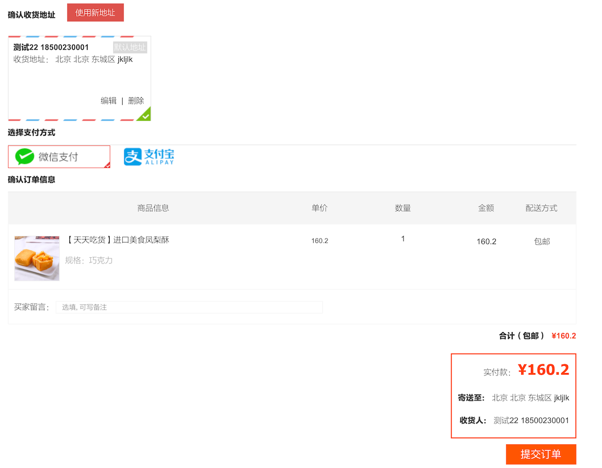
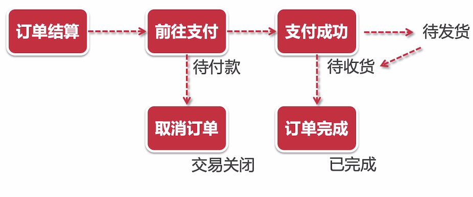
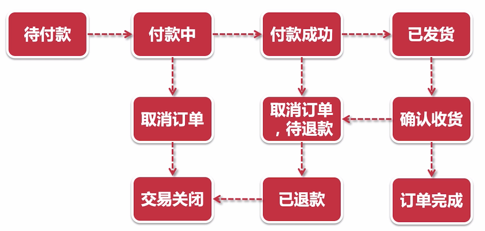

# 确认订单 & 创建订单



选择收货地址，和支付方式后，就可以点击提交订单了，在这之前，先来看看订单实现流程

## 订单实现流程


- 用户浏览商品
- 添加到购物车
- 订单结算：相当于是订单确认
- 发起支付

## 订单状态流转



- 前往支付：这里生成订单？
- 待发货 变成 待收货，这里需要有 客服系统或则商家系统 来做这件事，本阶段不涉及该系统，可以直接修改状态来演示

## 复杂订单状态涉及

当你的用户量起来之后，你的业务也会随之发生改变，那么订单状态就可能变得复杂了



- 付款中：有可能是一些第三方平台，或则政府平台，同步等待结果的话，可能会超过 10 秒，长的可能几分钟，这里异步等待回调
- 取消订单，待退款：是需要客服等人员去审核的

## 订单相关表设计


订单表：

- 收货xx快照：基本上下达填写收货地址后，再去更改收货地址信息，订单中的收货地址是不会被影响的
- 实际支付总价格：可能会有优惠卷之类的；但是在本阶段没有这些优惠功能
- 邮费：本阶段邮费都是包邮的
- 买家是否评价：判断是否对该订单是否进行了评价
- 逻辑删除状态：订单这种数据对我们公司来说是宝贵的数据，对于用户来说是看不到了，但是对于我们公司来说它是有价值的

订单商品关联表：子订单表

- 这里关于商品的一些信息，也是快照信息，而不是直接是一个 ID
- 商品 ID、规格 ID：这些数据也是比较珍贵的，可以用来做一些大数据分析之类的

订单状态表：可以和订单表进行合并的，但是为了性能，就拆开来了（列多，查询性能低）

- 订单 ID：与订单表的 ID 是一样的
- 订单状态：订单状态表;订单的每个状态更改都需要进行记录
  10：待付款  20：已付款，待发货  30：已发货，待收货（7天自动确认）  40：交易成功（此时可以评价）50：交易关闭（待付款时，用户取消 或 长时间未付款，系统识别后自动关闭）
  退货/退货（退款），此分支流程不做，所以不加入

## 聚合支付中心

就是将 **微信支付** 和 **支付宝支付** 封装成了一个服务，这个服务部署在公网上


我们要使用微信支付和支付宝支付，是需要去申请开通支付功能的，而开通支付功能一般是收费且需要公司资质的，那么这里就做了一个项目（支付中心），以供开发调试使用


由于这个聚合支付中心，需要单独开通接口权限，比较麻烦，笔者在这一块的时候会直接跳过。

## 提交并接受订单信息

###  前端代码

```java
				// 提交订单，创建订单
				submitOrder() {
					// 判断提交的商品不能为空
					var orderItemList = this.orderItemList;
					if (orderItemList == null || orderItemList == undefined || orderItemList == '' || orderItemList.length <= 0) {
						alert("没有商品信息，订单无法提交~！");
						return;
					}
					// 拼接规格ids
					var itemSpecIds = "";
					for (var i = 0 ; i < orderItemList.length ; i ++) {
						var tmpSpecId = orderItemList[i].specId;
						itemSpecIds += tmpSpecId;
						if (i < orderItemList.length-1) {
							itemSpecIds += ",";
						}
					}

					// 判断选中的地址id不能为空
					var choosedAddressId = this.choosedAddressId;
					if (choosedAddressId == null || choosedAddressId == undefined || choosedAddressId == '') {
						alert("请选择收货地址！");
						return;
					}

					// 判断支付方式不能为空
					var choosedPayMethod = parseInt(this.choosedPayMethod);
					if (choosedPayMethod != 1 && choosedPayMethod != 2) {
						alert("请选择支付方式！");
						return;
					}

					// var newWindow = window.open();

					// 买家备注可以为空
					var orderRemarker = this.orderRemarker;
					// console.log(orderRemarker);

					var userInfo = this.userInfo;
					var serverUrl = app.serverUrl;
					axios.defaults.withCredentials = true;
					axios.post(
							serverUrl + '/orders/create', 
							{
								"userId": userInfo.id,
								"itemSpecIds": itemSpecIds,
								"addressId": choosedAddressId,
								"payMethod": choosedPayMethod,
								"leftMsg": orderRemarker,
							},
							{
								headers: {
									'headerUserId': userInfo.id,
									'headerUserToken': userInfo.userUniqueToken
								}
							})
							.then(res => {
								if (res.data.status == 200) {
									// alert("OK");
									var orderId = res.data.data;
									// 判断是否微信还是支付宝支付
									if (choosedPayMethod == 1) {
										// 微信支付则跳转到微信支付页面，并且获得支付二维码
										window.location.href = "wxpay.html?orderId=" + orderId;
									} else if (choosedPayMethod == 2) {
										this.orderId = orderId;

										// 支付宝支付直接跳转
										window.location.href = "alipay.html?orderId=" + orderId + "&amount="+this.totalAmount;
										window.open("alipayTempTransit.html?orderId=" + orderId);
										// const newWindow = window.open();
										// 弹出的新窗口进行支付
										// newWindow.location = "alipayTempTransit.html?orderId=" + orderId;
										// this.$nextTick(()=> {
										// 	// 当前页面跳转后会轮训支付结果
										// 	newWindow.location.href = "alipay.html?orderId=" + orderId;
										// })
									} else {
										alert("目前只支持微信或支付宝支付！");
									}

								} else {
									alert(res.data.msg);
								}
							});
				},
```

大致流程如下：

1. 获取到商品的规格 ID
2. 拿到选择的地址 ID
3. 拿到支付的方式
4. 创建订单 `/orders/create`
5. 订单创建成功之后，再处理支付相关的业务，后面再说

这里主要是需要先实现创建订单的功能

### 用户下单（创建订单）接口

BO

```java

/**
 * 用于创建订单的 BO 对象
 */
public class SubmitOrderBO {

    private String userId;
    private String itemSpecIds;
    private String addressId;
    private Integer payMethod;
    private String leftMsg;
```

```java
package cn.mrcode.foodiedev.service.impl;

import cn.mrcode.foodiedev.common.enums.OrderStatusEnum;
import cn.mrcode.foodiedev.common.enums.YesOrNo;
import cn.mrcode.foodiedev.mapper.OrderItemsMapper;
import cn.mrcode.foodiedev.mapper.OrderStatusMapper;
import cn.mrcode.foodiedev.mapper.OrdersMapper;
import cn.mrcode.foodiedev.pojo.*;
import cn.mrcode.foodiedev.pojo.bo.SubmitOrderBO;
import cn.mrcode.foodiedev.pojo.vo.MerchantOrdersVO;
import cn.mrcode.foodiedev.pojo.vo.OrderVO;
import cn.mrcode.foodiedev.service.AddressService;
import cn.mrcode.foodiedev.service.ItemService;
import cn.mrcode.foodiedev.service.OrderService;
import org.n3r.idworker.Sid;
import org.springframework.beans.factory.annotation.Autowired;
import org.springframework.stereotype.Service;

import java.util.Date;

/**
 * @author mrcode
 * @date 2021/2/16 20:11
 */
@SuppressWarnings("SpringJavaInjectionPointsAutowiringInspection")
@Service
public class OrderServiceImpl implements OrderService {
    @SuppressWarnings("SpringJavaInjectionPointsAutowiringInspection")
    @Autowired
    private OrdersMapper ordersMapper;
    @Autowired
    private Sid sid;
    @Autowired
    private AddressService addressService;
    @Autowired
    private ItemService itemService;
    @Autowired
    private OrderItemsMapper orderItemsMapper;
    @Autowired
    private OrderStatusMapper orderStatusMapper;

    @Transactional(propagation = Propagation.REQUIRED)
    @Override
    public OrderVO createOrder(SubmitOrderBO submitOrderBO) {

        String userId = submitOrderBO.getUserId();
        String addressId = submitOrderBO.getAddressId();
        String itemSpecIds = submitOrderBO.getItemSpecIds();
        Integer payMethod = submitOrderBO.getPayMethod();
        String leftMsg = submitOrderBO.getLeftMsg();
        // 包邮费用设置为0
        Integer postAmount = 0;

        // 使用 sid 生成
        String orderId = sid.nextShort();

        UserAddress address = addressService.queryUserAddres(userId, addressId);

        // 1. 新订单数据保存
        Orders newOrder = new Orders();
        newOrder.setId(orderId);
        newOrder.setUserId(userId);

        // 地址快照
        newOrder.setReceiverName(address.getReceiver());
        newOrder.setReceiverMobile(address.getMobile());
        newOrder.setReceiverAddress(address.getProvince() + " "
                + address.getCity() + " "
                + address.getDistrict() + " "
                + address.getDetail());

        // 在保存子订单后，计算出总价和真实价格后再填充
        //        newOrder.setTotalAmount();
        //        newOrder.setRealPayAmount();

        // 设置运费，真实的业务中，会动态设置的，要获取到
        newOrder.setPostAmount(postAmount);

        newOrder.setPayMethod(payMethod);
        newOrder.setLeftMsg(leftMsg); // 买家留言

        newOrder.setIsComment(YesOrNo.NO.type);
        newOrder.setIsDelete(YesOrNo.NO.type);
        newOrder.setCreatedTime(new Date());
        newOrder.setUpdatedTime(new Date());


        // 2. 循环根据 itemSpecIds 保存订单商品信息表
        String itemSpecIdArr[] = itemSpecIds.split(",");
        Integer totalAmount = 0;    // 商品原价累计
        Integer realPayAmount = 0;  // 优惠后的实际支付价格累计
        for (String itemSpecId : itemSpecIdArr) {

            // TODO 整合 redis 后，商品购买的数量重新从 redis 的购物车中获取
            int buyCounts = 1;

            // 2.1 根据规格 id，查询规格的具体信息，主要获取价格
            ItemsSpec itemSpec = itemService.queryItemSpecById(itemSpecId);
            totalAmount += itemSpec.getPriceNormal() * buyCounts;
            realPayAmount += itemSpec.getPriceDiscount() * buyCounts;

            // 2.2 根据商品 id，获得商品信息以及商品主图
            String itemId = itemSpec.getItemId();
            Items item = itemService.queryItemById(itemId);
            String imgUrl = itemService.queryItemMainImgById(itemId);

            // 2.3 循环保存子订单数据到数据库
            String subOrderId = sid.nextShort();
            OrderItems subOrderItem = new OrderItems();
            subOrderItem.setId(subOrderId);
            subOrderItem.setOrderId(orderId);
            subOrderItem.setItemId(itemId);
            subOrderItem.setItemName(item.getItemName());
            subOrderItem.setItemImg(imgUrl);
            subOrderItem.setBuyCounts(buyCounts);
            subOrderItem.setItemSpecId(itemSpecId);
            subOrderItem.setItemSpecName(itemSpec.getName());
            subOrderItem.setPrice(itemSpec.getPriceDiscount());
            orderItemsMapper.insert(subOrderItem);

            // 2.4 在用户提交订单以后，规格表中需要扣除库存
            itemService.decreaseItemSpecStock(itemSpecId, buyCounts);
        }

        newOrder.setTotalAmount(totalAmount);
        newOrder.setRealPayAmount(realPayAmount);
        ordersMapper.insert(newOrder);

        // 3. 保存订单状态表
        OrderStatus waitPayOrderStatus = new OrderStatus();
        waitPayOrderStatus.setOrderId(orderId);
        waitPayOrderStatus.setOrderStatus(OrderStatusEnum.WAIT_PAY.type);
        waitPayOrderStatus.setCreatedTime(new Date());
        orderStatusMapper.insert(waitPayOrderStatus);

        // 4. 构建商户订单，用于传给支付中心
        MerchantOrdersVO merchantOrdersVO = new MerchantOrdersVO();
        merchantOrdersVO.setMerchantOrderId(orderId);
        merchantOrdersVO.setMerchantUserId(userId);
        merchantOrdersVO.setAmount(realPayAmount + postAmount);
        merchantOrdersVO.setPayMethod(payMethod);

        // 5. 构建自定义订单 vo
        OrderVO orderVO = new OrderVO();
        orderVO.setOrderId(orderId);
        orderVO.setMerchantOrdersVO(merchantOrdersVO);

        return orderVO;
    }
}

```

## 创建订单-扣减库存

在插入子单时，就要扣减库存

```java
 // 2.4 在用户提交订单以后，规格表中需要扣除库存
itemService.decreaseItemSpecStock(itemSpecId, buyCounts);
```

```java
   @Transactional(propagation = Propagation.REQUIRED)
    @Override
    public void decreaseItemSpecStock(String specId, int buyCounts) {

        // synchronized 不推荐使用，集群下无用，性能低下
        // 锁数据库: 不推荐，导致数据库性能低下
        // 分布式锁 zookeeper redis

        // lockUtil.getLock(); -- 加锁

        // 1. 查询库存
//        int stock = 10;

        // 2. 判断库存，是否能够减少到0以下
//        if (stock - buyCounts < 0) {
        // 提示用户库存不够
//            10 - 3 -3 - 5 = -1
//        }

        // lockUtil.unLock(); -- 解锁


        int result = itemsMapperCustom.decreaseItemSpecStock(specId, buyCounts);
        if (result != 1) {
            throw new RuntimeException("订单创建失败，原因：库存不足!");
        }
    }
```

这里以后可以使用分布式所来实现，现在在数据库层面实现，在更新的时候去减库存，并且库减要大于 0 ，这就会触发行级锁

```java
    <update id="decreaseItemSpecStock">

        update
            items_spec
        set
            stock = stock - #{pendingCounts}
        where
            id = #{specId}
          and
            stock >= #{pendingCounts}

    </update>
```

这里的基本原理则是 **数据库乐观锁**

controller

```java
package cn.mrcode.foodiedev.api.controller;

import cn.mrcode.foodiedev.common.enums.PayMethod;
import cn.mrcode.foodiedev.common.util.JSONResult;
import cn.mrcode.foodiedev.pojo.bo.SubmitOrderBO;
import cn.mrcode.foodiedev.pojo.vo.MerchantOrdersVO;
import cn.mrcode.foodiedev.pojo.vo.OrderVO;
import cn.mrcode.foodiedev.service.OrderService;
import io.swagger.annotations.Api;
import io.swagger.annotations.ApiOperation;
import org.slf4j.Logger;
import org.slf4j.LoggerFactory;
import org.springframework.beans.factory.annotation.Autowired;
import org.springframework.http.HttpEntity;
import org.springframework.http.HttpHeaders;
import org.springframework.http.MediaType;
import org.springframework.http.ResponseEntity;
import org.springframework.web.bind.annotation.*;
import org.springframework.web.client.RestTemplate;
import springfox.documentation.annotations.ApiIgnore;

import javax.servlet.http.HttpServletRequest;
import javax.servlet.http.HttpServletResponse;

@Api(value = "订单相关", tags = {"订单相关 API 接口"})
@RestController
@RequestMapping("orders")
public class OrdersController {
    final static Logger logger = LoggerFactory.getLogger(OrdersController.class);
    @Autowired
    private OrderService orderService;

    @ApiOperation(value = "用户下单", notes = "用户下单", httpMethod = "POST")
    @PostMapping("/create")
    public JSONResult create(
            @RequestBody SubmitOrderBO submitOrderBO,
            HttpServletRequest request,
            HttpServletResponse response) {

        if (submitOrderBO.getPayMethod() != PayMethod.WEIXIN.type
                && submitOrderBO.getPayMethod() != PayMethod.ALIPAY.type) {
            return JSONResult.errorMsg("支付方式不支持！");
        }

//        System.out.println(submitOrderBO.toString());

        // 1. 创建订单
        OrderVO orderVO = orderService.createOrder(submitOrderBO);
        String orderId = orderVO.getOrderId();

        return JSONResult.ok(orderId);
    }
}

```

## 创建订单后-前端业务处理

创建订单以后，移除购物车中已结算（已提交）的商品

```
* 1001
* 2002 -> 用户购买
* 3003 -> 用户购买
* 4004
```

那么需要移除的则有 2002 和 3003，同样需要移除前后端的购物车数据。

```java
// 2. 创建订单以后，移除购物车中已结算（已提交）的商品
        /**
         * 1001
         * 2002 -> 用户购买
         * 3003 -> 用户购买
         * 4004
         */
        // TODO 整合redis之后，完善购物车中的已结算商品清除，并且同步到前端的cookie
        // 这里直接清空购物车，后续讲  redis 之后，再来完善移除已购产品的操作
        CookieUtils.setCookie(request, response, FOODIE_SHOPCART, "", true);
```

前端在创建订单之后的操作代码如下

```javascript
if (res.data.status == 200) {
									// alert("OK");
									var orderId = res.data.data;
									// 判断是否微信还是支付宝支付
									if (choosedPayMethod == 1) {
										// 微信支付则跳转到微信支付页面，并且获得支付二维码
										window.location.href = "wxpay.html?orderId=" + orderId;
									} else if (choosedPayMethod == 2) {
										this.orderId = orderId;

										// 支付宝支付直接跳转
										window.location.href = "alipay.html?orderId=" + orderId + "&amount="+this.totalAmount;
										window.open("alipayTempTransit.html?orderId=" + orderId);
										// const newWindow = window.open();
										// 弹出的新窗口进行支付
										// newWindow.location = "alipayTempTransit.html?orderId=" + orderId;
										// this.$nextTick(()=> {
										// 	// 当前页面跳转后会轮训支付结果
										// 	newWindow.location.href = "alipay.html?orderId=" + orderId;
										// })
									} else {
										alert("目前只支持微信或支付宝支付！");
									}

								} else {
									alert(res.data.msg);
								}
```

大致流程如下：

1. 如果失败，则打印错误消息
2. 如果成功，则判断支付方式，安装支付方式不同跳转到不同的页面，主要参数是  orderId