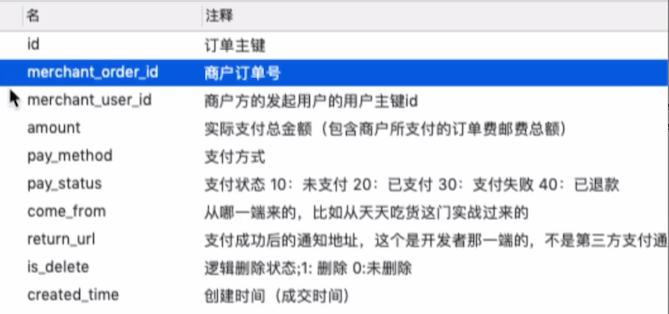
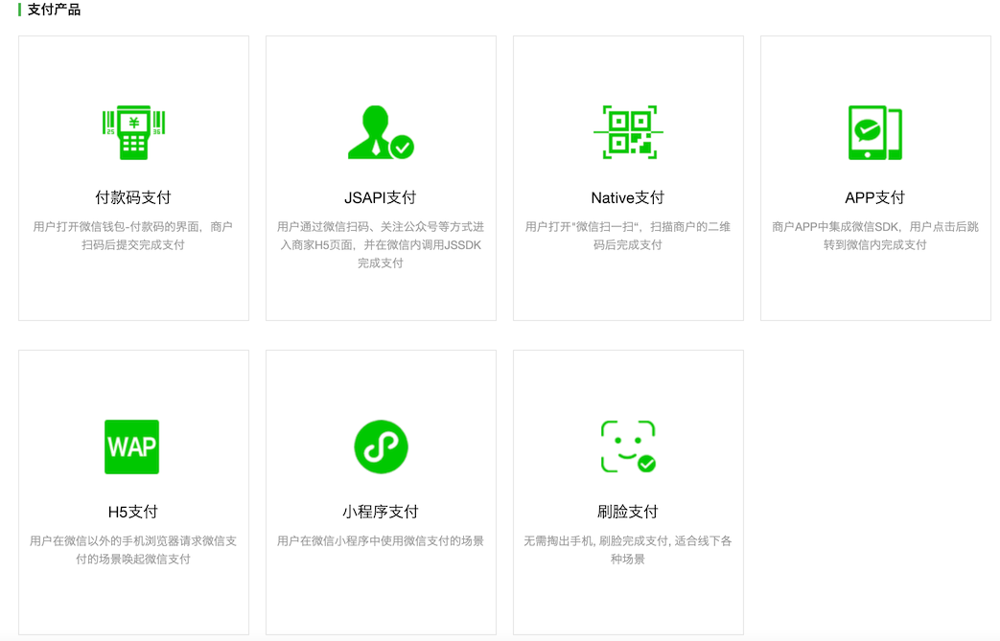
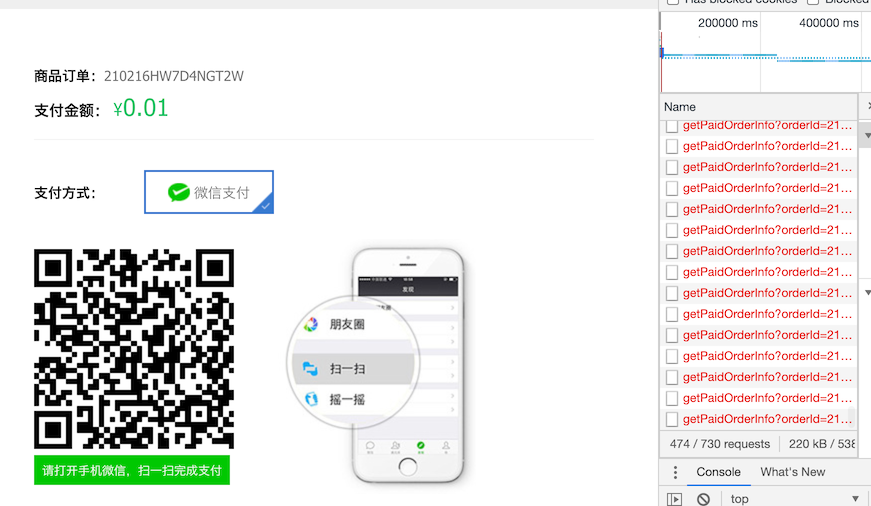

# 微信支付


## 微信支付页前端代码

创建订单后，根据订单支付类型，跳转到不同的支付页面，微信使用了二维码的形式，前端核心代码如下

```javascript
    <script type="text/javascript">
        var index = new Vue({
            el: "#wxpay",
            data: {
                userIsLogin: false,
                userInfo: {},

                orderId: null,
                paymentInfo: [],
            },
            created() {
                // var me = this;
                // 通过cookie判断用户是否登录
                this.judgeUserLoginStatus();

                // 获得订单号
                var orderId = app.getUrlParam("orderId");
                // 如果orderId为空，跳转到错误页面
                if (orderId == null || orderId == undefined || orderId == '') {
                    app.goErrorPage();
                    return;
                }

                this.orderId = orderId;
                this.getWXPayQRCodeUrl(orderId);

                // 每隔3秒调用后台方法，查看订单是否已经支付成功
                this.setTimer();
            },
            methods: {
                setTimer() {
                    return setInterval(()=>{
                        this.checkPayResult()
                    }, 3000)
                },
                // 查询是否支付成功 
                checkPayResult() {
                    var orderId = this.orderId;
                    // console.log(orderId);
                    // 查询订单是否成功
                    var userInfo = this.userInfo;

                    // 发起请求获得微信支付扫描二维码
                    var serverUrl = app.serverUrl;
					axios.defaults.withCredentials = true;
					axios.post(
                            serverUrl + '/orders/getPaidOrderInfo?orderId=' + orderId, 
							{},
							{
								headers: {
									'headerUserId': userInfo.id,
									'headerUserToken': userInfo.userUniqueToken
								}
							})
							.then(res => {
								if (res.data.status == 200) {
                                    var orderStatus = res.data.data;
                                    // console.log(orderStatus);

                                    if (orderStatus.orderStatus == 20) {
                                        window.location.href = "success.html?orderId=" + orderId + "&orderAmount=" + this.paymentInfo.amount;
                                    }
								} else {
									alert(res.data.msg);
								}
							});
                },
                getWXPayQRCodeUrl(orderId) {
                    var userInfo = this.userInfo;

                    // 发起请求获得微信支付扫描二维码
                    var paymentServerUrl = app.paymentServerUrl;
					axios.defaults.withCredentials = true;
					axios.post(
                            paymentServerUrl + '/payment/getWXPayQRCode?merchantUserId=' + userInfo.id + "&merchantOrderId=" + orderId, 
							{},
							{
								headers: {
									'imoocUserId': "imooc",
									'password': "imooc"
								}
							})
							.then(res => {
								if (res.data.status == 200) {
                                    var paymentInfo = res.data.data;
                                    this.paymentInfo = paymentInfo;
                                    // qrCodeUrl
                                    // console.log(paymentInfo);
                                    
                                    $('#wxqrcode-display').qrcode({
                                        width: 200,
                                        height:200,
                                        text: paymentInfo.qrCodeUrl
                                    });


								} else {
									alert(res.data.msg);
								}
							});
                },
                // 通过cookie判断用户是否登录
                judgeUserLoginStatus() {
                    var userCookie = app.getCookie("user");
                    if (
                        userCookie != null &&
                        userCookie != undefined &&
                        userCookie != ""
                    ) {
                        var userInfoStr = decodeURIComponent(userCookie);
                        // console.log(userInfo);
                        if (
                            userInfoStr != null &&
                            userInfoStr != undefined &&
                            userInfoStr != ""
                        ) {
                            var userInfo = JSON.parse(userInfoStr);
                            // 判断是否是一个对象
                            if ( typeof(userInfo)  == "object" ) {
                                this.userIsLogin = true;
                                // console.log(userInfo);
                                this.userInfo = userInfo;
                            } else {
                                this.userIsLogin = false;
                                this.userInfo = {};
                            }
                        }
                    } else {
                        this.userIsLogin = false;
                        this.userInfo = {};
                    }
                }
            }
        });
```

大致流程如下：

1. 判断用户是否登录
2. 从 URL 中获取到订单 ID
3. 去聚合支付中心获取二维码
4. 启动一个定时任务，每隔 3 秒一次，去后端检查当前订单是否支付成功

那么这里后端需要填充的代码则有：

1. 微信支付到聚合支付中心下单
2. 检查订单是否支付成功

## 支付中心订单设计

前端代码中获取二维码的请求地址

```javascript
paymentServerUrl + '/payment/getWXPayQRCode?merchantUserId=' + userInfo.id + "&merchantOrderId=" + orderId
```

这个是聚合支付中心的请求地址，所以需要在支付中心先存在订单，下表是支付中心的订单设计



需要向支付中心下单的字段有：

- 商户订单号
- 商户方发起用户的用户主键 id
- 实际支付总金额
- 支付方式
- 支付成功后的通知地址

## 微信支付时序图

[微信支付官方文档](https://pay.weixin.qq.com/wiki/doc/api/index.html)



- 付款码支付：你需要展示你的付款码，商户扫描付款码，完成扣款
- JSAPI 支付：需要在微信公众号内部浏览器调用 jssdk 进行支付
- Native 支付：用户打开微信扫描商户的二维码完成支付，这个也是我们课程中所使用的方式
- App 支付：app 集成支付后，跳转到微信的支付
- H5 支付：手机端的 H5 页面，唤醒微信支付

[在 Native 支付的开发指引里面](https://pay.weixin.qq.com/wiki/doc/api/native.php?chapter=6_5&index=3) 有一个描述时序图的说明


- 商户后台系统

  在本课程中有两个端，老师提供的聚合支付中心  和 我们自己的后端服务

商户这边生成二维码如上图：

1. 生成自己的商户订单

2. 调用统一下单 API，生成 **预支付交易**

   这个就类似与，我们使用它的支付，那么就需要先在他这里产生一条订单信息，后续的相关操作，就可以使用这个预支付订单完成

3. 返回预支付交易链接，其实就是一个 二维码的 url 地址

4. 商户这边通过二维码工具将返回的二维码地址，生成在二维码图片中

5. 这是商户就可以掏出手机扫描二维码了

## 支付完成回调通知

```java
    @PostMapping("notifyMerchantOrderPaid")
    public Integer notifyMerchantOrderPaid(String merchantOrderId) {
        orderService.updateOrderStatus(merchantOrderId, OrderStatusEnum.WAIT_DELIVER.type);
        return HttpStatus.OK.value();
    }
```

```java
    @Transactional(propagation = Propagation.REQUIRED)
    @Override
    public void updateOrderStatus(String orderId, Integer orderStatus) {

        OrderStatus paidStatus = new OrderStatus();
        paidStatus.setOrderId(orderId);
        paidStatus.setOrderStatus(orderStatus);
        paidStatus.setPayTime(new Date());

        orderStatusMapper.updateByPrimaryKeySelective(paidStatus);
    }
```

支付成功之后，支付中心通知我们的后台，我们将该订单状态变更为  「已付款，待发货」状态

## 构建商户订单

首先，老师提供的聚合支付中心，创建商户订单地址如下，同时上面我们写好了支付完成的回调接口地址，在 baseController 中先定义常量

```java
    // 支付中心的调用地址
    String paymentUrl = "http://payment.t.mukewang.com/foodie-payment/payment/createMerchantOrder";		// produce

    // 微信支付成功 -> 支付中心 -> 天天吃货平台
    //                       |-> 回调通知的url
    String payReturnUrl = "http://localhost:8088/orders/notifyMerchantOrderPaid";
```

支付中心项目在练习项目仓库下，但是本地跑起来也没有用，因为需要你的微信支付相关信息，还需要域名等。

不过可以去看看学习下，如何构建一个聚合支付中心。

在创建订单的服务里面，有一段代码如下

```java
        // 4. 构建商户订单，用于传给支付中心
        MerchantOrdersVO merchantOrdersVO = new MerchantOrdersVO();
        merchantOrdersVO.setMerchantOrderId(orderId);
        merchantOrdersVO.setMerchantUserId(userId);
        merchantOrdersVO.setAmount(realPayAmount + postAmount);
        merchantOrdersVO.setPayMethod(payMethod);
```

这个是按照支付中心的商户订单接口，所需要的信息构建的 VO 对象。

## 向支付中心发送商户订单

在 controller 中，填充对构建商户订单代码。我们要发送 HTTP 请求到支付中心，这里使用 `org.springframework.web.client.RestTemplate`

### RestTemplate 配置

```java
package cn.mrcode.foodiedev.config;

import org.springframework.context.annotation.Bean;
import org.springframework.context.annotation.Configuration;
import org.springframework.web.client.RestTemplate;

/**
 * @author mrcode
 * @date 2021/2/16 23:33
 */
@Configuration
public class WebMvcConfig {
    @Bean
    public RestTemplate restTemplate() {
        return new RestTemplate();
    }
}
```

### 发送商户订单

```java
    @ApiOperation(value = "用户下单", notes = "用户下单", httpMethod = "POST")
    @PostMapping("/create")
    public JSONResult create(
            @RequestBody SubmitOrderBO submitOrderBO,
            HttpServletRequest request,
            HttpServletResponse response) {

        if (submitOrderBO.getPayMethod() != PayMethod.WEIXIN.type
                && submitOrderBO.getPayMethod() != PayMethod.ALIPAY.type) {
            return JSONResult.errorMsg("支付方式不支持！");
        }

//        System.out.println(submitOrderBO.toString());

        // 1. 创建订单
        OrderVO orderVO = orderService.createOrder(submitOrderBO);
        String orderId = orderVO.getOrderId();

        // 2. 创建订单以后，移除购物车中已结算（已提交）的商品
        /**
         * 1001
         * 2002 -> 用户购买
         * 3003 -> 用户购买
         * 4004
         */
        // TODO 整合redis之后，完善购物车中的已结算商品清除，并且同步到前端的cookie
        // 这里直接清空购物车，后续讲  redis 之后，再来完善移除已购产品的操作
        // CookieUtils.setCookie(request, response, FOODIE_SHOPCART, "", true);

        // 使用 restTemplate 像支付中心发送商户订单请求
        // 3. 向支付中心发送当前订单，用于保存支付中心的订单数据
        MerchantOrdersVO merchantOrdersVO = orderVO.getMerchantOrdersVO();
        merchantOrdersVO.setReturnUrl(payReturnUrl);

        // 为了方便测试购买，所以所有的支付金额都统一改为1分钱
        merchantOrdersVO.setAmount(1);

        HttpHeaders headers = new HttpHeaders();
        headers.setContentType(MediaType.APPLICATION_JSON);
        // 这个账户是老师视频中的账户，可以直接用来测试
        headers.add("imoocUserId", "imooc");
        headers.add("password", "imooc");

        HttpEntity<MerchantOrdersVO> entity = new HttpEntity<>(merchantOrdersVO, headers);

        ResponseEntity<JSONResult> responseEntity = restTemplate.postForEntity(
                paymentUrl,
                entity,
                JSONResult.class);
        JSONResult paymentResult = responseEntity.getBody();
        if (paymentResult.getStatus() != 200) {
            logger.error("发送错误：{}", paymentResult.getMsg());
            return JSONResult.errorMsg("支付中心订单创建失败，请联系管理员！");
        }

        return JSONResult.ok(orderId);
    }
```

此时再测试提交订单，二维码就出来了，如下图所示



那么在右侧可以看到，还有红色报错，我们还差一个功能：前端开启了定时像后端服务查询该订单是否支付成功的定时轮询任务