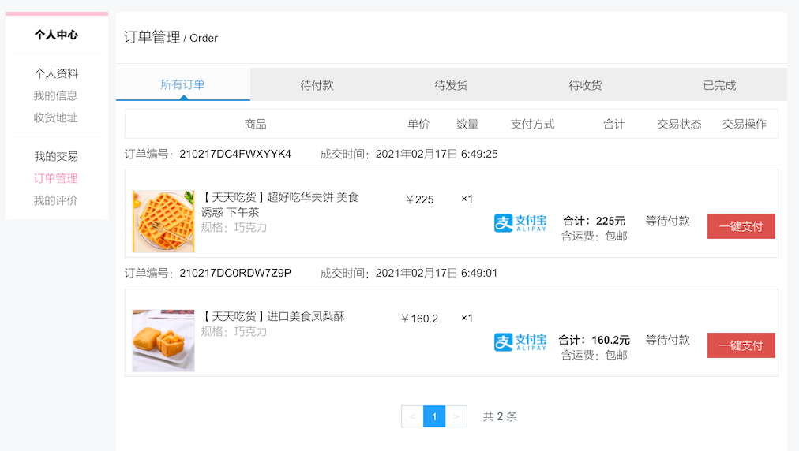
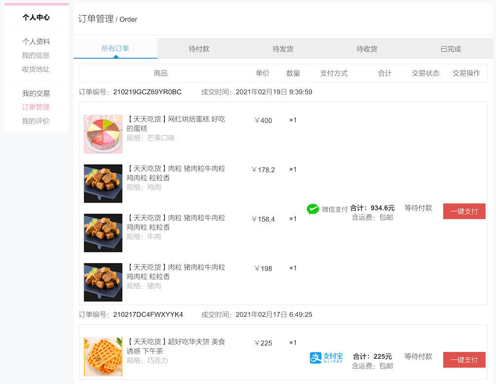
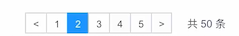
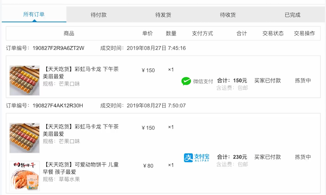

# 订单管理





在订单管理中心其实还有其他的操作，在前端页面中可以看到定义的所有操作

```html
															<li class="td td-change" style="width: 25%;">

																<div v-show="order.orderStatus == 10" @click="goPay(order.orderId, order.payMethod, order.realPayAmount)" class="am-btn am-btn-danger anniu">
																	一键支付
																</div>
																<p v-show="order.orderStatus == 20" class="Mystatus">拣货中</p>
																<div v-show="order.orderStatus == 30" @click="confirmReceive(order.orderId)" class="am-btn am-btn-danger anniu">
																	确认收货
																</div>
																<div v-show="order.isComment == 0 && order.orderStatus == 40" @click="commentItems(order.orderId)" class="am-btn am-btn-danger anniu">
																	评价商品
																</div>
																<div v-show="order.isComment == 1 && order.orderStatus == 40" class="Mystatus">
																	已评价
																</div>
																<div v-show="order.orderStatus == 50" @click="deleteOrder(order.orderId)" class="am-btn am-btn-danger anniu">
																	删除订单
																</div>

															</li>
```

有：

- 一键支付
- 确认收货
- 评价商品
- 删除订单操作

## 订单查询

这里比较简单

```sql
select od.id              as orderId,
       od.created_time    as createdTime,
       od.pay_method      as payMethod,
       od.real_pay_amount as realPayAmount,
       od.post_amount     as postAmount,
       os.order_status    as orderStatus,
       oi.item_id         as itemId,
       oi.item_name       as itemName,
       oi.item_img        as itemImg,
       oi.item_spec_id    as itemSpecId,
       oi.item_spec_name  as itemSpecName,
       oi.buy_counts      as buyCounts,
       oi.price           as price
from orders od
         left join order_status os on od.id = os.order_id
         left join order_items oi on od.id = oi.order_id
where od.user_id = '1908189H7TNWDTXP'
  and od.is_delete = 0
order by od.updated_time asc
```

| orderId | createdTime | payMethod | realPayAmount | postAmount | orderStatus | itemId | itemName | itemImg | itemSpecId | itemSpecName | buyCounts | price |
| :--- | :--- | :--- | :--- | :--- | :--- | :--- | :--- | :--- | :--- | :--- | :--- | :--- |
| 190827F2R9A6ZT2W | 2019-08-27 19:45:16 | 1 | 15000 | 0 | 20 | bingan-1001 | 【天天吃货】彩虹马卡龙 下午茶 美眉最爱 | http://122.152.205.72:88/foodie/bingan-1001/img1.png | bingan-1001-spec-3 | 芒果口味 | 1 | 15000 |
| 190827F4AK12R30H | 2019-08-27 19:50:07 | 2 | 23000 | 0 | 20 | bingan-1001 | 【天天吃货】彩虹马卡龙 下午茶 美眉最爱 | http://122.152.205.72:88/foodie/bingan-1001/img1.png | bingan-1001-spec-3 | 芒果口味 | 1 | 15000 |
| 190827F4AK12R30H | 2019-08-27 19:50:07 | 2 | 23000 | 0 | 20 | bingan-1003 | 【天天吃货】可爱动物饼干 儿童早餐 孩子最爱 | http://122.152.205.72:88/foodie/bingan-1003/img1.png | bingan-1003-spec-2 | 草莓水果 | 1 | 8000 |

这样主要的信息就都出来了，可以看到又是一个嵌套的父子结构。下面是完整的代码

```java
    @ApiOperation(value = "查询订单列表", notes = "查询订单列表", httpMethod = "POST")
    @PostMapping("/query")
    public JSONResult query(
            @ApiParam(name = "userId", value = "用户id", required = true)
            @RequestParam String userId,
            @ApiParam(name = "orderStatus", value = "订单状态", required = false)
            @RequestParam Integer orderStatus,
            @ApiParam(name = "page", value = "查询下一页的第几页", required = false)
            @RequestParam Integer page,
            @ApiParam(name = "pageSize", value = "分页的每一页显示的条数", required = false)
            @RequestParam Integer pageSize) {

        if (StringUtils.isBlank(userId)) {
            return JSONResult.errorMsg(null);
        }
        if (page == null) {
            page = 1;
        }
        if (pageSize == null) {
            pageSize = COMMON_PAGE_SIZE;
        }

        PagedGridResult grid = myOrdersService.queryMyOrders(userId,
                orderStatus,
                page,
                pageSize);

        return JSONResult.ok(grid);
    }
```

service

```java
    @Transactional(propagation = Propagation.SUPPORTS)
    @Override
    public PagedGridResult queryMyOrders(String userId,
                                         Integer orderStatus,
                                         Integer page,
                                         Integer pageSize) {

        Map<String, Object> map = new HashMap<>();
        map.put("userId", userId);
        // 状态为空则查询所有状态的订单
        if (orderStatus != null) {
            map.put("orderStatus", orderStatus);
        }

        PageHelper.startPage(page, pageSize);

        List<MyOrdersVO> list = ordersMapperCustom.queryMyOrders(map);

        return setterPagedGrid(list, page);
    }
```

mapper

```java
public interface OrdersMapperCustom {

    List<MyOrdersVO> queryMyOrders(@Param("paramsMap") Map<String, Object> map);
```

```xml
  <resultMap id="myOrdersVO" type="cn.mrcode.foodiedev.pojo.vo.MyOrdersVO">
    <id column="orderId" property="orderId"/>
    <result column="createdTime" property="createdTime"/>
    <result column="payMethod" property="payMethod"/>
    <result column="realPayAmount" property="realPayAmount"/>
      <result column="postAmount" property="postAmount"/>
      <result column="orderStatus" property="orderStatus"/>
      <result column="isComment" property="isComment"/>

    <collection property="subOrderItemList"
                select="getSubItems"
                column="orderId"
                ofType="cn.mrcode.foodiedev.pojo.vo.MySubOrderItemVO">
      <result column="itemId" property="itemId"/>
      <result column="itemName" property="itemName"/>
      <result column="itemImg" property="itemImg"/>
        <result column="itemSpecId" property="itemSpecId"/>
        <result column="itemSpecName" property="itemSpecName"/>
        <result column="buyCounts" property="buyCounts"/>
        <result column="price" property="price"/>
    </collection>
  </resultMap>

  <select id="queryMyOrders" resultMap="myOrdersVO" parameterType="Map">
    SELECT
        od.id as orderId,
        od.created_time as createdTime,
        od.pay_method as payMethod,
        od.real_pay_amount as realPayAmount,
        od.post_amount as postAmount,
        os.order_status as orderStatus,
        od.is_comment as isComment
    FROM
        orders od
    LEFT JOIN
        order_status os
    on od.id = os.order_id
    WHERE
        od.user_id = #{paramsMap.userId}
    AND
        od.is_delete = 0
        <if test="paramsMap.orderStatus != null">
          and os.order_status = #{paramsMap.orderStatus}
        </if>
    ORDER BY
        od.updated_time ASC
  </select>
<select id="getSubItems" parameterType="String" resultType="cn.mrcode.foodiedev.pojo.vo.MySubOrderItemVO">

      select
        oi.item_id as itemId,
        oi.item_name as itemName,
        oi.item_img as itemImg,
        oi.item_spec_name as itemSpecName,
        oi.buy_counts as buyCounts,
        oi.price as price
      from
        order_items oi
      where
        oi.order_id = #{orderId}

    </select>
```

## 订单列表嵌套查询分页 BUG 



正常分页是这样的，但是前面我们使用了嵌套合并了子订单。 tkmapper 官方明确解释了，对于嵌套结果集，分页结果是不准确的。

也就是如下的代码，使用 collection 标签将多条语句映射成嵌套的结果集

```xml
  <resultMap id="myOrdersVO" type="cn.mrcode.foodiedev.pojo.vo.MyOrdersVO">
    <id column="orderId" property="orderId"/>
    <result column="createdTime" property="createdTime"/>
    <result column="payMethod" property="payMethod"/>
    <result column="realPayAmount" property="realPayAmount"/>
      <result column="postAmount" property="postAmount"/>
      <result column="orderStatus" property="orderStatus"/>
      <result column="isComment" property="isComment"/>

    <collection property="subOrderItemList"
                ofType="cn.mrcode.foodiedev.pojo.vo.MySubOrderItemVO">
      <result column="itemId" property="itemId"/>
      <result column="itemName" property="itemName"/>
      <result column="itemImg" property="itemImg"/>
        <result column="itemSpecId" property="itemSpecId"/>
        <result column="itemSpecName" property="itemSpecName"/>
        <result column="buyCounts" property="buyCounts"/>
        <result column="price" property="price"/>
    </collection>
  </resultMap>   
<select id="queryMyOrdersDoNotUse" resultMap="myOrdersVO" parameterType="Map">
        SELECT
          od.id as orderId,
          od.created_time as createdTime,
          od.pay_method as payMethod,
          od.real_pay_amount as realPayAmount,
          od.post_amount as postAmount,
          os.order_status as orderStatus,
          oi.item_id as itemId,
          oi.item_name as itemName,
          oi.item_img as itemImg,
          oi.item_spec_name as itemSpecName,
          oi.buy_counts as buyCounts,
          oi.price as price
        FROM
          orders od
          LEFT JOIN
          order_status os
          on od.id = os.order_id
          LEFT JOIN
          order_items oi
          ON od.id = oi.order_id
        WHERE
        od.user_id = #{paramsMap.userId}
        AND
        od.is_delete = 0
        <if test="paramsMap.orderStatus != null">
            and os.order_status = #{paramsMap.orderStatus}
        </if>
        ORDER BY
        od.updated_time ASC
    </select>
```

### mybatis 原生嵌套子查询

解决方式 1：使用 mybatis 原生嵌套的子查询语句

```xml
  <resultMap id="myOrdersVO" type="cn.mrcode.foodiedev.pojo.vo.MyOrdersVO">
    <id column="orderId" property="orderId"/>
    <result column="createdTime" property="createdTime"/>
    <result column="payMethod" property="payMethod"/>
    <result column="realPayAmount" property="realPayAmount"/>
      <result column="postAmount" property="postAmount"/>
      <result column="orderStatus" property="orderStatus"/>
      <result column="isComment" property="isComment"/>

    <collection property="subOrderItemList"
                select="getSubItems"
                column="orderId"
                ofType="cn.mrcode.foodiedev.pojo.vo.MySubOrderItemVO">
      <result column="itemId" property="itemId"/>
      <result column="itemName" property="itemName"/>
      <result column="itemImg" property="itemImg"/>
        <result column="itemSpecId" property="itemSpecId"/>
        <result column="itemSpecName" property="itemSpecName"/>
        <result column="buyCounts" property="buyCounts"/>
        <result column="price" property="price"/>
    </collection>
  </resultMap>

  <select id="queryMyOrders" resultMap="myOrdersVO" parameterType="Map">
    SELECT
        od.id as orderId,
        od.created_time as createdTime,
        od.pay_method as payMethod,
        od.real_pay_amount as realPayAmount,
        od.post_amount as postAmount,
        os.order_status as orderStatus,
        od.is_comment as isComment
    FROM
        orders od
    LEFT JOIN
        order_status os
    on od.id = os.order_id
    WHERE
        od.user_id = #{paramsMap.userId}
    AND
        od.is_delete = 0
        <if test="paramsMap.orderStatus != null">
          and os.order_status = #{paramsMap.orderStatus}
        </if>
    ORDER BY
        od.updated_time ASC
  </select>
<select id="getSubItems" parameterType="String" resultType="cn.mrcode.foodiedev.pojo.vo.MySubOrderItemVO">

      select
        oi.item_id as itemId,
        oi.item_name as itemName,
        oi.item_img as itemImg,
        oi.item_spec_name as itemSpecName,
        oi.buy_counts as buyCounts,
        oi.price as price
      from
        order_items oi
      where
        oi.order_id = #{orderId}

    </select>
```

上述语句与直接用 collection 将多条数据嵌套的方式不同点有如下：

-  queryMyOrders 主查询语句，只查询了主单的信息

- resultMap 中的 collection 标签定义不同

  ```xml
  <resultMap id="myOrdersVO" type="cn.mrcode.foodiedev.pojo.vo.MyOrdersVO">
    <id column="orderId" property="orderId"/>  
    ....
    <collection property="subOrderItemList"
                  select="getSubItems"
                  column="orderId"
                  ofType="cn.mrcode.foodiedev.pojo.vo.MySubOrderItemVO">
        <result column="itemId" property="itemId"/>
        <result column="itemName" property="itemName"/>
        <result column="itemImg" property="itemImg"/>
          <result column="itemSpecId" property="itemSpecId"/>
          <result column="itemSpecName" property="itemSpecName"/>
          <result column="buyCounts" property="buyCounts"/>
          <result column="price" property="price"/>
      </collection>
  </resultMap>
  ```

  多了 select、column 设置，含义分别如下：

  - select：引用了该 xml 中的哪一个 select 语句，这里引用的是 getSubItems ，可以看到 getSubItems 中以 orderId 作为条件查询出来了该主单的所有子单信息

  - column：也就是从主语句中的哪一个列的值作为条件传递给子查询语句

    这里使用了 orderId 传递到子查询中。

它的原理则是：先使用主查询语句，将主单查询出来（页面上分页数量也是以主单算作一条数据的），然后发现有 collection 的子查询，每一条主单信息都会执行一次子单查询。

### 前端解决

在前端做延迟加载，先查询出所有的主单信息，然后再去查询每个主单的子单信息

## 一键支付

这里的支付功能和之前我们做的提交订单后，发起的支付是同一份代码，由前端跳转到不同的指定的支付页完成后续的支付

```javascript
				goPay(orderId, payMethod, totalAmount) {
					// console.log(orderId);
					// console.log(payMethod);
					// 判断是否微信还是支付宝支付
					if (payMethod == 1) {
						// 微信支付则跳转到微信支付页面，并且获得支付二维码
						window.location.href = app.shopServerUrl + "wxpay.html?orderId=" + orderId;
					} else if (payMethod == 2) {
						// 支付宝支付直接跳转
						window.location.href = app.shopServerUrl + "alipay.html?orderId=" + orderId + "&amount=" + totalAmount;
						window.open(app.shopServerUrl + "alipayTempTransit.html?orderId=" + orderId);
					} else {
						alert("目前只支持微信或支付宝支付！");
					}
				},
```

特别注意：这里的支付功能跳转到的是 **网站项目** 的支付页面，不是个人中心这个项目的支付页面。

## 再次支付时，调用微信预下单的逻辑

1. 从这里跳转到网站的微信支付页面
2. 拿到订单 ID，直接去支付中心获取支付二维码
3. 支付中心处理：
   1. 查询在第一次结算支付时，创建的订单信息
      1. 先从 redis 中获取二维码 地址（一次下单二维码有效期为 2 小时）
      2. 如果二维码已经过期，或则第一次支付，则去 微信平台 统一下单获得二维码信息，放入 redis 中，并设置 2 小时的过期时间
      3. 返回二维码地址，由前端渲染到页面上

所以这样处理之后，就杜绝了一直刷新支付页面，频繁调用微信统一下单接口的问题。

## 商家发货

支付完成之后，是 **待发货** 状态，也就是如下所示的拣货中的订单



该功能应该是在 **商户后台管理系统** 中完成，我们这里不涉及这个系统，所以可以直接去修改该状态完成发货。

````java
    // 商家发货没有后端，所以这个接口仅仅只是用于模拟
    @ApiOperation(value = "商家发货", notes = "商家发货", httpMethod = "GET")
    @GetMapping("/deliver")
    public JSONResult deliver(
            @ApiParam(name = "orderId", value = "订单id", required = true)
            @RequestParam String orderId) throws Exception {

        if (StringUtils.isBlank(orderId)) {
            return JSONResult.errorMsg("订单ID不能为空");
        }
        myOrdersService.updateDeliverOrderStatus(orderId);
        return JSONResult.ok();
    }
````

```java
    @Transactional(propagation = Propagation.REQUIRED)
    @Override
    public void updateDeliverOrderStatus(String orderId) {

        OrderStatus updateOrder = new OrderStatus();
        updateOrder.setOrderStatus(OrderStatusEnum.WAIT_RECEIVE.type);
        updateOrder.setDeliverTime(new Date());

        Example example = new Example(OrderStatus.class);
        Example.Criteria criteria = example.createCriteria();
        criteria.andEqualTo("orderId", orderId);
        criteria.andEqualTo("orderStatus", OrderStatusEnum.WAIT_DELIVER.type);

        orderStatusMapper.updateByExampleSelective(updateOrder, example);
    }
```

## 确认收货

在确认收货这里有一个 **资源验证** 操作，验证该订单是否是当前操作的用户的订单，否则有可能会有恶意的请求确认别人的订单

```java
    /**
     * 用于验证用户和订单是否有关联关系，避免非法用户调用
     *
     * @return
     */
    public JSONResult checkUserOrder(String userId, String orderId) {
        Orders order = myOrdersService.queryMyOrder(userId, orderId);
        if (order == null) {
            return JSONResult.errorMsg("订单不存在！");
        }
        return JSONResult.ok(order);
    }
```

```java
    @ApiOperation(value = "用户确认收货", notes = "用户确认收货", httpMethod = "POST")
    @PostMapping("/confirmReceive")
    public JSONResult confirmReceive(
            @ApiParam(name = "orderId", value = "订单id", required = true)
            @RequestParam String orderId,
            @ApiParam(name = "userId", value = "用户id", required = true)
            @RequestParam String userId) throws Exception {

        JSONResult checkResult = checkUserOrder(userId, orderId);
        if (checkResult.getStatus() != HttpStatus.OK.value()) {
            return checkResult;
        }

        boolean res = myOrdersService.updateReceiveOrderStatus(orderId);
        if (!res) {
            return JSONResult.errorMsg("订单确认收货失败！");
        }

        return JSONResult.ok();
    }
```

```java
    @Transactional(propagation = Propagation.REQUIRED)
    @Override
    public boolean updateReceiveOrderStatus(String orderId) {

        OrderStatus updateOrder = new OrderStatus();
        updateOrder.setOrderStatus(OrderStatusEnum.SUCCESS.type);
        // 交易完成时间
        updateOrder.setSuccessTime(new Date());

        Example example = new Example(OrderStatus.class);
        Example.Criteria criteria = example.createCriteria();
        criteria.andEqualTo("orderId", orderId);
        criteria.andEqualTo("orderStatus", OrderStatusEnum.WAIT_RECEIVE.type);

        int result = orderStatusMapper.updateByExampleSelective(updateOrder, example);

        return result == 1 ? true : false;
    }
```

确认收货，其实也就是改变它的订单状态。这里还用 sql 更新影响的行数作为了一个判定是否更新成功。

::: tip

这里有一个判定操作：因为只有当 **已发货的订单才能被确认收货**，笔者平时是先查询该订单出来，然后判断它的状态。

这里的操作是，将更新订单状态的条件增加了  订单状态 限定为 已发货状态

```java
Example.Criteria criteria = example.createCriteria();
        criteria.andEqualTo("orderId", orderId);
        criteria.andEqualTo("orderStatus", OrderStatusEnum.WAIT_RECEIVE.type);

        int result = orderStatusMapper.updateByExampleSelective(updateOrder, example);
```

所以才会判定影响的行数，来确定是否完成了更新。这里的技巧在于是使用了 **乐观锁** 的原理

:::

由于订单状态改变，所以前端在点击 **确认收货** 后，后端响应之后，前端是刷新了当前页的订单列表。和我们平时做后台管理时候的处理一致

## 删除订单

```java
    @ApiOperation(value = "用户删除订单", notes = "用户删除订单", httpMethod = "POST")
    @PostMapping("/delete")
    public JSONResult delete(
            @ApiParam(name = "orderId", value = "订单id", required = true)
            @RequestParam String orderId,
            @ApiParam(name = "userId", value = "用户id", required = true)
            @RequestParam String userId) throws Exception {

        JSONResult checkResult = checkUserOrder(userId, orderId);
        if (checkResult.getStatus() != HttpStatus.OK.value()) {
            return checkResult;
        }

        boolean res = myOrdersService.deleteOrder(userId, orderId);
        if (!res) {
            return JSONResult.errorMsg("订单删除失败！");
        }

        return JSONResult.ok();
    }
```

```java
    @Transactional(propagation = Propagation.REQUIRED)
    @Override
    public boolean deleteOrder(String userId, String orderId) {

        Orders updateOrder = new Orders();
        updateOrder.setIsDelete(YesOrNo.YES.type);
        updateOrder.setUpdatedTime(new Date());

        Example example = new Example(Orders.class);
        Example.Criteria criteria = example.createCriteria();
        criteria.andEqualTo("id", orderId);
        criteria.andEqualTo("userId", userId);

        int result = ordersMapper.updateByExampleSelective(updateOrder, example);

        return result == 1 ? true : false;
    }
```

这里使用了逻辑删除。

这里删除订单，感觉没有特别的严谨，因为没有像确认收货的操作那样去判定订单状态。

但是这里还是再次使用了 **删除时使用条件限定资源**，这里删除订单，带上了 userId ，这确保了，该订单只能是该用户的订单。杜绝了恶意请求。