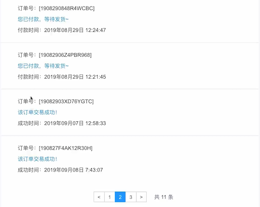

# 中心首页


如上图所示：中心首页中，还有两个功能：

- 订单状态概览

  将 4 个状态的数量展示出来

- 订单动向

## 订单状态概览

使用 order 和 order_status 表关联查询出数据即可

```java
    @ApiOperation(value = "获得订单状态数概况", notes = "获得订单状态数概况", httpMethod = "POST")
    @PostMapping("/statusCounts")
    public JSONResult statusCounts(
            @ApiParam(name = "userId", value = "用户id", required = true)
            @RequestParam String userId) {

        if (StringUtils.isBlank(userId)) {
            return JSONResult.errorMsg(null);
        }

        OrderStatusCountsVO result = myOrdersService.getOrderStatusCounts(userId);

        return JSONResult.ok(result);
    }
```

```java
 @Transactional(propagation = Propagation.SUPPORTS)
    @Override
    public OrderStatusCountsVO getOrderStatusCounts(String userId) {

        Map<String, Object> map = new HashMap<>();
        map.put("userId", userId);

        map.put("orderStatus", OrderStatusEnum.WAIT_PAY.type);
        int waitPayCounts = ordersMapperCustom.getMyOrderStatusCounts(map);

        map.put("orderStatus", OrderStatusEnum.WAIT_DELIVER.type);
        int waitDeliverCounts = ordersMapperCustom.getMyOrderStatusCounts(map);

        map.put("orderStatus", OrderStatusEnum.WAIT_RECEIVE.type);
        int waitReceiveCounts = ordersMapperCustom.getMyOrderStatusCounts(map);

        map.put("orderStatus", OrderStatusEnum.SUCCESS.type);
        map.put("isComment", YesOrNo.NO.type);
        int waitCommentCounts = ordersMapperCustom.getMyOrderStatusCounts(map);

        OrderStatusCountsVO countsVO = new OrderStatusCountsVO(waitPayCounts,
                waitDeliverCounts,
                waitReceiveCounts,
                waitCommentCounts);
        return countsVO;
    }
```

按状态去 4 次查询出来。

```xml
    <select id="getMyOrderStatusCounts" parameterType="Map" resultType="int">
        SELECT
            count(1)
        FROM
            orders o
        LEFT JOIN
            order_status os
        on
            o.id = os.order_id
        WHERE
            o.user_id = #{paramsMap.userId}
        AND
            os.order_status = #{paramsMap.orderStatus}
        <if test="paramsMap.isComment != null">
            and o.is_comment = #{paramsMap.isComment}
        </if>
    </select>
```

## 订单动向



使用 order 和 order_status 表关联查询出数据即可，只需要订单号，订单状态，订单状态的不同时间

```java
 @ApiOperation(value = "查询订单动向", notes = "查询订单动向", httpMethod = "POST")
    @PostMapping("/trend")
    public JSONResult trend(
            @ApiParam(name = "userId", value = "用户id", required = true)
            @RequestParam String userId,
            @ApiParam(name = "page", value = "查询下一页的第几页", required = false)
            @RequestParam Integer page,
            @ApiParam(name = "pageSize", value = "分页的每一页显示的条数", required = false)
            @RequestParam Integer pageSize) {

        if (StringUtils.isBlank(userId)) {
            return JSONResult.errorMsg(null);
        }
        if (page == null) {
            page = 1;
        }
        if (pageSize == null) {
            pageSize = COMMON_PAGE_SIZE;
        }

        PagedGridResult grid = myOrdersService.getOrdersTrend(userId,
                page,
                pageSize);

        return JSONResult.ok(grid);
    }
```

```java
  @Transactional(propagation = Propagation.SUPPORTS)
    @Override
    public PagedGridResult getOrdersTrend(String userId, Integer page, Integer pageSize) {

        Map<String, Object> map = new HashMap<>();
        map.put("userId", userId);

        PageHelper.startPage(page, pageSize);
        List<OrderStatus> list = ordersMapperCustom.getMyOrderTrend(map);

        return setterPagedGrid(list, page);
    }
```

```xml
 <select id="getMyOrderTrend" parameterType="Map" resultType="cn.mrcode.foodiedev.pojo.OrderStatus">

        SELECT
            os.order_id as orderId,
            os.order_status as orderStatus,
            os.created_time as createdTime,
            os.pay_time as payTime,
            os.deliver_time as deliverTime,
            os.success_time as successTime,
            os.close_time as closeTime,
            os.comment_time as commentTime
        FROM
          orders o
        LEFT JOIN
          order_status os
        on
          o.id = os.order_id
        WHERE
          o.is_delete = 0
        AND
          o.user_id = #{paramsMap.userId}
        AND
          os.order_status in (20, 30, 40)
        ORDER BY
          os.order_id
        DESC
    </select>
```

前端代码

```html
							<!--物流 -->
							<div class="m-logistics">
								<div class="s-bar">
									<i class="s-icon"></i>订单动向
								</div>
								<div class="s-content">
									<ul class="lg-list">

										<li class="lg-item" v-for="(trend, trendIndex) in orderTrendList" :key="trendIndex">
											
											<div class="lg-info" v-show="trend.orderStatus == 20">
												<p>订单号：[{{trend.orderId}}]</p>
												<div class="lg-detail-wrap" >
													<a href="javascript:void(0);" class="lg-detail i-tip-trigger" style="color: #0e90d2;">您已付款，等待发货~</a>
												</div>
												<p>付款时间：{{trend.payTime}}</p>
											</div>

											<div class="lg-info" v-show="trend.orderStatus == 30">
												<p>订单号：[{{trend.orderId}}]</p>
												<div class="lg-detail-wrap" >
													<a href="javascript:void(0);" class="lg-detail i-tip-trigger" style="color: #0e90d2;">商家已发货，请耐心等待噢~</a>
												</div>
												<p>发货时间：{{trend.deliverTime}}</p>
											</div>
											
											<div class="lg-info" v-show="trend.orderStatus == 40">
												<p>订单号：[{{trend.orderId}}]</p>
												<div class="lg-detail-wrap" >
													<a href="javascript:void(0);" class="lg-detail i-tip-trigger" style="color: #0e90d2;">该订单交易成功！</a>
												</div>
												<p>成功时间：{{trend.successTime}}</p>
											</div>
										</li>

									</ul>

									<!-- 分页 start-->
									<div class="wrap" id="wrap">
										<zpagenav v-bind:page="page" v-bind:page-size="pageSize" v-bind:total="total" 
											v-bind:max-page="maxPage"  v-on:pagehandler="doPaging">
										</zpagenav>
									</div>
									<!-- 分页 end-->
								</div>
							</div>

```

