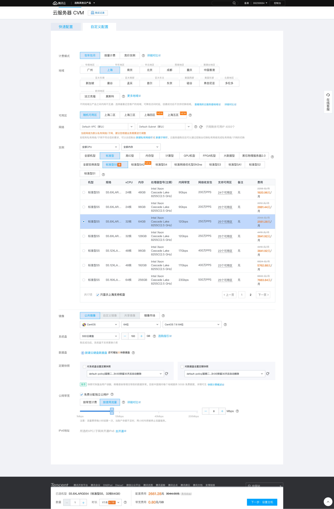
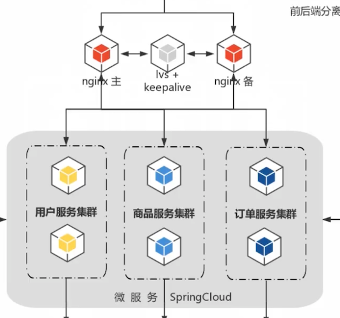
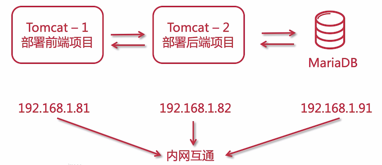
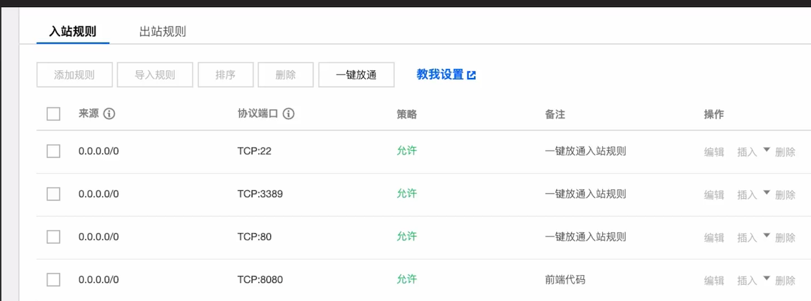
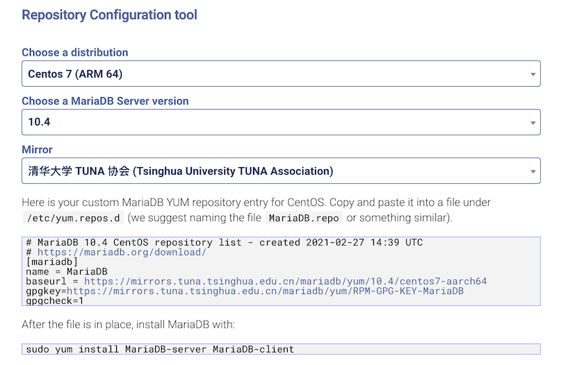
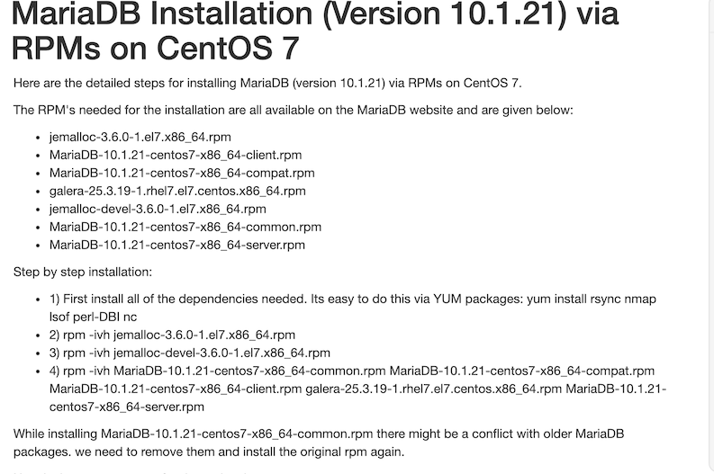

# 云服务器购买及安装配置(JDK/Tomcat/MariaDB)

## 前置必备

- 云服务器 或 本地虚拟机

  部署项目，如果有云服务器则用云服务器，没有则可以使用本地虚拟机来部署，充当线上环境
  
- Linux 系统基础

  你需要懂一些 Linux 的基础知识

- 内网互通

  因为需要安装多台虚拟机，所以需要这些虚拟机内网互通

  

## 云服务器购买建议

这里以 [腾讯云服务器](buy.cloud.tencent.com) 举例说明



需要注意的有如下项（这些每个云服务器厂商购买页面都有说明），特别注意的是一些通用概念：

- 地域

  腾讯云云服务器托管机房分布在全球多个位置，由不同的地域（region）构成。每个地域（region）都指一个独立的物理数据中心，不同地域间的云服务器内网不互通。

  服务器购买后，不能更换区域，除非重新购买服务器

- 可用区

  每个地域内都有多个物理上相互隔离的位置，称为可用区（zone）。每个可用区都是独立的，同一地域下的可用区通过低时延的内网链路相连。同一地域下的不同可用区间的云服务器可以通过内网互相访问

- 网络

  默认为私有网络/子网，购买服务器后，可以去新建私有网络或子网

- 实例

  重要的就是选择 CPU 核数，一般 16 核、32G 服务器就很不错了，根据需要选择

  它的 CPU 高低还和内网带宽绑定，这个挑选时需要注意

- 镜像

  也就是选择服务器系统，一般选择  CentOS 64 位 7.x 以上了

- 系统盘

  可选 SSD 和高性能普通盘，需要注意的是，系统盘选定后不能更换介质，大小也无法变更，只能通过挂载其他盘的方式来扩充

- 公网带宽

  可选免费分配独立公网 IP

  云服务器需要外网访问能力的时候，需要为云服务器分配公网 IP，如果云服务器不分配公网 IP，不支持外出流量，并且无法使用外网 IP 对外进行互相通信。

- 公共网关

  视频中选购的时候有该选项，笔者购买的时候没有看到

  

  它的作用是这样的，说如果不绑定公共网关，该服务器是不能访问外网的，比如用户服务器调用第三方 API 接口，无法调用，只有通过 nginx 主/备这两台作为公共网关的机器去访问。

  笔者对网络这一块不太熟悉，所以没有太明白其中的含义。


- 安全组

  可以配置入站规则和出站规则

  入站：允许哪些来源的 IP 和端口访问我们的服务器

  出站：允许我们的服务器可以访问哪些网络上的 IP 和 端口，只有这里允许了的，才可以访问出去，否则将不能访问到外网环境

- 其他的，就没有那么重要了

## 安装 JDK

购买云服务器后，厂商会提供一个公网 IP 和内网 IP，我们需要使用 SSH 工具连接到云服务器，随后就能在命令行中操作 linux 系统。

- 公网 IP：39.106.215.59

- 内网 IP：172.17.41.6

若在本地虚拟机中操作 linux，只需要配置静态 IP 即可，比如：192.168.1.88

推荐使用 SecureCRT 工具来链接 SSH，它在 windows 和 mac 上都可以使用

### 检查是否安装 JDK

服务器安装 JDK 之前，先确保有没有默认安装 JDK，执行以下命令进行检查：

```java
java -version
openjdk version "1.8.0_222-ea"
OpenJDK Runtime Environment (build 1.8.0_222-ea-b03)
OpenJDK 64-Bit Server VM (build 25.222-b03, mixed mode)
```

如果需要卸载，卸载步骤如下：

### 卸载

检查系统安装的 OpenJDK

```bash
rpm -qa | grep openJdk -i
java-1.8.0-openjdk-headless-1.8.0.222.b03-1.el7.x86_64
java-1.8.0-openjdk-1.8.0.222.b03-1.el7.x86_64
```

删除以上 2 项的安装包并且，再次检查是否删除完成

```bash
# 删除
rpm -e --nodeps java-1.8.0-openjdk-headless-1.8.0.222.b03-1.el7.x86_64
rpm -e --nodeps java-1.8.0-openjdk-1.8.0.222.b03-1.el7.x86_64

# 再次查看
rpm -qa | grep openJdk -i
```

### 安装

```bash
# 创建目录，该目录用来存放 jdk
mkdir /usr/java
# 创建专门用来存放软件的临时目录
mkdir /home/software
# 通过 ftp 工具将我们本地下载好的 jdk tar.gz 的包上传到该目录下
# 解压 jdk 压缩包
tar -zxvf jdk-8u9191-linux-x64.tar.gz
# 移动解压后的包到  /usr/java 
mv jdk1.8.0_191/ /usr/java
```

添加环境变量

```bash
# 修改 profile 文件
vim /etc/profile

# 配置 jdk 环境变量
export JAVA_HOME=/usr/java/jdk1.8.0_191
export PATH=$PATH:$JAVA_HOME/bin

# 刷新 profile 文件，让环境变量生效
source /etc/profile
```

## 安装 Tomcat

### 部署方案



这里会使用 3 台服务器：

- tomcat-1 用来部署前端项目，后续会使用 nginx 来代替
- tomcat-2 用来部署后端项目
- mariaDB 数据库

他们三台服务器一定要在同一个局域网中，并且互通.

- 192.168.56.105 部署前端项目
- 192.168.56.107 部署后端项目
- 192.168.56.108 部署数据库

### 部署前端 tomcat

```bash
# 部署前端 tomcat
[root@study software]# tar -zxvf apache-tomcat-9.0.24.tar.gz 
[root@study software]# mv apache-tomcat-9.0.24 tomcat-frontend
[root@study software]# mv tomcat-frontend/ /usr/local/
[root@study software]# cd /usr/local/tomcat-frontend/
[root@study tomcat-frontend]# ./bin/startup.sh 

# 开放 8080 端口，tomcat 默认是以该端口提供服务
firewall-cmd --add-port=8080/tcp --permanent
```

访问 `http://192.168.56.105:8080/` 检查 tomcat 是否已经启动。

如果是线上部署：你需要申请二级域名来指向对应的服务，如：

- api.mrcode.cn：后端 restfull 服务
- shop.mrcode.cn：天天吃货门户网站
- center.mrcode.cn：天天吃货用户中心

如果使用的是虚拟机，就使用 IP 访问吧

### 部署后端 tomcat

```bash
# 部署后端 tomcat
[root@study software]# mv apache-tomcat-9.0.24 /usr/local/tomcat-api
[root@study software]# cd /usr/local/tomcat-api/

```

访问 `http://192.168.56.107:8080/`

## centos7 防火墙/端口管理

防火墙

```bash
# 查看防火墙状态 
systemctl status firewalld
# 开启防火墙 
systemctl start firewalld  
关闭防火墙
systemctl stop firewalld
开启防火墙 
service firewalld start 
若遇到无法开启
先用：systemctl unmask firewalld.service 
然后：systemctl start firewalld.service

```

端口管理

```bash
# 查询已开放的端口
netstat -anp
# 添加
firewall-cmd --add-port=8080/tcp --permanent
# 重载
firewall-cmd --reload

# 查询端口是否开放
# 提示 yes，表示开启；no表示未开启。
firewall-cmd --query-port=8080/tcp
# 移除端口
firewall-cmd --permanent --remove-port=8080/tcp
```

如果是云服务器的话，直接在入站规则里面暴露端口



## 安装 MariaDB

### 安装

[MariaDb 官网](https://mariadb.org/)，[下载页面](https://mariadb.org/download/)，找到如下图所示的地方



这里就出来了 yum 安装方式了。可以在线安装，因为这里提供了国内的镜像

```bash
# MariaDB 10.4 CentOS repository list - created 2021-02-27 14:39 UTC
# https://mariadb.org/download/
[mariadb]
name = MariaDB
baseurl = https://mirrors.tuna.tsinghua.edu.cn/mariadb/yum/10.4/centos7-aarch64
gpgkey=https://mirrors.tuna.tsinghua.edu.cn/mariadb/yum/RPM-GPG-KEY-MariaDB
gpgcheck=1
```

```bash
sudo yum install MariaDB-server MariaDB-client
```

这里采用离线安装（视频中当时没有提供国内镜像，速度很慢），[离线安装的官网文档在这里](https://mariadb.com/kb/en/mariadb-installation-version-10121-via-rpms-on-centos-7/)



里面写都很详细了，需要下载好几个 rpm 包，有依赖包，还有 mariaDB ，需要下载下来，然后按照后面的安装步骤安装 rpm

```bash
# 准备好 rpm 包
[root@study mariadb]# ls
galera-4-26.4.2-1.rhel7.el7.centos.x86_64.rpm  MariaDB-common-10.4.8-1.el7.centos.x86_64.rpm
jemalloc-3.6.0-1.el7.x86_64.rpm                MariaDB-compat-10.4.8-1.el7.centos.x86_64.rpm
jemalloc-devel-3.6.0-1.el7.x86_64.rpm          MariaDB-server-10.4.8-1.el7.centos.x86_64.rpm
MariaDB-client-10.4.8-1.el7.centos.x86_64.rpm

# 安装依赖项
yum install rsync nmap lsof perl-DBI nc
rpm -ivh jemalloc-3.6.0-1.el7.x86_64.rpm 
rpm -ivh jemalloc-devel-3.6.0-1.el7.x86_64.rpm 
rpm -ivh MariaDB-common-10.4.8-1.el7.centos.x86_64.rpm  MariaDB-compat-10.4.8-1.el7.centos.x86_64.rpm MariaDB-client-10.4.8-1.el7.centos.x86_64.rpm galera-4-26.4.2-1.rhel7.el7.centos.x86_64.rpm MariaDB-server-10.4.8-1.el7.centos.x86_64.rpm
```

如果安装失败，如下所示

```bash
[root@study mariadb]# rpm -ivh MariaDB-common-10.4.8-1.el7.centos.x86_64.rpm  MariaDB-compat-10.4.8-1.el7.centos.x86_64.rpm MariaDB-client-10.4.8-1.el7.centos.x86_64.rpm galera-4-26.4.2-1.rhel7.el7.centos.x86_64.rpm MariaDB-server-10.4.8-1.el7.centos.x86_64.rpm
警告：MariaDB-common-10.4.8-1.el7.centos.x86_64.rpm: 头V4 DSA/SHA1 Signature, 密钥 ID 1bb943db: NOKEY
错误：依赖检测失败：
        mariadb-libs < 1:10.1.0 与 MariaDB-compat-10.4.8-1.el7.centos.x86_64 冲突
        mariadb-libs 被 MariaDB-compat-10.4.8-1.el7.centos.x86_64 取代
        mariadb 被 MariaDB-client-10.4.8-1.el7.centos.x86_64 取代
# mariadb-libs 冲突，官网文档中也有解决方案
# 找到 mariadb-libs ，然后移除他们
[root@study mariadb]# rpm -ev --nodeps mariadb-libs-5.5.64-1.el7.x86_64
# 如果还有依赖冲突问题，就像上面那样，将他们移除

# 还有一些依赖问题需要解决，最后再尝试安装就成功了
yum install boost-devel.x86_64
```

安装成功之后，注意下这里的打印信息

```bash
Two all-privilege accounts were created.
One is root@localhost, it has no password, but you need to
be system 'root' user to connect. Use, for example, sudo mysql
The second is mysql@localhost, it has no password either, but
you need to be the system 'mysql' user to connect.
After connecting you can set the password, if you would need to be
able to connect as any of these users with a password and without sudo

See the MariaDB Knowledgebase at http://mariadb.com/kb or the
MySQL manual for more instructions.

Please report any problems at http://mariadb.org/jira

The latest information about MariaDB is available at http://mariadb.org/.
You can find additional information about the MySQL part at:
http://dev.mysql.com
Consider joining MariaDB's strong and vibrant community:
https://mariadb.org/get-involved/
```

上面说创建了两个没有密码的账户，他们都只支持 localhost 链接到 mysql 服务器：

- `root@localhost`：需要使用系统账户 root 链接到 mysql 服务器
- `mysql@localhost`：需要使用系统账户 mysql 链接

### mariaDb 启动与抽次安全配置

启动 mysql，他的启动命令和 mysql 是一致的，所以可以和 mysql 无缝切换

```bash
service mysql start
```

启动之后，再运行安全配置：

```bash
After step 4, the installation will be completed. The last step will be to run mysql_secure_installation to secure the production server by dis allowing remote login for root, creating root password and removing the test database.

5) mysql_secure_installation
```

安装配置的文档也在上面的离线安装文档中有写明了，在页面最底部的第 5 步，[mysql_secure_installation 的使用文档](https://mariadb.com/kb/en/mysql_secure_installation/)

```bash
mysql_secure_installation
```

1. 输入当前密码，初次安装后是没有密码的，直接回车
2. 新闻是否使用 `unix_socket` 进行身份验证：n
3. 为 root 设置密码：y
4. 输入 root 的新密码：root
5. 确认输入 root 的新密码：root
6. 是否移除匿名用户：y
7. 禁止 root 远程登录?：n
8. 是否删除数据库中的 test 库：y
9. 是否重新加载 `privilege ` 表的内容：y

初始化完成。

### 配置远程登录

如果你尝试使用 UI 工具远程连接到 192.168.56.108:3306 的 mysql 服务器，会提示

```bash
[HY000][1130] null,  message from server: "Host 'gateway' is not allowed to connect to this MariaDB server"
```

被拒绝了（当前前提要开放 3306 端口号）

```bash
# 在服务器上进入 mysql 控制台
mysql -u root -p
# 增加 root 远程登录权限
# 这里 root 密码还是写的 root
grant all privileges on *.* to 'root'@'%' identified by 'root密码';
flush privileges;
```

## 准备生产环境所需要的表结构

可以使用 Navicat Premium 软件完成，表结构和数据的拷贝。

有一些初始数据是需要的：比如商品相关数据，为了简单，这里直接将测试环境所有数据都复制过去。

