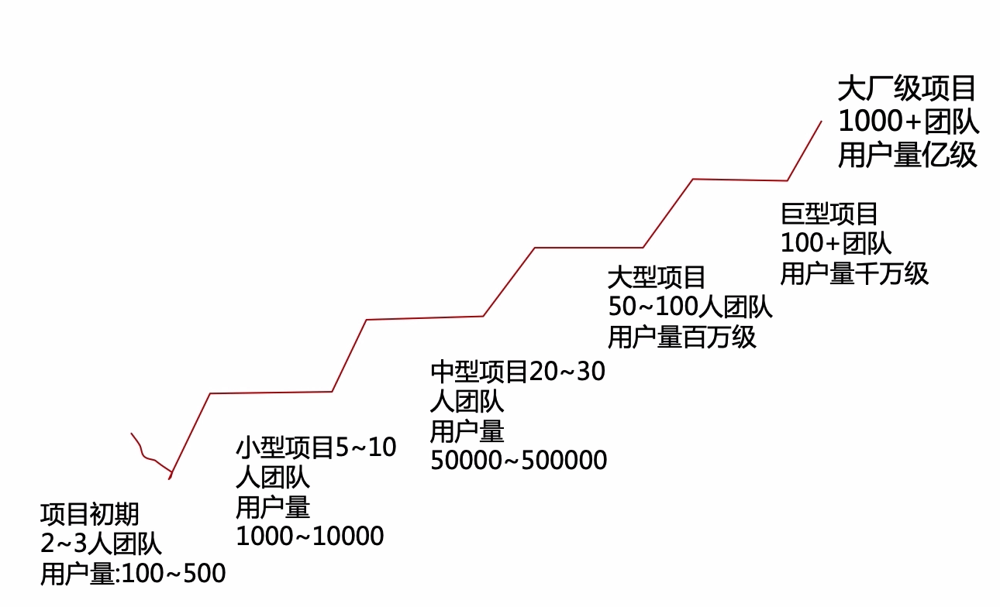
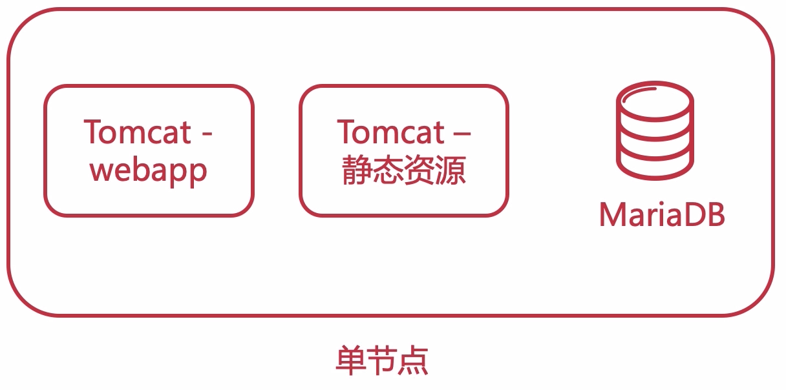
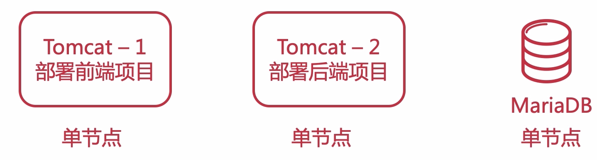
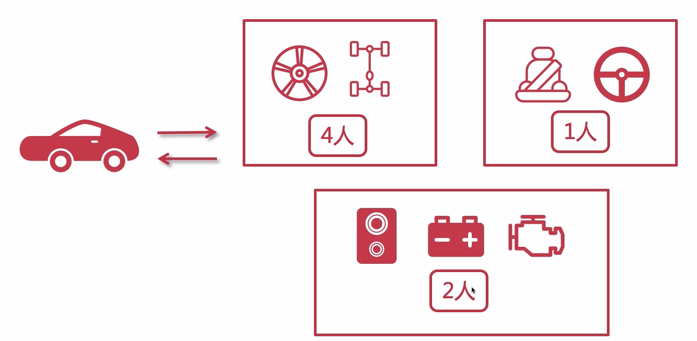
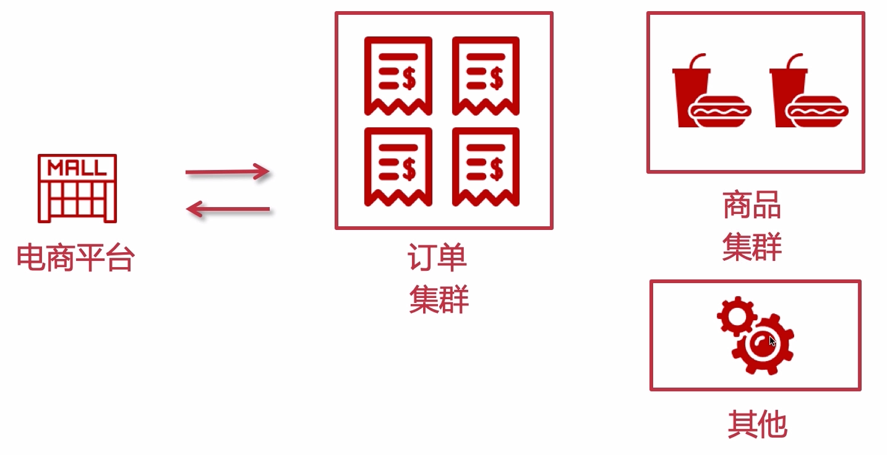

# 集群阶段开篇概述

 一般如上图所示，来衡量一个项目的 规模，也会随着用户量的增长进行往集群方向的演进

本课程也是按照这个进程来不断演进

## 单体部署

可以全部单节点部署，也可以每个组件分开部署，但是还是单体部署，如下所示

## 单体架构的优点

- 小团队成型即可完成开发、测试、上线

  更新的话，停机时间短

- 迭代周期短，速度快

- 打包方便，运维省事

## 单体架构面临的挑战

- 单节点宕机造成所有服务不可用

  随着业务的发展，用户量增多，系统承载能力变弱

  可以通过集群来实现高可用

- 耦合度太高（迭代、测试、部署）

  随着代码量增多，维护、开发都不是那么容易了

  可以通过业务拆分，如微服务来改进

- 单节点并发能力有限

  可以通过负载均衡来降低服务器的压力

现阶段先做集群，后续根据业务的发展来进行架构的升级。

## 集群概念

- 计算机 **群体** 构成整个系统

- 这个 **群体** 构成一个整体，不能独立存在

  对于用户来讲是 **透明** 的，一个请求过来，只要能正确处理响应即可，用户并不关心你后端是 1 台服务器还是 1000 台服务器

- 人多力量大，群体提升并发与可用性

  集群：每个节点运行的业务相同

  分布式：每个节点运行的业务不同

## 集群

- 第一个任务使用 4 个人来做
- 第二个任务使用了 1 个人来做
- 第三个任务使用了 2 个人来做

那么这一张图就是一个 **分布式的集群系统**，总共有三个不同的业务（分布式），多人做同一个业务就是集群。

下面使用电商平台来看看集群是什么样子的

这里按照业务拆分：

- 订单集群

  使用 4 台节点来组成一个订单集群

- 商品集群

  使用 2 个节点组成一个商品集群

- 其他

  由于流量不多，使用一个节点来提供服务

## 使用集群的优势

- 提高系统性能

  可以分发流量到各个节点，提高整个系统的性能

- 提高系统可用性

  不会像单体那样宕机之后就无法堆外提供服务了，就算有一两个节点宕机了，也不会影响其他节点提供服务

- 高扩展性

  当预估到高流量的时候，可以适当的增加计算机节点，流量下去之后又可以去掉这些节点
## 使用集群的注意点

- 用户会话

  需要使用分布式会话，后续整合 redis 后，会通过 redis 来实现

- 定时任务

  单体变集群环境时，某一个时间点的定时任务会被所有节点执行，某些任务是在同一时间点只能有一个节点执行的，像这种情况下也可以解决，比如下面的方案：

  - 使用分布式锁
  - 把定时任务单独提取出来做成一个服务，部署一个节点来执行
  - 使用 mq 的延迟队列来实现

- 内网互通