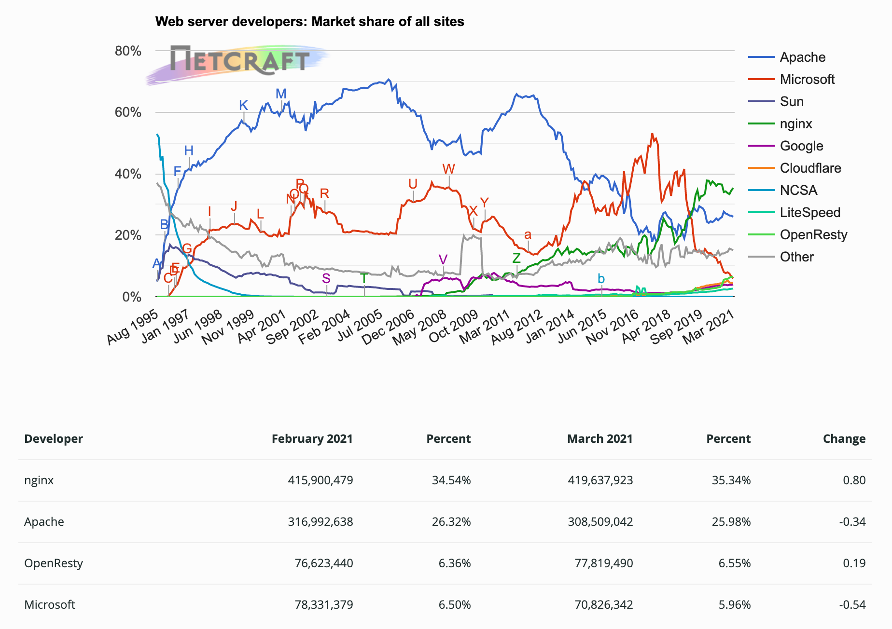
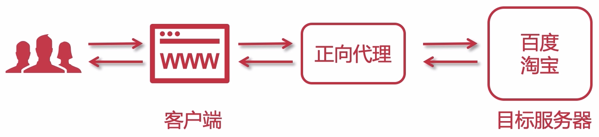
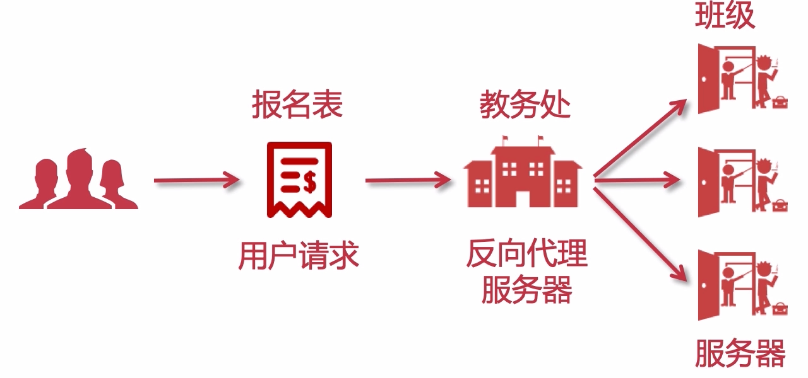
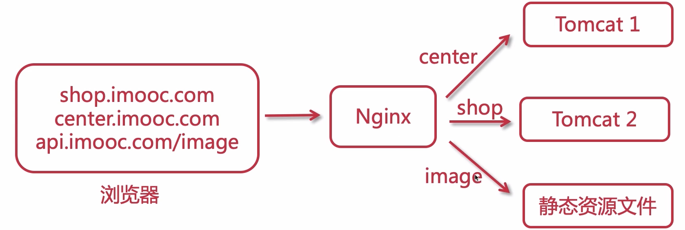

# Web 服务器基础知识

## 什么是 Nginx

Nginx（engine x）是一个高性能的 HTTP 和反向代理 web 服务器，同时也提供 IMAP/POP3/SMTP 服务。但是它的 **主要功能是反向代理** ，通过配置文件可以实现集群和负载均衡，可以实现热加载

还可以实现静态资源虚拟化，将图片、css 等静态资源进行虚拟化，就可以通过浏览器访问到资源了

## 常见的服务器

- MS IIS：asp.net

- Weblogic、Jboss：传统行业 ERP/物流/电信/金融

- Tomcat、Jetty：J2EE 等 JAVA 项目

- Apache、Nginx：静态服务、反向代理

- Netty：高性能服务器编码

  比如可以开发一个聊天室

[netcraft 网站](https://news.netcraft.com/)，提供了一些对比图，可以看到各个服务器的时长占有率，如下图所示

上图信息可以在 [2021年3月Web服务器调查](https://news.netcraft.com/archives/2021/03/29/march-2021-web-server-survey.html) 中找到，并且里面还包含了一些其他维度的对比信息

## 什么是正向代理？

客户端请求目标服务器之间的一个代理服务器，**请求会先经过代理服务器，然后再转发请求到目标服务器**，获得内容后最后响应给客户端

比如：在家里访问慕课网，我们的请求实际上会先经过你的移动运营商才会到达慕课网服务器，中间经历了中转

再比如：公司的网络环境下，有些网管会屏蔽百度下载，你发起的请求会先经过代理服务器，它可以控制或则监控你的一些行为的

## 什么是反向代理？

用户请求目标服务器，**由代理服务器决定访问哪个 IP** 。

注意区别：

- 正向代理：代理服务器只是转发用户的请求到用户想要访问的资源
- 反向代理：代理服务器决定返回哪个服务器的资源给用户

 

如上图所示，你报名之后，但是要去到哪个班级？不是你能决定的

通过反向代理我们可以实现很多功能，比如反向代理 **路由**

上述中的域名，在 Nginx 中是用虚拟主机实现的