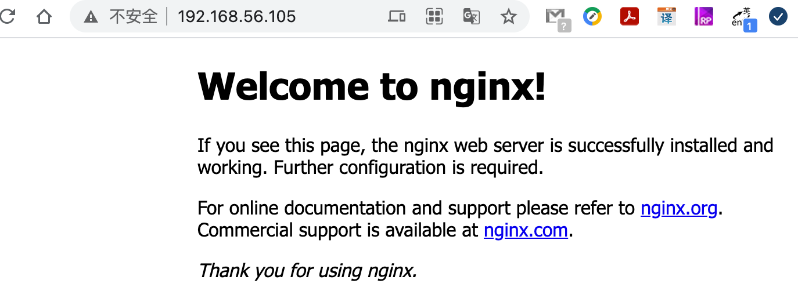

## Nginx 安装与运行

可以通过 [nginx 官网下载页面](http://nginx.org/en/download.html) 进行下载，本课程使用 [nginx-1.16.1](http://nginx.org/download/nginx-1.16.1.tar.gz) 这个版本

1. 安装依赖环境

   ```bash
   # 安装 gcc 环境
   yum install gcc-c++
   
   # 安装 PCRE 库，用于解析正则表达式
   yum install -y pcre pcre-devel
   
   # zlib 压缩和解压缩依赖
   yum install -y zlib zlib-devel
   
   # SSL 安全的加密的套接字协议层，用于 HTTP 安全传输，也就是 https
   yum install -y openssl openssl-devel
   ```

2. 解压后，将源码进行编译后才能安装

   ```bash
   # 解压
   tar -zxvf nginx-1.16.1.tar.gz
   
   # 创建 nginx 临时目录，否则有可能在启动 nginx 的过程中会报错
   mkdir /var/temp/nginx -p
   
   # 进入 nginx 源码目录，进行 configure，主要目的是创建 makefile 文件
   # \ 表示在命令行中换行，提高可读性
   cd nginx-1.16.1/
   ./configure	\
    --prefix=/usr/local/nginx \
    --pid-path=/var/run/nginx/nginx.pid \
    --lock-path=/var/lock/nginx.lock \
    --error-log-path=/var/log/nginx/error.log \
    --http-log-path=/var/log/nginx/access.log \
    --with-http_gzip_static_module \
    --http-client-body-temp-path=/var/temp/nginx/client \
    --http-proxy-temp-path=/var/temp/nginx/proxy \
    --http-fastcgi-temp-path=/var/temp/nginx/fastcgi \
    --http-uwsgi-temp-path=/var/temp/nginx/uwsgi \
    --http-scgi-temp-path=/var/temp/nginx/scgi
   ```

   配置命令的含义如下

   
   
	|命令|解释|
	|:--:|:-:|
   |–prefix |指定 nginx 安装目录|
   |–pid-path |指向 nginx 的 pid|
   |–lock-path| 锁定安装文件，防止被恶意篡改或误操作|
   |–error-log |错误日志|
   |–http-log-path| http 日志 |
   |–with-http_gzip_static_module |启用 gzip 模块，在线实时压缩输出数据流|
   |–http-client-body-temp-path |设定客户端请求的临时目录|
   |–http-proxy-temp-path |设定 http 代理临时目录|
   |–http-fastcgi-temp-path |设定 fastcg i临时目录|
   |–http-uwsgi-temp-path| 设定 uwsgi 临时目录 |
   |–http-scgi-temp-path| 设定 scgi 临时目录 |

3. 编译并安装

   ```bash
   make && make install
   ```

4. 启动、重新加载、停止 nginx

   ```bash
   cd /usr/local/nginx/sbin/
   
   # 启动
   ./nginx
   
   # 停止
   ./ nginx -s stop
   
   # 重新加载配置文件
   ./nginx -s reload
   
   # 检测配置文件是否有错误
   ./nginx -t
   ```

   如果提示 80 端口被占用

   ```bash
   # 查看 80 端口是否被占用
   netstat -nat |grep ':80'
   tcp6       0      0 :::80                   :::*                    LISTEN 
   
   # 查看是那个进程占用
   [root@study sbin]# netstat -pan | grep ':80'
   tcp6       0      0 :::80                   :::*                    LISTEN      1392/httpd 
   
   # 可以看到是 1392 httpd 服务占用了，kill 掉它
   kill 1392
   ```

访问 `http://192.168.56.105/` 查看是否有 `Welcome to nginx!` 字样的页面，



注意：如果访问不到，请检查端口是否有暴露出来

该页面的内容在 `/usr/local/nginx/html/index.html` 中，你可以尝试修改下该文件内容，再次访问看看内容是否有改变