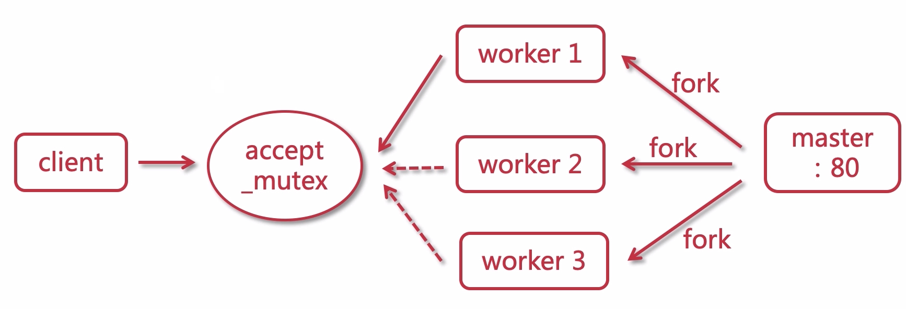
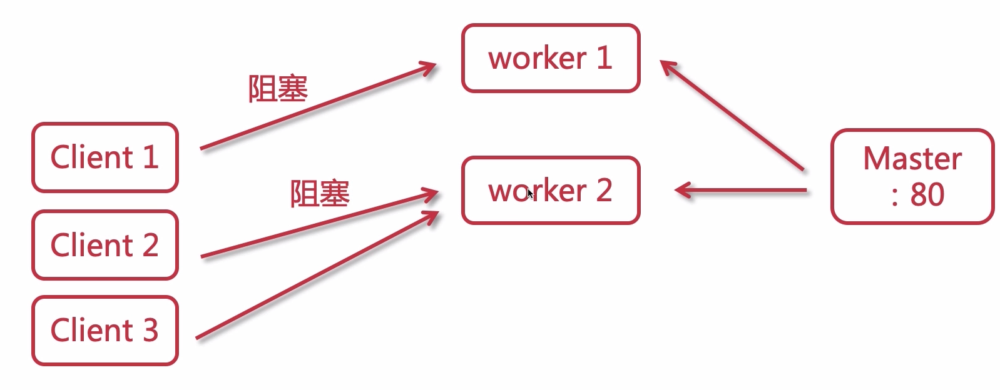
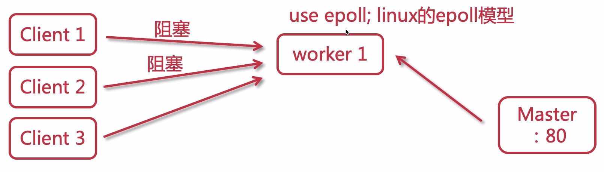
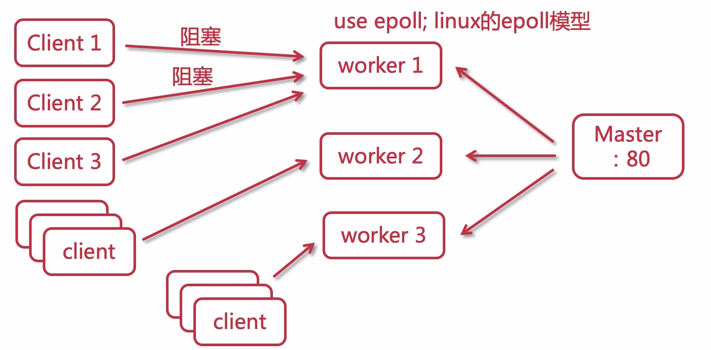

# Nginx 的进程模型

分为两种：

- master 进程：主进程
- worker 进程：工作进程

可以看现在启动的 nginx 进程情况

```bash
[root@study nginx]# ps -ef | grep nginx
root     10108     1  0 16:31 ?        00:00:00 nginx: master process ./nginx
nobody   10965 10108  0 17:27 ?        00:00:00 nginx: worker process
```

可以通过配置文件中的 worker_processes 来配置 worker 的进程数量

```
worker_processes 2;
```

master 可以接受一些指令，然后安排给 work 进行执行，比如如下信号：

```bash
./nginx -s stop
./nginx -s quit
./nginx -s reload
./nginx -t
```

如下图所示：


master 是用来管理 worker 的，而 work 是用来处理 web 请求的，与浏览器之间保持连接，处理响应请求

还有一个需要注意：比如我们需要 stop ，如果 worker 1、worker 2 此时没有任何连接，则会直接关闭，worker 3 还有连接的话，不会立即关闭，会等待连接释放后才会关闭

这种多进程的模型与多线程的模型相比还是有一些优势的，比如：

- 进程之间的相互独立的
- 某个 work 异常了，可以直接干掉，而不会影响其他的 work

Nginx 的并发性能很棒，可达到几万甚至几十万，那么我们看看看，一个连接过来之后，如何与 work 进行连接上的呢？

## Worker 抢占机制



如上图所示：master 监听了 80 端口，并且 fork 出 3 个 wokrer 进程，当 client 一个请求过来时，work 是需要去 **抢占一个互斥锁**（上图中的 accept_mutex） ，抢占成功的 worker 进行处理

## 传统服务器事件处理

最大的问题就是 **同步阻塞**，如下图所示



一个 worker 同时只能处理一个 client 请求，当一个请求被阻塞时，就不能处理其他的请求了，只能 fork 出新的 worker 出来，接受新的请求

## Nginx 事件处理

解决问题的关键就是 **异步非阻塞**，如下图所示



当 3 个请求落在一个 work 上时，当一个 client 阻塞时，它会去处理另外一个请求，而不是像传统服务器那样就卡住了



所以，nginx 只需要少量的 work 就可以处理大量的请求

对于默认的并发处理能力，也可以通过 `worker_connections` 属性配置 

```lua
events {
  # 默认使用 epoll
  use epoll;
  
  # 每个 woker 允许客户端的最大链接数量
  worker_connections 1024
}
```

