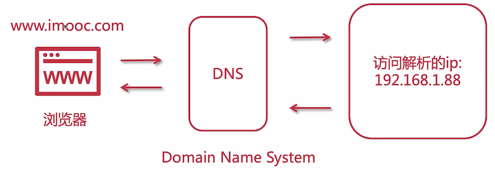
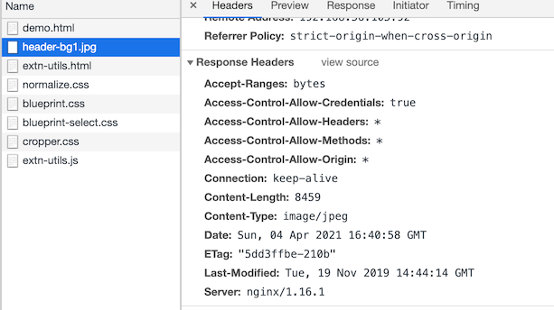
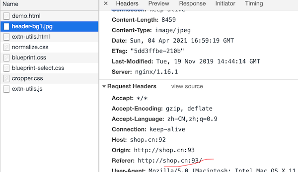

# DNS 域名解析、跨域、防盗链



这里简单说使用域名绑定 IP，那么可以通过访问域名，DNS 拿到 IP 后访问到我们的服务，IP 有可能会变动，那么更改 IP 后，DNS 也会解析到最新的 IP，这就很方便了

这个在 HTTP 协议中有介绍，访问之前会先通过 DNS 拿到对应的 IP 地址，再通过 TCP/IP 协议与目标 IP 地址建立连接

对于我们的服务集群，来看看示意图


域名绑定的是一个公网 IP，代理服务器与目标服务器是在同一个局域网内，通过内网 IP 通信

## 使用 SwitchHosts 模拟域名解析访问

可以通过 hosts 文件进行域名和 IP 的映射，像笔者这里是 mac 系统，前面章节为了解决跨域的问题，自己配置了几个域名，还有操作系统自己默认的 localhost 域名映射等信息

```
127.0.0.1       localhost
255.255.255.255 broadcasthost
::1             localhost
127.0.0.1 kubernetes.docker.internal

192.168.56.105 shop.shop.cn
192.168.56.107 api.shop.cn
```

上面修改文件的反射是手动的，还有一种更好的方式来达到效果，就是使用一些工具来做这件事情

[SwitchHosts](https://oldj.github.io/SwitchHosts/#cn) 是一个管理 hosts 文件的应用，安装后就可以进行添加，然后按需切换


注意：它的原理是帮你配置的内容覆盖掉 `/etc/hosts` 中内容，因此在你需要切换的时候，需要将系统默认的配置先复制一份出来，方便切换回去

## 使用 Nginx 解决跨域问题

既然涉及到域名了，就会出现跨域问题，如下图所示


域名不同，使用 ajax 访问则会出现跨域错误

### CORS 跨域资源共享

全称是 Cross-Origin Resource Sharing，允许浏览器向跨 Origin 的服务器发起 js 请求获取响应

可以使用：如下几种方式解决：

- Jsonp：这种方式需要前服务端做特殊的处理

- SpringBoot Cors

  前面章节已经配置过，但是由于当时笔者对 boot jar 包部署方式改成 war 包部署方式，使用起来不方便，后来想到用 hosts 模拟域名方式也没有测试通过跨域是可以的，正常情况下是可以解决的

- Nginx：反向代理

### 模拟跨域环境搭建

```lua
# 前面配置过的，访问图片
server {
   listen       92;
   server_name  localhost;

   location ^~ /images {
       root   /home/foodie-shop/;
   }
}

# 这里使用一个测试页面，去访问 92 端口的图片地址
server {
   listen       93;
   server_name  localhost;

   location = /demo.html {
       root   /home/software;
   }
}
```

demo.html 如下

```html
<!DOCTYPE html>
<html lang="en">
<head>
  <meta charset="UTF-8">
  <title>Title</title>
</head>
<body>

<script>
  //步骤一:创建异步对象
  var ajax = new XMLHttpRequest()
  
  //步骤二:设置请求的url参数,参数一是请求的类型,参数二是请求的url,可以带参数,动态的传递参数starName到服务端
  ajax.open('get', 'http://shop.cn:92/images/header-bg1.jpg')

  //步骤三:发送请求
  ajax.send()

  //步骤四:注册事件 onreadystatechange 状态改变就会调用
  ajax.onreadystatechange = function () {
    if (ajax.readyState == 4 && ajax.status == 200) {

      //步骤五 如果能够进到这个判断 说明 数据 完美的回来了,并且请求的页面是存在的　　　　
      console.log(ajax.responseText)//输入相应的内容
    }
  }
</script>
</body>
</html>
```

让后访问 `http://shop.cn:93/demo.html` 会发现跨域错误


::: tip

demo.html 也可以不用单独放到 nginx 上，直接在本地文件打开也是一样的效果，因为 localhost 与 sho.cn 不是同一个源

笔者这里放到同一个 nginx 上，但是设置了不同的端口，他们也是不同源的

:::

###  Nginx 配置 CORS

我们只要在需要访问的图片虚拟机上添加配置即可

```lua
server {
   listen       92;
   server_name  localhost;

   # 允许跨域请求的域， * 代表所有
   add_header 'Access-Control-Allow-Origin' *;
   # 允许带上 cookie 请求
   add_header 'Access-Control-Allow-Credentials' 'true';
   # 允许请求的方法，如 GET/POST
   add_header 'Access-Control-Allow-Methods' *;
   # 允许请求的 header
   add_header 'Access-Control-Allow-Headers' *;
   
   location ^~ /images {
       root   /home/foodie-shop/;
   }
}
```

上述配置和 SpringBoot 中配置的 Cors 类似，只要给该资源添加上这些头，浏览器就会允许读取资源



## Nginx 配置静态资源防盗链

通过 ajax 有跨域的限制，但是图片等资源，跨域通过标签直接引用，就不存在跨域问题了，比如在 demo.html 中增加 img 标签

```html

```

在你本地打开也是能看到该图片的，设置防盗链

```
server {
   listen       92;
   server_name  localhost;

   # 允许跨域请求的域， * 代表所有
   add_header 'Access-Control-Allow-Origin' *;
   # 允许带上 cookie 请求
   add_header 'Access-Control-Allow-Credentials' 'true';
   # 允许请求的方法，如 GET/POST
   add_header 'Access-Control-Allow-Methods' *;
   # 允许请求的 header
   add_header 'Access-Control-Allow-Headers' *;

   # =========  静态资源防盗链配置
   # 对源站点验证
   valid_referers    *.shop.cn;
   # 非法引入会进入下方判断，响应 404
   # 该变量是 nginx 的内置变量
   if ($invalid_referer) {
   	return 404;
   }
   
   location ^~ /images {
       root   /home/foodie-shop/;
   }
}
```

这样配置之后，通过 ajax 和 img 标签访问都不能访问了，通过 img 标签访问的会响应 404 状态码，通过 ajax 访问的会显示跨域

::: tip

因为防盗链校验的是这个地址



因此如果在 `http://shop.cn:93/demo.html` 上测试的话，因为至少端口不一样，但是域名是一样的，按道理来说是可以访问的，但是这里的配置是 `valid_referers    *.shop.cn;` 

域名对应不上，这里要改成 `valid_referers    shop.cn;` 就可以访问到了

:::