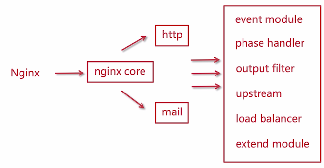

# Nginx 的模块化体系

> 模块化部分内容应该可以在 [这个官方地址](http://www.aosabook.org/en/nginx.html) 找到一部分说明



它分为了两部分：http 和 maail，这里我们主要关注 http

- nginx core：主要实现了底层的通讯协议

  为其他模块和 nginx 进程提供了一个运行时环境，同时还会协调其他的模块

- event

- phase handler：处理客户端的请求响应

- output filter：输出过滤

  如 gzip 压缩

- upstream：反向代理模块

  将真正的请求转发到真实的服务器地址

- load balancer：负载均衡器

- extend module：继承模块，第三方实现的模块

下面是 nginx 安装目录简要说明

```
auto  
CHANGES 
CHANGES.ru  
conf  		# 默认配置
configure # 编译配置
contrib   
html  		# 默认的主页内容
LICENSE 
Makefile  # 编译相关
man  		  # nginx 守则
objs  		# rpm 编译后相关，里面包含了很多模块
README  
src				# nginx 源码
```


