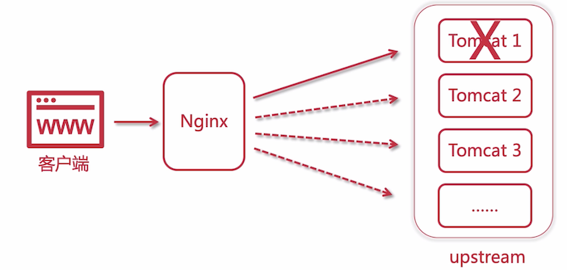

# Nginx 的集群负载均衡解析

## 单节点

一个人搬砖，当量少的时候还没有问题，逐渐多起来的时候，就不行了，他一个人搬不过来了，如果他生病之后，砖头就会累积没有人搬了

## 集群

使用集群处理的话，人多了，三个人去协调分配工作量，如果还不够，还可以雇佣更多的人来搬砖，这个老板就相当于是 Nginx

计算机中还有一个原则：`1 + 1 > 2`，如 `2 核 4G + 2 核 4G > 4 核 8G`，两台的性能远远会超过一台的性能

## Nginx 集群负载均衡

所有的请求会先经过 Nginx，由 Nginx 去分配处理该请求的节点

如上图所示，后端的所有真实服务器统称为 **upstream（上游服务器）**，那么如何分配？这就是 Nginx 的均衡负载了，它可以平均分配、权重、用户 IP、用户地址等可以使用相应的策略去分配

假如其中一个节点挂掉了，那么会自动剔除该节点，不再访问。

## 四层负载均衡

四层负载均衡基于 IP + 端口，进行转发实现的，当客户端与后端服务器建立链接之后，后续在该链接上的请求还会继续通信

它是传输层的，基于 TCP/UDP 协议，性能非常高

- F5 硬负载均衡：基于硬件，商业级别的负载均衡，很贵
- LVS 四层负载均衡：linux 内核的均衡负载，与协议无关
- Haproxy 四层负载均衡：也可以在 7 层做负载均衡
- Nginx 四层负载均衡：新版本中支持，但是一般还是习惯使用 Nginx 作为七层

## 七层负载均衡

基于 URL、IP 的应用层负载均衡，针对 HTTP 协议的负载均衡

- Nginx 七层负载均衡

- Haproxy 七层负载均衡，灵活性很高

  当它作为四层均衡负载时，是不处理请求的，只是转发。而在七层时，它会处理请求的

- apache 七层负载均衡，性能不如 Nginx，达到百万级别后，性能不太行

## DNS 地域负载均衡

DNS 根据就近原则返回不同的 IP，提供服务。