# JMeter 测试单节点与集群的并发异常

可以在 [JMeter](https://jmeter.apache.org/index.html) 官方下载 [apache-jmeter-5.4.1.zip](https://mirrors.tuna.tsinghua.edu.cn/apache//jmeter/binaries/apache-jmeter-5.4.1.zip)，解压之后在 `bin` 目录下有启动文件：

- Mac：`jmeter`
- Win：`jmeter.bat`

## 单节点测试

1. 创建线程组与取样器

   设置使用多少个线程来做什么事情

   先创建一个计划，名称定义为 「单个 tomcat 测试」保存后，再添加线程组，如下图所示

   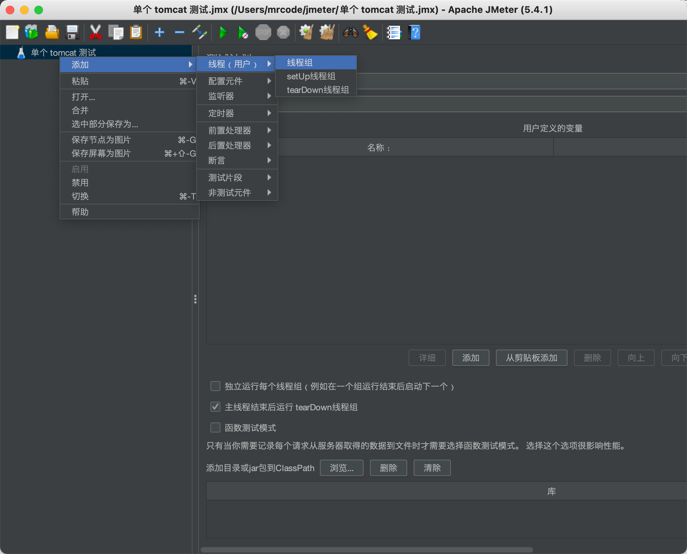

   设置 **线程组** 相关信息

   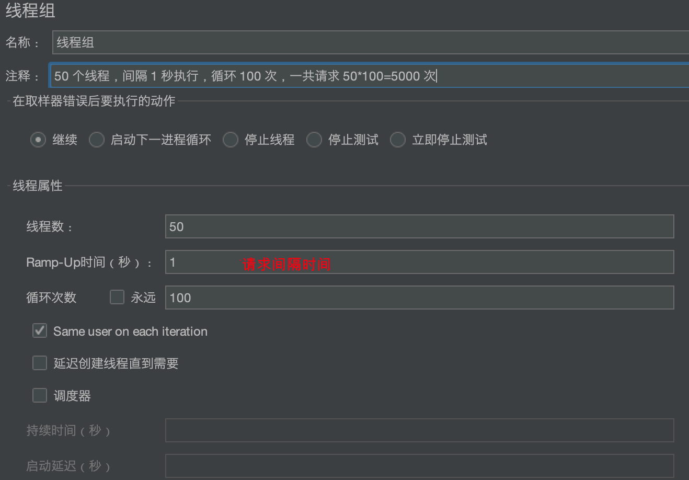

   再在该线程组上添加 **取样器**，选择 HTTP 请求

   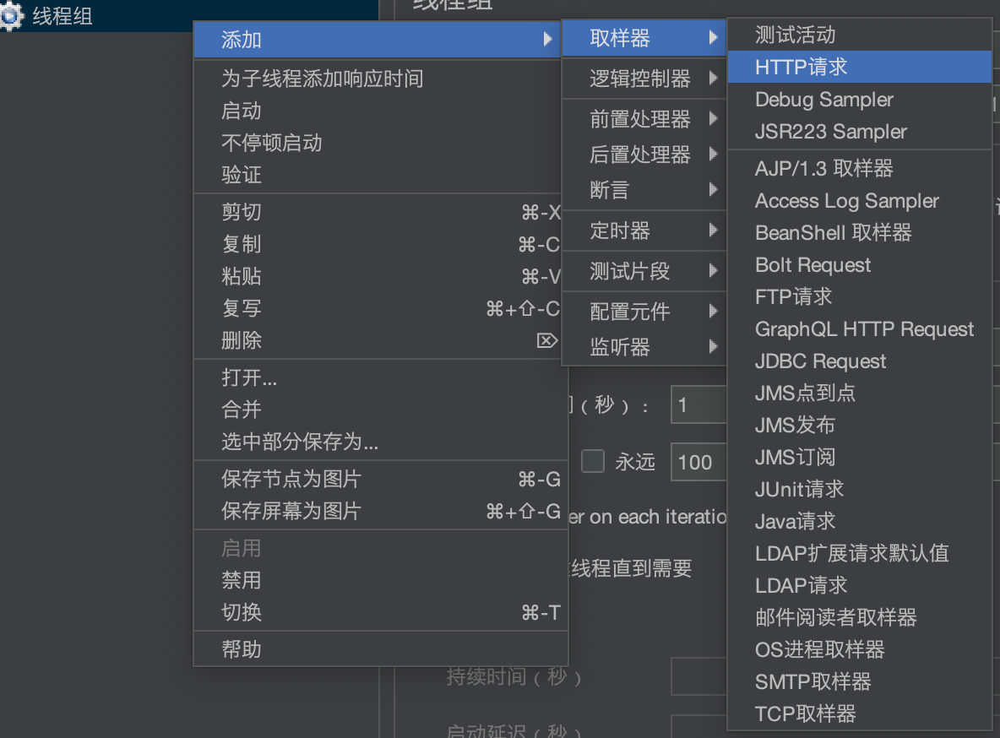

   填写要测试的 tomcat 节点信息，如图所示，我们这里没有填写路径，就是直接请求 `http://192.168.56.107:8080/` 这个地址。另外下面还有参数等信息可以填写

   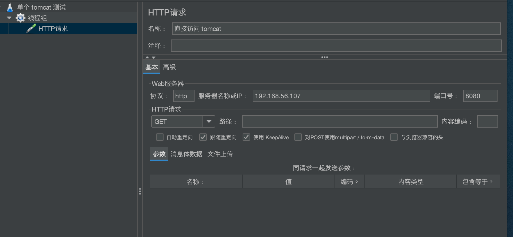

2. 创建监听器

   也就是线程组执行的结果信息如何显示

   在执行计划上面右键打开添加导航

   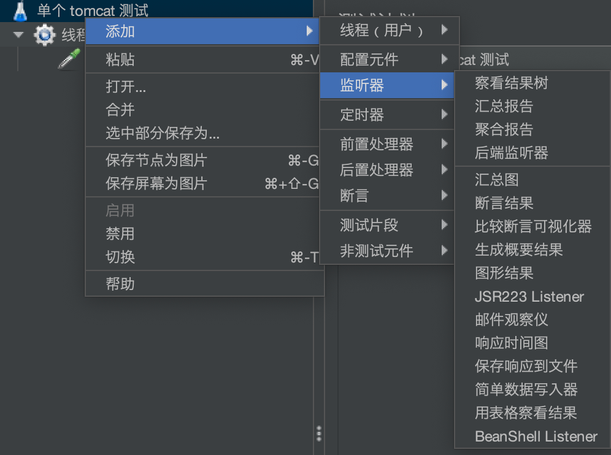

   下面我们先添加三个监听器：聚合报告、查看结果树、用表格查看结果

3. 启动测试

   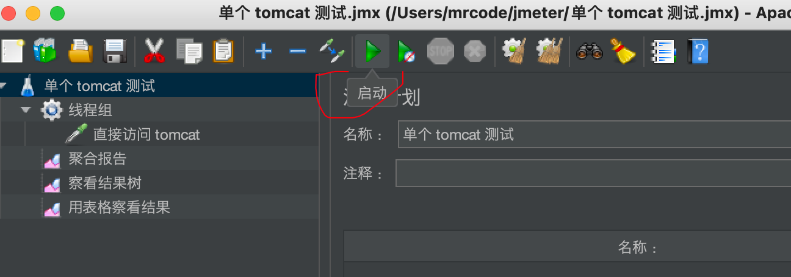

点击启动之后，就可以查看报告了，在执行过程中也可以查看报告，不过报告的数据会实时变化

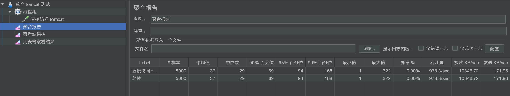

- 样本：总的请求次数

- 品均值：平均响应时间，单位是毫秒

- 中位数：50% 的请求在 29 毫秒

  意思是，在 5000 次请求里面，有 `5000 * 50% = 2500` 次请求是 29 毫秒内响应，那么另外 50% 的请求会大于 29 毫秒  

- 其余的 90%、95%、99%：以此类图

- 最大、最小值：耗时最小最大的时间是多少毫秒

- 异常%：异常请求占比，这里对于 50 个并发的请求，tomcat 能处理过来，没有出现异常

- 吞吐量：意思是每秒可以处理 900+ 的请求

- 接收 KB/sec：每秒接收多少 KB 的数据，这个与网络带宽有关，现在我们是在本地测试的，所以很高

调整线程数量到 200 后，再次测试，在测试前要点击那个黄色扫帚按钮，先清除结果


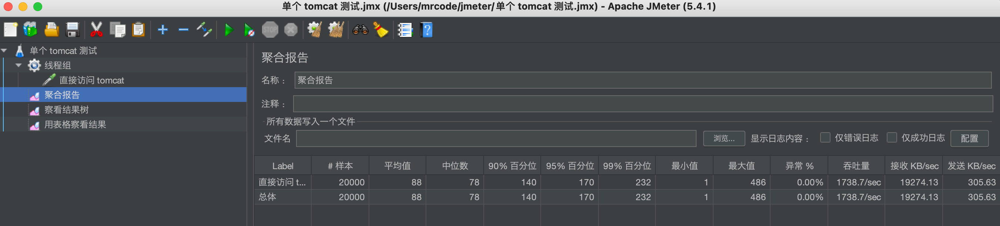

还是正常的，那么笔者这里把线程数量加到了 1000 发现有错误的了，如下图所示

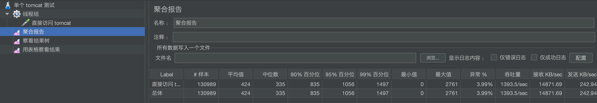

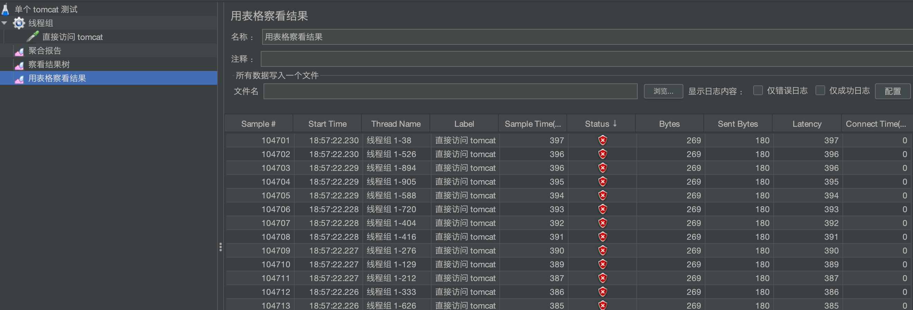

能看到具体的错误结果是什么

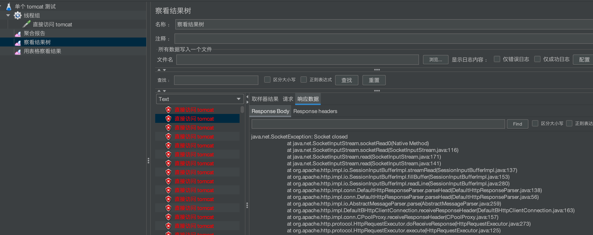

## 集群测试

我们在另外一台机器上再启动一个 tomcat，这里可以直接将当前的 tomcat 复制过去

```bash
[root@study local]# scp -r ./tomcat-api/ root@192.168.56.108:/usr/local/
```

那么下面使用 Nginx 来配置 tomcat 集群

```lua
# 修改为了 4 个 worker
worker_processes  4;

events {
    worker_connections  1024;
}

http {
    ....
    # 配置上游服务器
    upstream tomcats{
        server 192.168.56.107:8080;
        server 192.168.56.108:8080;
    }
    server {
        listen       80;
        server_name  localhost;

        location / {
           # 转发到上游服务器
           proxy_pass    http://tomcats;
        }
    }
}
```

JMeter 是可以启动多个的，所有另外启动一个来测试集群的。下面笔者重新按照 1000 的并发数量测试了单个 tomcat 测试（笔者的电脑上，只有线程达到 1000 的时候才会出现异常）

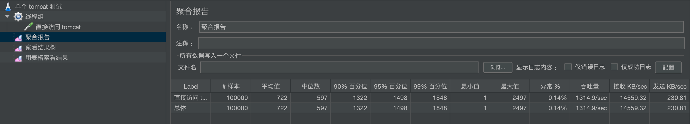

集群的测试结果

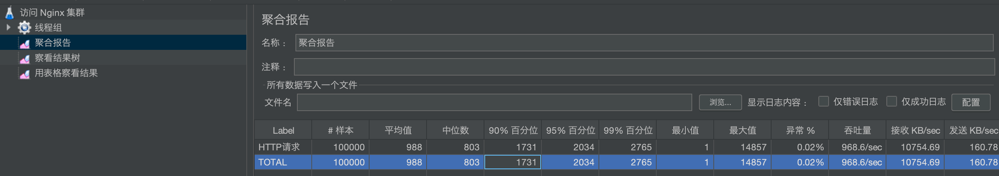

在上面的报告中，其他的耗时并不能表现出真实的状况，因为所有服务器都是在我宿主机上的，着重需要看的是 **异常占比**

- 单机异常：0.14%，140 个异常
- 集群异常：0.02%，20 个异常

一般来说某些企业的异常临界点是 20%，比如超过 20% 就需要扩容了。
