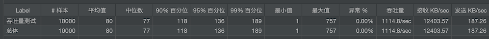

# Nginx 构建 Tomcat 集群

在前面是在介绍 Nginx 的用法和基础知识，现在我们要来构建业务集群了


笔者这里的分布如下：

- Nginx：192.168.56.105
- Tomcat1：192.168.56.106
- Tomcat2：192.168.56.107
- Tomcat3：192.168.56.108

这里，我们在原来的 my.conf 中来编写配置文件

```lua
# 配置上游服务器,名称是自定义的
upstream tomcats {
   server 192.168.56.106:8080;
   server 192.168.56.107:8080;
   server 192.168.56.108:8080;
}

server {
   listen       80;
   server_name  www.tomcats.com;

   location / {
      proxy_pass    http://tomcats;
   }
}
```

不要忘记增加 hosts 配置

```
# tomcat 集群
192.168.56.105 www.tomcats.com
```

访问 `http://www.tomcats.com/` 就能访问到集群了

注：proxy_pass 指令后面可以直接写目标地址，这个和 upstream 中只有一个 server 效果是一样的

## 负载均衡策略 1

### 轮询

Nginx 搭建的 upstream 默认策略是 **轮询**，就是一个 server 依次处理一个请求

这种情况下适合每个 server 的硬件配置是一样的（处理能力是一样的）

如何验证呢？现在 3 个 tomcat 的默认首页都是一样的，我们需要 更改它的默认首页信息，才能验证当前访问的到底是哪一个 server

```bash
# 每个 tomcat 都更改该文件的内容
vim /usr/local/tomcat-api/webapps/ROOT/index.jsp 

# 在 body 标签下面增加一行代码，标识当前是哪一个 tomcat
<body>
 <p>tomcat1</p>
 ...
```

每次刷新都会是不同的 tomcat 被访问到

### 加权轮询


如上图所示，根据每个工人的身体素质，分配不同的任务。

在 nginx 中使用 `weight` 关键字来指定

```
upstream tomcats {
   server 192.168.56.106:8080    weight=1;
   server 192.168.56.107:8080    weight=2;
   server 192.168.56.108:8080    weight=3;
}
```

这个测试的话，不太明显的能看出来，但是在不断的刷新中，能明显的感觉到 `weight=3` 的出现几率较大

## upstream 指令参数
::: tip
本章内容可以在官方文档 [ngx_stream_upstream_module](http://nginx.org/en/docs/stream/ngx_stream_upstream_module.html) 找到

要记得：nginx 是由多个模块组合起来的，我们在配置的时候其实就是在针对他的模块配置，所以只要找对应的模块即可
:::

下面介绍几个常用的参数

- max_conns

- slow_start

- down

- backup

- max_fails

- fail_timeout

### max_conns

限制链接到 server 的最大连接数

需要注意的是：

- 如果配置了多个 work 进程，则需要共享配置，链接总数就有可能会超过 max_conns 的限制，这里说需要定义在共享内存中，这个也是一个语法，文档中有描述；但是文档中大概意思是说：如果没有定义共享内存，那么这个限制会在每个 worker 进程中独享配置
- 老版本中没有该参数，原来是给商业版本使用的，在新版本就可以使用了

如下配置

```lua
# 配置上游服务器,名称是自定义的
upstream tomcats {
   server 192.168.56.106:8080    max_conns=1;
   server 192.168.56.107:8080    max_conns=2;
   server 192.168.56.108:8080    max_conns=3;
}
```

当达到最大链接数量时，新增的链接会被拒绝掉，响应 `502 状态，Bad Gateway` 信息，这个可以通过 JMeter 来进行测试

### slow_start

```
slow_start = time
```

缓慢的启动，只能用在 **集群** 和 **均衡负载为权重** 的场景中，含义是：当该节点不正常或新加入的集群在 time 时间内，将它的权重从 0 逐渐恢复到正常设置的权重值

```lua
# 配置上游服务器,名称是自定义的
upstream tomcats {
   server 192.168.56.106:8080    weight=6   slow_start=60s;
   server 192.168.56.107:8080    weight=2;
   server 192.168.56.108:8080    weight=3;
}
```

但是很遗憾的是，此参数目前只能在商业版本中使用，哪些参数是商业版本中使用的，在文档中也有说明，列出来了的

### down

将服务器标记为永久不可用。也就是不会被路由到

```lua
upstream tomcats {
   server 192.168.56.106:8080    weight=6   down;
   server 192.168.56.107:8080    weight=2;
   server 192.168.56.108:8080    weight=3;
}
```

### backup

标识该 server 是一个备用节点，只有当集群内所有非 backup 标识的节点都挂掉之后，才会被路由到

```lua
upstream tomcats {
   server 192.168.56.106:8080    weight=6   backup;
   server 192.168.56.107:8080    weight=2;
   server 192.168.56.108:8080    weight=3;
}
```

比如你可以直接将两外两台 tomcat kill 掉，或则将他们配置为 down 标识，就能访问到 backup 节点了

### max_fails、fail_timeout

- max_fails：最大重试次数

  当与服务器建立连接时出现错误或超时，重试的次数，到达重试次数后，将认为服务器不可用

  默认值是 1

- fail_timeout：当服务器不可用时，在指定的时间内将不会再次尝试与该服务器连接

  默认时间是 10s

也就是说，这两个参数是配合使用的，当服务器不可用时，会被关到小黑屋 fail_timeout 时间，之后会继续尝试连接该服务器。

```lua
upstream tomcats {
   server 192.168.56.106:8080    weight=6   max_fails=1  fail_timeout=2 ;
   server 192.168.56.107:8080    weight=2;
   server 192.168.56.108:8080    weight=3;
}
```

它们组合出来的效果是：当该节点不可用时（连接不上或连接超时）**请求会被转发给其他节点，并不会报错**，然后会在 fail_timeout 指定的时间之后，再次尝试连接是否可用。

如果要测试效果可用使用如下的步骤：

1. 把配置了 fail_timeout 的节点先手动停止掉
2. 使用 JMeter 去请求这个集群
3. 保证在请求完成前，手动启动被停掉的节点
4. 然后观察请求的结果

正常表现：请求不会报错，会落在其他正常的节点上，当手动启动后，会发现该节点能正常访问了

## 使用 Keepalived 提高吞吐量

> 该参数在 [ngx_http_upstream_module](http://nginx.org/en/docs/http/ngx_http_upstream_module.html) 模块中，
>
> 笔者看到里面的配置也有上面所讲解的参数，连示例都差不多的

```
句法：	keepalive connections;
默认：	-
语境：	upstream
```

`connections` 参数设置每个工作进程的高速缓存中保留的到上游服务器的空闲保持连接的最大数量。超过此数量时，将关闭最近最少使用的连接。

设置 100 个线程间隔 1 秒，循环 100 次

下面来测试下单机的吞吐量：

```
upstream tomcats {
   server 192.168.56.106:8080;
}
```


设置 keepalive，下面配置在代理转发的时候，使用 http 1.1，并且将客户端请求的 connection 的信息重置为了空（应该是防止非长链接的信息出现） 

```lua
upstream tomcats {
   server 192.168.56.106:8080;
   keepalive 16;
}
server {
   listen       80;
   server_name  www.tomcats.com;

   location / {
      proxy_pass    http://tomcats;
      proxy_http_version 1.1;
      proxy_set_header Connection "";
   }
}
```



可以看到吞吐量确实是提高了，这里我是本机测试的，在实际的生成环境中差别会更高

上面测试是针对 HTTP 协议的，非 HTTP 协议，可以不用设置头信息

另外：该指令设置的数量，并不是限制 nginx 能创建连接的总大小，只是保持长连接的大小，因此不应该设置的特别的大

