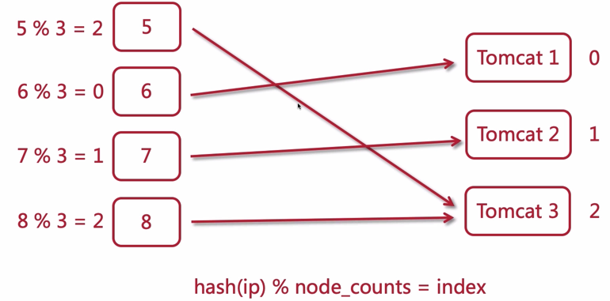
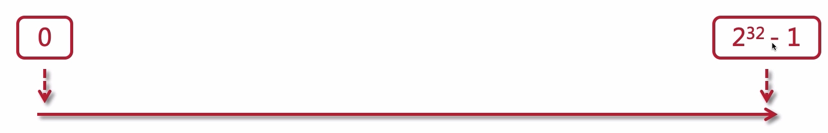
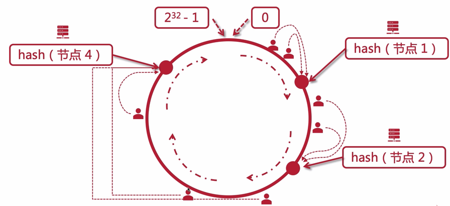
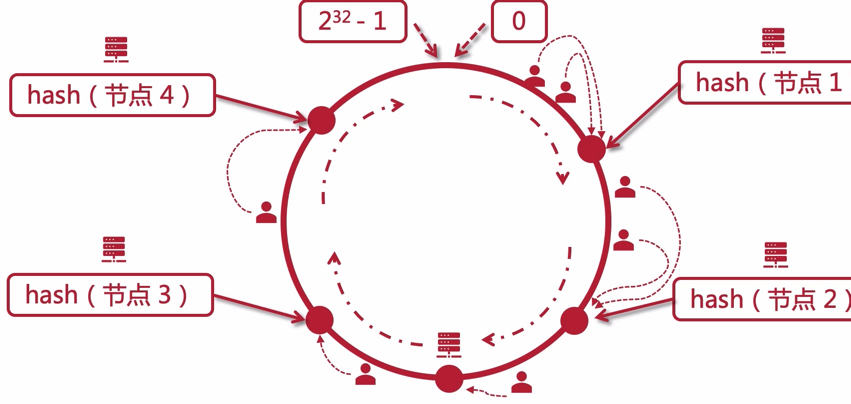
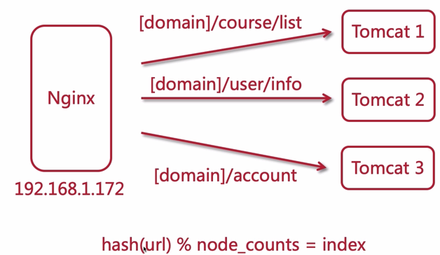

# 负载均衡策略 2

上一节介绍了轮询和加权轮询，这章讲解另外几种：

- ip_hash
- hash
- least_conn

## ip_hash


按访问 IP 做哈希算法，落到后端的服务节点上，也就是说如果该用户的 IP 一直不变，那么 ta 的请求将会一直落在同一个节点上

下面来看看 hash 算法是如何做的



> [官网文档](http://nginx.org/en/docs/http/ngx_http_upstream_module.html#ip_hash)

```lua
upstream tomcats {
   ip_hash;
   server 192.168.56.106:8080;
   server 192.168.56.107:8080;
   server 192.168.56.108:8080;
}
```

这个 ip_hash 的源码在以下路径

```bash
/home/software/nginx-1.16.1/src/http/modules/ngx_http_upstream_ip_hash_module.c 
```

可以看看它的路径组织，在 modules 下，分模块放置的。它的源码里面写着 hash 的算法，只截取了 ip 地址的前 3 段进行计算，所以：如果你在同一个 IP 段中不同 IP 去访问的话，会被路由到同一台节点


需要特别注意的是：当新增节点或删除节点的时候会 hash 值会变化，但是在临时移除节点的时候，可以使用 down 标记，可以让 hash 值不发生变化，如下所示

```lua
upstream backend {
    ip_hash;

    server backend1.example.com;
    server backend2.example.com;
    server backend3.example.com down;
    server backend4.example.com;
}
```

## hash 算法带来的问题

当节点数量变化后，hash 值计算后与原来的不一致，当大量用户和大量机器的时候，依赖该算法相关的业务都会受到一定的影响，比如缓存。

那么就有另外一种 hash 算法来解决这个问题：一致性哈希算法

## 一致性哈希算法



一条线，上面分布着从 0 开始到 2<sup>32-1</sup> 的值，这条线可以变成一个圆圈


1. 计算机节点按照 hash 算法，分布在这个圆环上
2. 那么用户计算访问时，它的 ip 经过 hash 算法后，也会落在这个圆环上的某一个点上
3. 那么如果落在的不是在计算机节点上，就顺时针找到一个最近的节点

如果节点减少，那么如下图所示：只会影响到 **一部分** 的用户被路由到下一个节点



同理，增加节点的话，也只会影响到一部分的用户



## url hash

基于 URL 的 hash 算法



基于 URL 有一个问题：有可能某一个 URL 访问量很高，那么就会导致部分节点过热，部分节点过冷，这种情况下，可以让过热的节点上再做一个集群来分担压力

> 官方文档 [hash](http://nginx.org/en/docs/http/ngx_http_upstream_module.html#hash)

官方其实提供的是一个 hash 函数，用来计算 hash 的参数可以是任意值，这里我们使用内置变量获得 url 可以如下配置

```hash
upstream tomcats {
   hash $request_uri;
   
   server 192.168.56.106:8080;
   server 192.168.56.107:8080;
   server 192.168.56.108:8080;
}
```

## least_conn

根据最少连接数路由


```bash
upstream tomcats {
   least_conn;
   
   server 192.168.56.106:8080;
   server 192.168.56.107:8080;
   server 192.168.56.108:8080;
}
```

