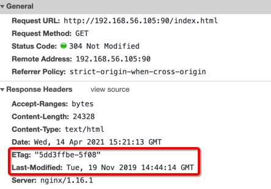
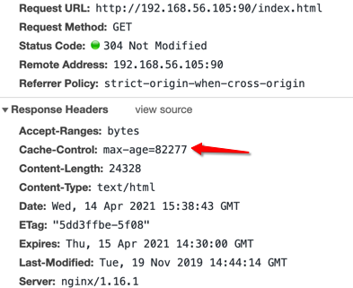
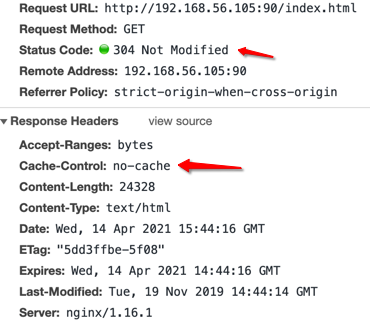

# Nginx 的缓存


对于上图这种架构来说，分为两段缓存：

1. 上游缓存到 nginx 端：中间的 nginx 相当于是缓存代理

   上游服务器到 nginx 是内网传输，但是也能使用缓存将一些静态文件缓存在 nginx 端

2. 静态资源缓存到浏览器：正常的浏览器缓存

## Nginx 控制浏览器缓存

>  [expires 官方文档](http://nginx.org/en/docs/http/ngx_http_headers_module.html#expires)

### 最大生存时间

```
expires [time]
```


我们访问下 nginx 中的任意一个 html 文件，访问第二次的时候就会发现是 304 状态了



也可以勾选这个禁用浏览器的缓存


可以使用 expires 来设置过期的时间，如下

```lua
   location / {
       root   /home/foodie-shop/;
       index  index.html;
       expires 10s;
   }
```


- max-age：最大缓存时间

- date：响应时间

- expires：过期时间

- last-modified：该文件的最后修改时间

  如果没有到达过期时间，但是你去修改了该 html 文件，那么在此刷新的时候也是会响应 200，而不是 304 

### 指定某个时间点过期

```
expires @[time]
```

如 `@22h30m` ，那么会在晚上 22.30 分过期，当在当前 22.30 分以后在此获取到文件查看它的过期时间时，则是第二天的 22.30 分了，也就是说：它是按天来计算间隔的

```lua
   location / {
       root   /home/foodie-shop/;
       index  index.html;
       expires @22h30m;
   }
```




验证的话，可以每次刷新看看这个 max-age 随着时间的减少，它会不断的减少，直到 0 时，就会过期了

### 缓存提前过期

```
expires -[time]
```

```
   location / {
       root   /home/foodie-shop/;
       index  index.html;
       expires -1h;
   }
```



提前过期就是不缓存，但是笔者有一个地方没有明白的是，像是过期时间在 1 小时前就已经过期了，但是每次访问响应的是 304 状态

### 不设置缓存

```
expires epoch
```

它会将设置为以下固定值，表现形式和前面的提前过期缓存一致

- Expires：`Thu, 01 Jan 1970 00:00:01 GMT`
- Cache-Control：`no-cache`

### 关闭缓存

```
expires off
```

nginx 不会添加 expires 和 cache-control 头字段到响应中，但是不表示该文件就不缓存了，浏览器端还会根据 last-modified 时间进行缓存

### 永不过期

```
expires max
```

会添加 expires 和 cache-control 响应头，但是这两个时间都特别的大，相当于永远不过期了

### 总结

- `expires 10s`：指定多少秒后过期
- `expires @22h30m`：指定在下一个 22.30 分过期
- `expires -1h`：指定已经过期 1 小时了
- `expires epoch`：指定在 1970 年就已经过期了
- `expires off`：关闭 nginx 的缓存，不往响应中写 expires 和 cache-control 头

另外还可以如下使用

```lua
map $sent_http_content_type $expires {
    default         off;
    application/pdf 42d;
    ~image/         max;
}

expires $expires;
```

使用 map 来针对 content type 来集中设置过期策略

## 反向代理缓存

> [代理缓存相关官方文档](http://nginx.org/en/docs/http/ngx_http_proxy_module.html#proxy_cache)

```bash
# 设置缓存保存目录,该目录只要保证 父目录存在即可，子目录（upsteam_cache）会自动创建
# keys_zone: 设置共享内存以及占用的空间大小，mycache 为自定义名称，5m 为大小
# 		   key，md5算法生成一个缓存文件的 key和相关数据，大于 1m 空间大小可以保存 8000 个 key
# max_size：设置缓存文件在磁盘上的最大占用空间
#		  当超过最大空间时，会按照最近最少使用原则，删除掉
# inactive：空闲时间，当多久没有访问过该缓存文件时，将会被清理掉
# use_temp_path：是否使用临时目录，使用临时目录可能会导致性能降低
proxy_cache_path /usr/local/nginx/upsteam_cache keys_zone=mycache:5m max_size=1g inactive=1m use_temp_path=off;
 
server {
   listen       80;
   server_name  www.tomcats.com;
   
   # 开启并使用缓存 
   # proxy_cache zone | off;
   # zone 则是通过 proxy_cache_path 中定义的 keys_zone 名称
   proxy_cache mycache;
   # 针对 200 和 304 状态码设置缓存过期时间为 8 小时
   proxy_cache_valid 200 304 8h;
   location / {
      proxy_pass    http://tomcats;
      proxy_http_version 1.1;
      proxy_set_header Connection "";
   }
}
```

重新加载配置后，查看配置的缓存目录，可以看到是空的

```bash
[root@study upsteam_cache]# pwd
/usr/local/nginx/upsteam_cache
[root@study upsteam_cache]# ll
总用量 0

```

我们访问下 www.tomcats.com，就发现出现了很多文件了

```bash
[root@study upsteam_cache]# ll
总用量 72
-rw------- 1 nobody nobody  6147 4月  15 00:30 1a83d784079c41fcdf67828cae294341
-rw------- 1 nobody nobody  1281 4月  15 00:30 3ef78c27c9f44369eacb43e60a890f0d
-rw------- 1 nobody nobody  1968 4月  15 00:30 6f7e21bb2c6246ba259832c682bdfdd0
-rw------- 1 nobody nobody 27815 4月  15 00:30 882de309fef04f64997cacef2cd74acb
-rw------- 1 nobody nobody  2488 4月  15 00:30 931a95c3023d89bb829a04b7cb49625c
-rw------- 1 nobody nobody  5670 4月  15 00:30 b4ec94b1070eec182f272b8dc783583e
-rw------- 1 nobody nobody  3672 4月  15 00:30 c862432b3e3ab370fd7d7e7b1444e4a6
-rw------- 1 nobody nobody 11686 4月  15 00:30 e71d8f737769be501e010bdb3387eaaf

```

如果 1 分钟不访问，那么这些条目会被清空，因为前面定义了 `inactive=1m`