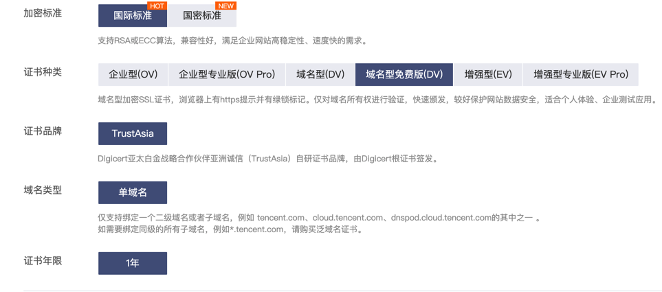
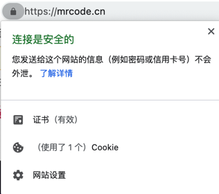

# Nginx 配置 SSL 证书提供 HTTPS 访问

## 申请免费的 DV 证书

各大云上一般都有 免费证书，那么免费证书和收费证书有什么区别呢？

1. 收费的安全等级更高
2. 免费证书只支持一个二级域名

如腾讯的 [SSL 证书申请地址](https://buy.cloud.tencent.com/ssl)



免费证书申请成功后（通过 DNS 解析验证的话，一般 10 分钟左右就可以通过申请），下载下来，一般会根据不同的配置提供配套的文件，如下图所示


## nginx 增加 SSL 模块

在 Nginx 开启 HTTPS 支持是需要 SSL 模块（`http_ssl_module`），可以通过下面命令查询是否开启

```bash
[root@study ~]# cd /usr/local/nginx/sbin/
[root@study sbin]# ./nginx -V
nginx version: nginx/1.16.1
built by gcc 4.8.5 20150623 (Red Hat 4.8.5-44) (GCC) 
configure arguments: --prefix=/usr/local/nginx --pid-path=/var/run/nginx/nginx.pid --lock-path=/var/lock/nginx.lock --error-log-path=/var/log/nginx/error.log --http-log-path=/var/log/nginx/access.log --with-http_gzip_static_module --http-client-body-temp-path=/var/temp/nginx/client --http-proxy-temp-path=/var/temp/nginx/proxy --http-fastcgi-temp-path=/var/temp/nginx/fastcgi --http-uwsgi-temp-path=/var/temp/nginx/uwsgi --http-scgi-temp-path=/var/temp/nginx/scgi

```

如果没有，那么可以进入源码目录

```bash
[root@study ~]# cd /home/software/nginx-1.16.1
# 查看该源码中是否有该模块
[root@study nginx-1.16.1]# grep ssl objs/ngx_modules.c 

# 可以看到是没有的，那么通过手动安装的 nginx，这个是后可以执行以下配置命令
# 注意：之前配置的参数还是保留，只是新增了一个模块 --with-http_ssl_module
./configure --prefix=/usr/local/nginx --pid-path=/var/run/nginx/nginx.pid --lock-path=/var/lock/nginx.lock --error-log-path=/var/log/nginx/error.log --http-log-path=/var/log/nginx/access.log --with-http_gzip_static_module --http-client-body-temp-path=/var/temp/nginx/client --http-proxy-temp-path=/var/temp/nginx/proxy --http-fastcgi-temp-path=/var/temp/nginx/fastcgi --http-uwsgi-temp-path=/var/temp/nginx/uwsgi --http-scgi-temp-path=/var/temp/nginx/scgi --with-http_ssl_module

# 配置完成后，进行编译和安装
make
make install

# 检查是否有 SSL 模块，发现已经存在了
[root@study nginx-1.16.1]# grep ssl objs/ngx_modules.c 
extern ngx_module_t  ngx_openssl_module;
extern ngx_module_t  ngx_http_ssl_module;
    &ngx_openssl_module,
    &ngx_http_ssl_module,
    "ngx_openssl_module",
    "ngx_http_ssl_module",

```

## 配置 HTTPS

nginx.conf 中其实默认已经有一段配置 HTTPS 的代码，如下面所示

```lua
    # HTTPS server
    #
    #server {
    #    listen       443 ssl;
    #    server_name  localhost;

    #    ssl_certificate      cert.pem;
    #    ssl_certificate_key  cert.key;

    #    ssl_session_cache    shared:SSL:1m;
    #    ssl_session_timeout  5m;

    #    ssl_ciphers  HIGH:!aNULL:!MD5;
    #    ssl_prefer_server_ciphers  on;

    #    location / {
    #        root   html;
    #        index  index.html index.htm;
    #    }
    #}
```

将证书文件上传到 nginx.config 同级目录下

```bash
/usr/local/nginx/conf
[root@study conf]# ll *_mrcode*
-r-------- 1 root root 3905 4月  18 2021 1_mrcode.cn_bundle.crt
-r-------- 1 root root 1674 4月  18 2021 2_mrcode.cn.key
```

增加我们自己的配置

```lua
server {
   listen       443 ssl; # 开启 ssl 
   server_name  mrcode.cn;

   # 配置 ssl 证书 
   ssl_certificate 1_mrcode.cn_bundle.crt; 
   # 配置证书秘钥 
   ssl_certificate_key 2_mrcode.cn.key; 
   # ssl 会话 cache 
   ssl_session_cache shared:SSL:1m; 
   # ssl 会话超时时间 
   ssl_session_timeout 5m; 
   # 配置加密套件，写法遵循 openssl 标准 
   ssl_protocols TLSv1 TLSv1.1 TLSv1.2; 
   ssl_ciphers ECDHE-RSA-AES128-GCM-SHA256:HIGH:!aNULL:!MD5:!RC4:!DHE; 
   ssl_prefer_server_ciphers on;
  
   location / {
      proxy_pass    http://tomcats;
      proxy_http_version 1.1;
      proxy_set_header Connection "";
   }
}
```

配置完成后，重新加载 nginx 配置文件后，访问域名 `https://mrcode.cn`

笔者这里在 hosts 中配置的该域名，如果访问时发现没有生效，很有可能是 nginx 配置文件没有生效的缘故，可以 stop 再重启 nginx

```
# mrcode.cn
192.168.56.105 mrcode.cn
```



