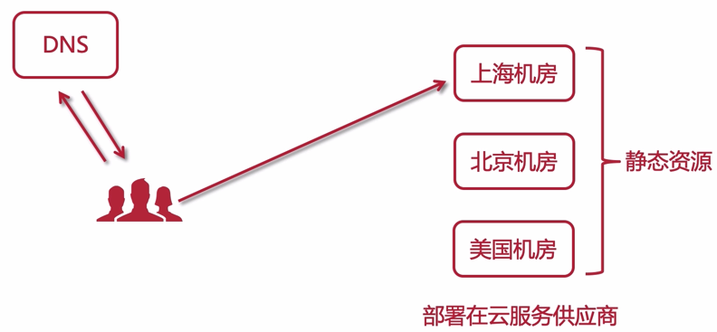
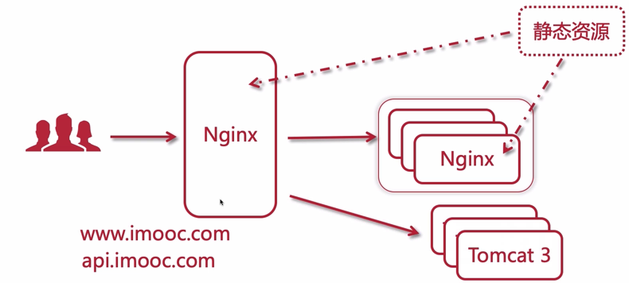

# 动静分离

## 动静分离的特点

- 分布式：把动态的 API 接口和静态资源分离开

  本质上是分布式，因为静态资源（如图片）等可以被浏览器缓存，CDN 加速，这就提高了这一块的吞吐量

- 前后端解耦

- 静态资源由 nginx 管理

- 接口服务化：接口单独部署，作为集群部署

  可以为不同的端，如：安卓、IOS、小程序提供服务

## 动静数据

- 静态数据：css、js、html 等
- 动态数据：得到的响应可能会和上一次不同

## 动静分离实现方式 - CDN



CDN：内容分发网络，简单说，静态资源会存在云 CDN 提供商的服务器上，在不同地域的服务器上都会存在，当用户访问的时候，会就近分配服务器节点提供服务

> 有关 CDN 更详细的知识，请参考 [HTTP 协议中的 CDN 章节](https://zq99299.github.io/note-book2/http-protocol/07/04.html) 

比如这个地址

```bash
https://cdn.jsdelivr.net/npm/vue@2.6.9/dist/vue
```

它就会按你访问的 IP 就近分配一个离你近的节点，以打到加速访问的效果

## 动静分离实现方式 - Nginx

我们这里学习该方案



- 静态资源：一般使用一级域名访问

  上图中列出了两种方式：

  - 第一种：使用一台 nginx 来提供静态资源服务
  - 第二种：使用 nginx 集群来提供静态资源，统一的入口再转发到这个集群上

- 动态资源：一般使用二级域名，如上面的 api.xx.com

  会转发到 tomcat 集群上

## 动静分离的问题

- 跨域：

  解决的方式：

  1. 前后使用同一个域名，后端用 nginx 代理转发

     这个笔者唯一能想到的缺点就是浏览器对同一个域名的链接限制

  2. SpringBoot 开启对跨域的支持、Nginx 允许跨域、jsonp

- 分布式会话

  分布式缓存中间件 Redis 来解决

  